## Aditya Mohan


- Reach me: <a href='mailto:adityak735@gmail.com'> `adityak735@gmail.com` </a>
- [Github](http://github.com/amsks)
- [Linkedin](https://www.linkedin.com/in/amsks/)
- [Curriculum Vitae](CV/CV_Aditya_Mohan.pdf)
- [Reading list](reading-list.html)


### About Me
- I am a Master student in the [EIT Digital Master's course in Autonomous systems](https://masterschool.eitdigital.eu/programmes/aus/). I am interested in exploring how systems infer patterns from empirical data and training them to learn a wide variety of skills from low-volume datasets. What excites me the most is the extent to which we can learn about our intelligence through the endeavor of creating one. I am currently working towards a specialization in Robotics and Reinforcement Learning.

- **Fun Fact :** I am a musician - multiinstrumentalist and singer - and can sing in around 8 languages so far. Checkout some of my song covers on my [instagram page](https://www.instagram.com/melodic.musings/)

#### Education
- [EURECOM](http://www.eurecom.fr/en)
- [TU-Berlin](https://www.tu.berlin/)
- [Manipal Institute of Technology](https://manipal.edu/mit.html)

#### Technologies

- **Robotics :** ROS, MORSE, FlexBE
- **Programming :** C++, Embedded C, Python, JAVA
- **RL Software :** OpenAI Gym, PyBullet, PhysX, RAI
- **Deep Learning :** Pytorch, Keras, Tensorflow


#### Work Reports
[Plan-Based Reward-Shaping for Goal-Focused Exploration in Reinforcement Learning](CV/LIS_Internship_Report.pdf)


#### Zettelkasten

<!-- %%% -->
# RTR: Conjuring Magic

An interesting thing that I recently read in [The Road to Reality](https://en.wikipedia.org/wiki/The_Road_to_Reality) was the power of abstraction in Mathematics. We traditionally learn numbers as being present and the set as being a natural extension of these numbers. Now, an interesting way to look at the power of the abstraction that the set theory allows us is to try and build the natural number system through empty sets! To do this, let us first consider the null set 

$$
\Phi = \{ \}
$$

Now, if we take the set of $\Phi$, we would get 

$$
\bm{1} = \{ \Phi \}
$$

Here, I have used the boldface to represent the number of elements in the set, and in this case it is 1. Now, let's take a collection of this new set and the empty set to make a second set with 2 elements: 

$$
\bm{2} = \{ \Phi, \{ \Phi \} \}
$$

If we again repeat this procedure to three and four elements, we get: 

$$
\begin{aligned}
\bm{3} = \{ \Phi, \{ \Phi \}, \{ \Phi, \{ \Phi \} \} \} \\
\bm{4} = \{ \Phi, \{ \Phi \}, \{ \Phi, \{ \Phi \} \}, \{ \Phi, \{ \Phi \}, \{ \Phi, \{ \Phi \} \} \} \}
\end{aligned}
$$

The interesting thing is, these are all valid sets! We have essentially used the null set to create 4 sets that are non-empty, by recursively using the null set. If we repeat this procedure infinitely, we see a clear isomorphism between the natural number line and this series of sets. Thus, we have somehow created numbers out of nothing!

## Broader Outlook 

We get an infinite sequence sequence of abstract mathematical entities—sets containing, respectively, zero, one,
two, three, etc., elements, one set for each of the natural numbers, quite independently of the actual physical nature of the universe. This just reminds me of Plato's belief in a world of abstract forms, independent of the world we live in. While we don't need to religiously believe in such a world, what seems interesting to me is that this 'abstraction' of mathematics allows us to somehow break the barriers of the physical world and develop some really cool and interesting stuff that might not even be discovered in our times. Moreover, as we have seen in the history of hte sciences somehow this formal 'imagination' (If we must) goes hand-in-hand with our attempt to understand reality through physics. Roger Penrose, beautifully summarizes this through his adaptation of M.C Escher's Penrose stairs as shown in the diagram below 


<!-- %%% -->
# MobMod: Vehicular Flow Modeling 

The key principle in flow modeling is to treat the vehicles as a liquid flowing through sections. We then put some numbers to this and get the car-following models. The major classification of the Vehicular Flow Models is shown below:

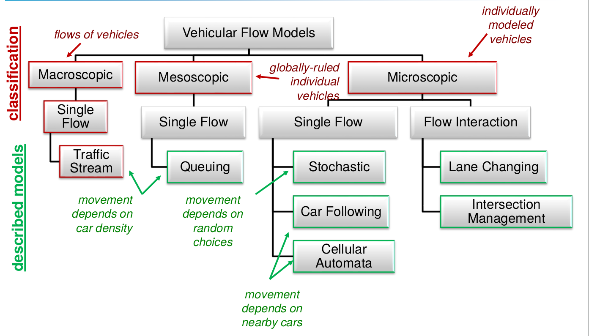

The models are fundamentally differentiated on the basis of the level of precision that they go into, which is inversely related to the cost of modeling, and this gives us the 3 categories: 

- **Macroscopic:** Here, we model vehicle traffic as a flow as a segment of the road, and thus, our fluid is the cars entering/exiting that segment and the density of the number of cars in that segment. All the cars in this segment will have the same speed. Thus, we can have the relationship :

$$flow = speed \times density$$

- **Microscopic:** Here, we measure the position of each vehicle and have the speed of each vehicle as different. Thus, we have individual entities with aggregated models.
- **Mesoscopic:** This is a hybrid between the above two, where we get to keep the individual speeds of vehicles and yet analyze flows. Thus, we can say stuff like while all vehicles will have the same speed in a section, we can still control individual vehicles. This also allows us to look into mixed flows.

## Macroscopic Models

### Lighthill-Whitman-Richard (LWR) Model

In this model, we directly model the traffic as a fluid. Thus, we take the flow $m$, the density $\rho$  and the speed $v$ over a segment $[x,\Delta x]$ and apply the fluid lagrangian equation to it to get

$$m(x,t) = \rho(x,t)v(x,t) \\
\frac{\partial \rho(x,t)}{\partial t} + \frac{\partial m(x,t)}{\partial x} =  0
$$

These are the basic constraints that tell us that the flow in this section is conserved and any discrepancy is happening due to friction or heat, which can be modeled as abrupt changes and leaving cars respectively. However, we have two equations  and 3 unknowns, and so for the vehicular model we impose the third condition which says that the speed and density are related

$$v(x,t) = f(\rho(x,t))$$

This relation is intuitive since the more density we have, the slower is the speed. Now, the way we model this speed function determines how we solve the problem and this is what gets us to apply this model.

### Fundamental Diagram

The solution of macroscopic models results in the fundamental diagram, which is something that is common in macroscopic and mesoscopic models.

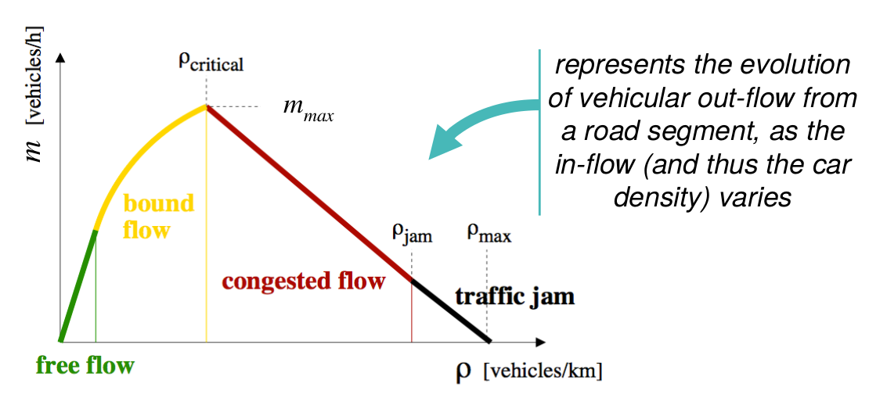

The diagram above is called the flow-density diagram. It accurately represents a highway phenomenon. Initially, we have a free highway and so, the more vehicles we add to this, the more is the speed of the vehicles until a certain point at which there are enough cars so that each car cannot move as fast as it wants. This is the region on bounded flow where the speeds of the cars are correlated. This happens till a maximum density that gives us a positive flow $\rho_{critical}$ after which we cannot add any more vehicles to the road without reducing the flow. Thus, our ideal is to stay at this density and try to play around this value. if w go beyond this flow, the speed goes down according to the strong correlation between vehicle speeds. This downward curve depends on the region in which we are. If we are on a highway, it is easier to have a straight line than in an urban environment. This result happens till a certain point after which we enter a traffic jam. This density is the $\rho_{jam}$ and is the starting of the region of traffic jam. In this region, the cars may be moving very slow till a density called $\rho_{max}$ at which the cars halt.

### Traffic Stream Model

This model is initially a macroscopic model since the whole model is characterized by macroscopic quantities, but to be able to implement this in a simulator, we need to discretize it. thus, we end up with individually modeled vehicles, but they all move according to macroscopic quantities i.e all vehicles traveling on the same road segment will have identical speed/acceleration. 

#### Fluid Traffic Model

This model exploits the inverse proportionality in the speed/density relationship → The speed is inversely related to the density of cars on a road :

$$v_i(t+ \Delta t) = max [v_{min}, v_{max}(1 - \frac{\rho(x,t)}{\rho_{jam}})]$$

As we can see, this is nothing but the velocity constraint needed to solve the lagrangian.

## Mesoscopic Models

### Queuing Model

In this model, each road is seen as a FIFO queue of length (size) $C$. Thus, the travel time is a function of $C$, but: 

1. At max, only $L$ cars can leave the queue
2. A car cannot leave until another queue accepts it
3. A queue can accept at mos  $C$  cars

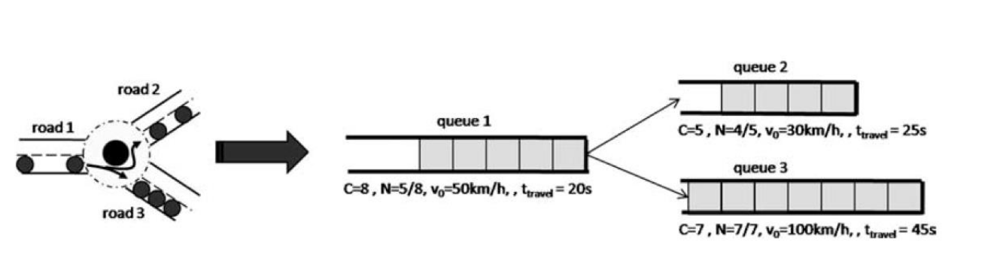

## Microscopic Models

Now, each vehicle has its own speed and we can have a lot of interesting things in this like leader-follower models, overtaking, etc., which is either not possible in macroscopic models, or is too complicated to model. All the three kinds of models are used for different kinds of applications: 

1. For **traffic safety**, we need fine granularity of vehicle representation since the communication range is short. Thus, we use Microscopic Models
2. For **Navigation,** we need to have a notikn of large scal  mobiltiy and Aggregated Metrics like average spped and time. Moreover, we need the capability of re-routing, and the precise position may not be that useful. Thus, while we can apply bot microscopic and mesoscopic models, the **mesoscopic models are preferred**
3. For Traffic monitoring, we just need a notion of aggregated metrics on a very large scale and need to see stuff like how the whole bunch of cars are populating a highwar. Thus, we need macroscopic modelling

### Single Lane Models

#### Stochastic Model

These are equivalent to Random models liek RWP, but tailored to a graph:

- We choose the location and speed, but can only move on a graph
- Each vehicle is completely independent of the other

The modelling is shown below:

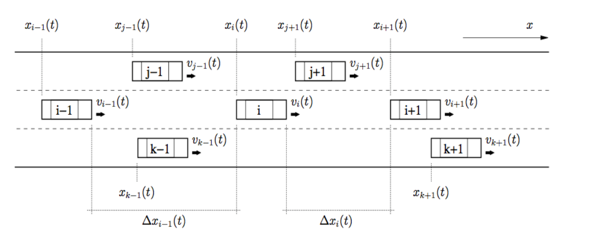

Here, we have the reference car in teh middle lane indexed by $i$ and has :

- Position → $x_i(t)$
- Speed → $v_i(t)$
- The cars in the lanes to the sides are indexed by $j, k$
- Distance between 2 cars - bumper to bumper distance - is calculated as

    $$\Delta x_i(t) = x_{i+1}(t) + x_i(t)$$


#### Constant Speed Model

This is an example of a stochastic model where we apply RWP on a graph. 

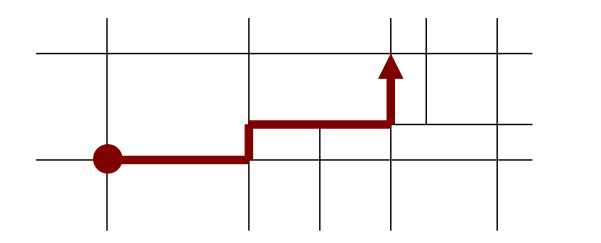


The movement of each vehicle is structures in trips, and we choose the spped as

$$v_i = v_{min} + \eta(v_{max} - v_{min})$$

Where $v_{min}, v_{max}$ are the bounds on speed and $\eta \in [0,1]$ is a random variable. The key aspect is tuning this $\eta$ to get a good speed estimate. An example of this being applied to urban scenarios is called **Urban CSM** where we represent roads on a city as nodes and edges and we can set $v_{max}$ depending on the speed limits on the road. We can add optimizations to this, like uniformly sampling speed around max:

$$v_i \sim U(v_{max} + \epsilon , v_{max} - \epsilon )$$


#### Manhattan Model

This is basically the same as the Urban CSM, but we become more realistic in sampling speed :

- We update speed based on acceleration 

    $$v_i (t + \Delta t) = v_i(t) + \eta a \Delta t  $$

- Then we ensure that this speed is bounded between $[v_{min}, v_{max}]$ 

    $$v_i (t + \Delta t) = \min\{\max\{v_i (t + \Delta t), v_{min}, v_{max} \}$$

- We then add a speed reduction if the bumper-to-bumper distance is lesser than a safety metric to implement car-car interaction and collision avoidance

    $$v_i (t+ \Delta t) = v_{i+t} - \frac{a}{2}, \,\,\,\,\, if \Delta x_i(t) \leq \Delta x_{safe}$$

### Car Following Models

In these models we follow the leader-follower approach. Thus, the speed of a car depennds on the cars nearby and on an absolute relative speed of surrounding vehicles.. In orther words, the movemet of each vehicle is strongly correlated with other vehicles.

### Intelligent Driver Model

The objective of this model is to represent the **interaction** between two vehicles in the most realistic way. Interaction in microscopic models means either **acceleration** or **speed**. The idea is that our car should accelerate based on its current speed and its vicinity, and this is modeled as follows :

- The resulting acceleration depends on the maximum acceleration  $(a)$, the ratio of the current speed to the maximum speed $\frac{v_i(t)}{v_{max}}$, and the ratio of the desired inter-distance between the car ad the bumper-to-bumper distance $\frac{\Delta x_{dex}(t)}{\Delta x_i(t)}$ as follows:

    $$\frac{d v_i(t)}{dt} = a \bigg[1 - \bigg(\frac{v_i(t)}{v_{max}} \bigg)^4 - \bigg(\frac{\Delta x_{des}(t)}{\Delta x_i(t)}\bigg)^2 \bigg]$$

- The desired inter-distance between the cars, in turn, depends on a safe distance, a safety headway time, the current velocity and the maximum acceleration (a) and deceleration (b

    $$\Delta x_{des}(t) = \Delta x_{safe} + \big[v_i(t) \Delta t_{safe} - \frac{v_i(t) \Delta v_i(t) }{2 \sqrt{ab}} \big]$$

- The major idea here is that the desired distance between the car should at-least be a safety distance $\Delta x_{safe}$ and then to this safety distance we add a headway distance calculated by multiplying the headway time $\Delta t_{safe}$, which is the elapsed time between the front of the lead vehicle passing a point on the roadway and the front of the following vehicle passing the same point and is usually something like 2 seconds,  with the current velocity. This means that we are essentially adding a leeway to the minimal safety distance by seeing how fast we are moving and multiplying it by the headway time. Thus, if these two were the only factors in consideration, then we would have a model where when our car is at rest, $\Delta x_{safe}$ is the desired distance and in case our car is moving, then we add a velocity-based factor to it to take into account how fast the car is moving. We also subtract the minimal distance by $\frac{v_i(t) \Delta v_i(t) }{2 \sqrt{ab}}$ to account for the difference in the velocity of the car and the next car and normalize it by the breaking capability $2 \sqrt{ab}$. This factor takes into account the relative speeds w.r.t to the car model the driver adapting to the difference in speeds.

This model is used in SUMO, VANET MobiSIM etc.


<!-- %%% -->
# MobMod: Palm Calculus
- Source: [J-Y Le Boudec's Original Paper](http://citeseerx.ist.psu.edu/viewdoc/download;jsessionid=650FABC44E04160877ED5C48308BFD62?doi=10.1.1.85.8803&rep=rep1&type=pdf) , [RWP Considered Harmful by Yoon et. al](http://citeseerx.ist.psu.edu/viewdoc/download;jsessionid=EE482699E40FC579D10F9B0D112599A9?doi=10.1.1.12.1241&rep=rep1&type=pdf)

## Issue with Random Models

To do this, we have to first realize that the performance measures of ad-hoc mobility models are directly impacted by the selection of the mobility model. So, to have any talk about the issues, we need to be clear about the model we are talking about first. Let us select the Random Waypoint Model. Now, one of the most important parameters of most mobility models is the speed, either of the individual particles as a constant value, or a distribution of speeds. Thus, if we have to compare the performance of routing protocols using the RWP model, then we have to be able to adjust this parameter in order to compare the performance of routing protocols under different levels of nodal speed. To be able to make this comparison, we need to assume that the model will reach a steady-state of speeds that can be used to compare average metrics, and in the RWP this average is often believed to be either half of the maximum speed $V_{max}$since the node speeds are chosen from a uniform distribution  $(0, V_{max}]$, or some other justified value in this range. Thus, to analyze the performance of a protocol and make comparisons, we assume that this average is reached at the start of the simulation. Hence, we would find simulations making comparisons by varying the value of $V_{max}$, and packaging results into averaged comparisons.

### Decay in Random Waypoint 
To understand the problem, let us take the average instantaneous speed which we define as 

$$
\bar{v}(t) = \frac{\sum_{i=1}^N v_i(t)}{N}
$$

Where, $N$ is the total number of nodes in the simulation, and $v_i(t)$ is the speed of a node at time $t$. For $V_{max} = 20$  and null pause times, an average of the instantaneous average speeds over 30 scenarios is shown in the following graph

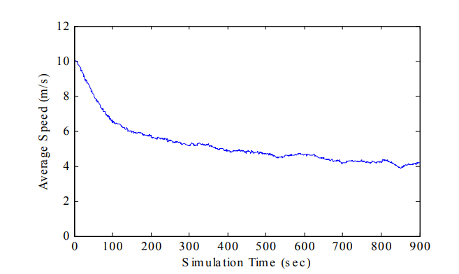

We see that this instantaneous average is consistently decreasing and it was proven that this can mathematically decay to 0 in the RWP model. An intuitive explanation is that the random waypoint model chooses a destination and a speed for a node at random and independently, and the node will keep moving at that speed until it reaches the destination. So, if we have a node with slow speed and a far-away destination, it is quite possible that this node might move so slow that it may take a very long time to finish the trip, or worse, never reach the destination. More and more nodes can be stuck with these slow speeds and thus, dominate the average value over time and this is what leads to the decay. This is a recurring issue with the majority of such model comparisons.

## Resolving through Palm Calculus

To understand Palm Calculus, we have to understand the difference between time and event averages. Time averages are obtained by sampling the system at arbitrary time instants, for example, the figure below is obtained by sampling the system every 10 sec of simulated time.

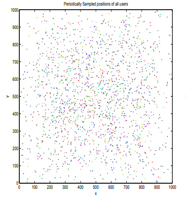

Event averages are obtained by sampling the system when selected state transitions occur. For example, the figure of the same system as time averages, when sampled on the times at which the nodes reach end of Waypoints is shown below: 

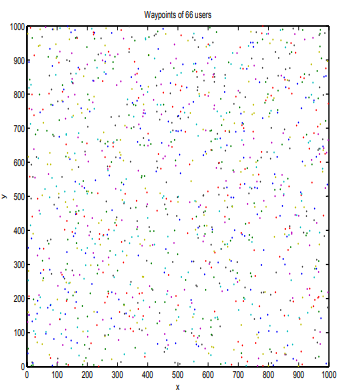

Palm calculus is a set of formulas that relate time averages versus event averages. Thus, the distribution obtained through event sampling is called a Palm distribution.

### Stationary Processes
A stationary process is one that is independent of a shift that can be applied to it. SO, for the joint distribution of stochastic variable $S_t$ from $t= t_1, .., t_n$, if we apply a shift of $u$, the new joint distribution $(S_{t_1+u}, S_{t_2+u}, ..., S_{t_n+u})$  should be independent of the shift u. 
- Thus,  the process does not change statistically as it gets older i.e it is Stationary. Palm calculus applied to any stationary process.

Now, If $X_t$ is jointly stationary with the simulation, the distribution of $X_t$ is, by definition, independent
of $t$ and this is called the time stationary distribution of $X$. If $X_t$ is ergodic i.e we can deduce its properties through taking a sufficiently long sample of the process, then we can assert that for a discrete set of times $t$, the expectation of $X_t$ being bounded by a function $\phi$  can be estimated by the time units for which the value of $\phi$ is valid, if these are of a sufficiently large number

$$\mathbb{E}(\phi(X_t)) = \frac{1}{T} \sum_{t=1}^T\phi(X_t)$$

In other words, the probability of$X_t$  being in a set of state $W$ is proportional to the fraction of time $X_t$ spends in the states of $W$. In other words, the time stationary distribution of $X_t$ can be estimated by a time average.

### Building up to Palm Formulas

Now, if we condition the expectation and probability on a point process, like reaching a waypoint, we can get palm intensity and probability. In general, a random sequence of time instants $T_n$ can be defined as the times at which the simulation $S_t$ reaches a certain subset of the state-space or does a transition from some state $s$ to some state $s'$, where both of these states belong to the same set (Like the set of waypoints). NOw, if we assume that the time at which we are observing our simulation is 0, then we can say that 

$$
T_0 \leq 0 < T_1
$$

Thus, $T_0$ is the last time a transition occurred before time 0, and $T_1$ the next transition
time starting from time 0. Now, we can define an intensity over this point process to be the probability of a transition to happen at a time point 

$$\lambda = \mathbb{P}(T_0 = 0)$$

In continuous-time, this would be the same as saying that the expectation over the number $N$ of transition in time-interval $[t, t+\tau]$ satisfied the above equation i.e 

$$\mathbb{E}(N(t, t+\tau)) = \lambda \tau$$

Thus, for our example of time points at which transitions occur, we could say that for a stationary process, the conditional expectation at time $t$ is independent of $t$ and is the same as the expectation at $t=0$, and so


$$\mathbb{E}^0(X_t) = \mathbb{E}(X_0|Transition \,)$$

This is called the palm expectation, and if our process is ergodic, we can apply the sam criteria to our palm distribution and say 

$$\mathbb{E}^0(X_0) = \frac{1}{N} \sum_{n=1}^N X_{T_n}$$

Thus, if $X_t$ is the speed and the transitions are departures from a waypoint, we are essentially saying 

$$\mathbb{P}^0(X_t \in W) \sim \mathbb{P}^0(X_0 \in W)  $$

and both of these probabilities are proportional to the fraction of transitions in which the speed of the node is in the set $W$.

### Major Palm Formulas

**Inversion Formula** : Gives the relation between the time-stationary expectations and palm expectations

$$
\begin{aligned}
&\mathbb{E}(X_t) = \mathbb{E}(X_0) = \lambda \mathbb{E}^0 (\sum_{s=1}^{T_1} X_s) = \lambda \mathbb{E}^0 (\sum_{s=0}^{T_1 - 1} X_s) \\
&\mathbb{E}(X_t) = \mathbb{E}(X_0) =  \lambda \mathbb{E}^0 (\int_0^{T_1} X_s ds)
\end{aligned}
$$

**Intensity Formula:**  The average number of selected transitions per time unit $\lambda$ satisfies

$$
\frac{1}{\lambda} = \mathbb{E}^0 (T_1 - T_0) = \mathbb{E}^0 (T_1)
$$


### Feller's Paradox

Assume at a bus stop there pass in average $\lambda$ buses per hour. If an inspector is measuring the time between the buses, then they would measure an estimate of  

$$
\mathbb{E}^0(T_1 - T_0) = \frac{1}{\lambda}
$$

Now, if someone arrives at time $t$ and measures the event as the difference between the time until the next bus and the time since the last bus, they would estimate $\mathbb{E}(X_0) = \mathbb{E}(T_1 - T_0)$ and the above two quantities can be related as: 

$$
\begin{aligned}
&\mathbb{E}(T_1 - T_0) =\lambda \mathbb{E}^0(\int_0^{T_1}X_t dt) \\
\implies &\mathbb{E}(T_1 - T_0) =\lambda \mathbb{E}^0(\int_0^{T_1}(+t - (-t))dt) \\ 
\implies &\mathbb{E}(T_1 - T_0) =\lambda \mathbb{E}^0(T^2) \\
\implies &\mathbb{E}(T_1 - T_0) =\frac{1}{\lambda} + \lambda var^0(T_1 - T_0) \\
\therefore \,\,\, &\mathbb{E}(T_1 - T_0) = \mathbb{E}^0(T_1 - T_0) + \lambda var^0(T_1 - T_0)
\end{aligned}
$$

This means that the estimate of the time that the person would have is  $\lambda var^0(T_1 - T_0)$ bigger than the inspector's estimate, even though both of them sample the same system. This is called the Feller's paradox. Intuitively, this occurs because a stationary observer (Joe) is more likely to fall in a large interval. Thus, Palm calculus gives us a way to relate distributions that have been sampled differently. So, in the case of RWP, this means that Palm calculus allows us to reconcile the issues we saw with the RWP models where we see decay in speed when sampled over the averages of particles in transitions, and the average speed when sampled over the averages

### Back to RWP

The $\frac{1}{\lambda}$ value that we get from the intensity formula can be related to the palm distribution of hte speed as follows:

$$
\frac{1}{\lambda} = \mathbb{E}^0(D1)\mathbb{E}^0(\frac{1}{V_0}) = \bar{\Delta}\int_0^{\infty} \frac{1}{v} f^0_V(v) dv
$$

Here, $\bar{\Delta}$ is the average distance between 2 points in teh Area selected and $f_V^0$ is the density function that represents the palm distribution of the speed. When we apply Palm distributions to RWP, we get:

1. **Selecting Speeds:** the time stationary distribution of the speed has a density proportional to $\frac{1}{v} f^0_V(v)$ . thus if we want our process to have a time distribution that is stationary, we need to choose this function very carefully. Some examples are: $f^0_V(v) = Cv1_{v_{min} < v < v_{max}}$, $f^0_V(v) = C\frac{v - v_{min}}{v_{max} - v_{min}}$, and $f^0_V(v) = C (v_{min} + v(v_{max} - v_{min}))$. The key is to get a function that when divided by $v$ would give a function that more-or-less is stable
2. **Selecting Mobile Positions:** Just like Feller's paradox, we do not have a closed-form solution for different mobile positions. Thus, we can't generate the directly from the distributions as in the case of velocity. However, we can apply heuristics to get around it. One heuristic is Choosing endpoints such that joint probability density proportional to the distance between them. So, if $Prev(t)$ is the previous waypoint before or at time $t$, and $Next(t)$ is the next waypoint after time $t$, then for the triplet $(Prev(t), M(t), Next(t))$ we need have the following conditions met: (1) $(Prev(t), Next(t))$ has a joint density over $A \times A$ given by $f_{Prev(t),Next(t)}(p,n) = K||p - n||$, and (2) The distribution $M(t)$ which we get from $Prev(t) = p, Next(t) = n$ should be uniform in the segment $[p,n]$

If we choose the initial speed and locations in to satisfy these conditions, then we can ensure a stationary distribution in time and palm spaces for RWP and eliminate the ergodic degreaing problem. This, would allow us to effectively compare the processes in different settings and thus, make the RWP model more useful.


<!-- %%% -->
# MobMod: Random Mobility
As with any analysis, the basics start from idealized scenarios. In terms of modeling, this would be random mobility. The historical viewpoint on this comes from Brownian Motion, which is the model of the movement of particles suspended in a liquid or gas caused by collisions with molecules of the surrounding medium. Of course, this is not the most realistic since vehicles don't just move randomly and hit each other, and so, our most basic models in random mobility come from a movement that is random to a certain extent but obeys tunable constraints. The two most basic models of random mobility are:

- **Random Walk:** For every new interval *t*, each node randomly and uniformly chooses its new direction $\theta(t)$ from an interval $[0, 2\pi]$. The new speed follows a Gaussian distribution in $[0, V_{max}]$. Therefore, during a time interval t, the node moves with the velocity vector $[v(t)\cos(θ(t)),v(t)\sin(θ(t))]$. If the node moves according to the above rules and reaches the boundary of a simulation field, the leaving node is bounced back to the simulation field with the angle of $\pi−\theta(t)$ or $\theta(t)$, respectively. This effect is called the border effect.
- **Random Waypoint:** We first choose a rectangular area of size $X_{max} \times Y_{max}$, and the total number of nodes N in this area. We then choose a random initial location $(x, y)$ for each node, where $x$ is uniformly distributed over $[X_{min}, X_{max}]$  and $y$ is uniformly distributed over $[Y_{min}, Y_{max}]$. Every node is then assigned a destination $(x', y')$ also uniformly distributed over the two-dimensional area, and a speed $v$, which is uniformly distributed over $[V_{min}, V_{max}]$, where $V_{max}$ is the user-assigned maximum allowed speed. A node will then start traveling toward the destination on a straight line at the chosen speed $v$. Upon reaching the destination $(x_0, y_0)$, the node stays there for some pause time, either constant or randomly chosen from a certain distribution. Upon expiration of the pause time, the next destination and speed are again chosen in the same way and the process repeats until the simulation ends.

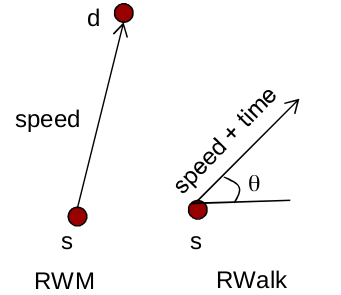

#### Limitations of the Random Waypoint and Walk models
These models are not able to capture a lot of realistic scenarios, the major ones listed as follows:

1. **Temporal Dependency of Velocity:** In these models, the velocity of the mobile node is a memoryless random process since the values at each epoch are independent of the previous one. Thus, sudden mobility behaviors are possible in these models, including sharp turns, sudden acceleration, or sudden stop. However, in real situations, these values change smoothly.
2. **Spatial Dependency of Velocity:** In these models, each node moves independently of all the other nodes. However, in real scenarios, like battlefield communication or museum touring, these values may be correlated in different ways, which is not taken into account in these models
3. **Geographic Restriction of Movement:** In these models, the mobile nodes are allowed to move freely without any restrictions, but this might not be the case in real-life scenarios, like driving for instance, where the agents are contained in their movement by the roads, obstacles, etc.

## More Realistic Models
#### Manhattan Model
This model addresses the drawback of Geographic restriction on movement. The general idea is that initially, the nodes are placed randomly on the edges of the graph. Then for each node, a destination is randomly chosen and the node moves towards this destination through the shortest path along the edges. Upon arrival, the node pauses for T time and again chooses a new destination for the next movement. This procedure is repeated until the end of the simulation. In the Manhattan Model, these edges are in the form of a grid. Thus, this is just an extension of the Random Waypoint idea, but with added constraints on movement

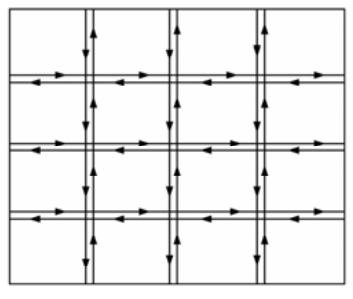

#### Reference-point Group Mobility Model (RPGM)

This model addresses the drawback of spatial dependency of the velocity in the random models. Nodes are categorized into groups. Each group has a center, which is either a logical center or a group leader node. For the sake of simplicity, we assume that the center is the group leader. Thus, each group is composed of one leader and many members. The movement of the group leader determines the mobility behavior of the entire group. The movement of group leader at time t can be represented by motion vector V^t_{Group}. This motion vector can be either randomly chosen or carefully designed based on certain predefined paths. Each member of this group deviates from this general motion vector to some degree, for example, each mobile node could be randomly placed in the neighborhood of the leader. The velocity of each member can be expressed as V^t_{Group} + R_i , where R_i is the deviation of each member from the group leader's velocity.

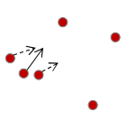

#### Gauss-Markov Model
This model **addresses the correlation of velocities**. In this model, the velocity of the mobile node is assumed to be correlated over time and modeled as a Gauss-Markov stochastic process:

$$R_t = \bar{\alpha}R(t-1) + (1-\bar{\alpha})R + \sqrt{1- \bar{\alpha}^2}\bar{X}_{t-1}$$

Here, $R(t)$  can be either speed or direction of movement, which is shown to be dependent on an autocorrelation function sampled from a Gaussian distribution $\bar{X} \thicksim \mathcal{N}(0, \sigma)$. The value of R at any time point is correlated to a certain extent with its value at time $t-1$ , and this is modeled through the parameter $\bar{\alpha} = e^{-\beta} \in [0,1]$. When $\bar{\alpha} = 0$, this equation decomposes to Brownian motion since the moton at any two points only depends on its current value and the Gaussian Noise $\bar{X}$,  while at $\bar{\alpha} = 1$ this represents a linear motion since the new variable perfectly depends on the previous variable, without any added noise. By tuning this $\bar{\alpha}$, this model is capable of duplicating different kinds of mobility behaviors lying on the spectrum of Linear and Brownian motion.

#### Smooth Motion Model
Another mobility model considering the temporal dependency of velocity over various time slots is the Smooth Random Mobility Model. Here, **instead of the sharp turns and accelerations as proposed in the Random Waypoint Model, these values are changed smoothly**. It is observed that mobile nodes in real life tend to move at certain preferred speeds, rather than at speeds purely uniformly distributed in the range. Therefore, in the Smooth Random Mobility model, the speed within the set of preferred speed values has a high probability, while a uniform distribution is assumed on the remaining part of the entire interval

$$V^{pref} \thicksim [V_1, V_2, ..., V_n] $$

The frequency of speed change is assumed to be a Poisson process. Upon an event of speed change, a new target speed is chosen according to the probability distribution function of speed above and the speed of the mobile node is changed incrementally from the current speed to the targeted new speed by acceleration or deceleration $a(t)$ . The probability distribution function of acceleration or deceleration a(t) is uniformly distributed among $[0, a_{max}]$ and $[a_{min}, 0]$, respectively. The new speed depends on the previous speed:

$$V_t = V_{t-1} + a(t)(V_t - V_{t-1})$$

A similar approach is followed for the direction update with angular accelerations.

## Problem of Unsteady Values
One of the most important factors that play a role in the analysis of the various parameters associated with these networks is the stability of values. In the evolution of network states, there is usually an initial phase where the process variables change over time, and this phase is called a **Transient Phase**. During this transient phase, analyzing these variables is not possible as any value that they predict for the system is not a good indicator. As this phase passes, these values start to stabilize and as they stop varying over time units on an average, a **Steady State** is reached. This is the point at which a feasible network analysis starts becoming possible. In case the network transitions into something else over time, another steady state is reached after an intermediate transient state. The problem comes when these transient states start lasting longer or start happening more frequently since then stable analysis of the system becomes increasingly difficult. Thus, one of the major areas of research had been in figuring out a way to effectively predict these steady-state values and use them in analyzing the models. The seminal work on this was done by J-Y Le Boudec at EPFL, where the team developed a method called **Palm Calculus** and used it to predict the steady-state distributions of all major random mobility models.

## Outlook on Random Mobility Models
1. Random Mobility Models are very powerful solutions to obtain the fast and controllable output. They are easily configurable and reproducible, and there are various models on different geometric data. Moreover, after the issues removed through palm calculus, they are able to offer decent steady-state characteristics
2. Random Models have to be well understood and analyzed for them to make sense. If not carefully modeled, as in the case of RWP with the initial selection of speed and mobility, they may never generate stable steady-state characteristics. Thus, we might not get expected mobility patterns, which is a bummer for routing protocols.
3. While Random models provide good statistics, they are not able to provide low scale mobility patterns like slow increase/decrease of speeds, the interaction between vehicles, etc.


<!-- %%% -->
# MobMod: Introduction to Mobility Modelling

The fundamental abstraction that is needed to understand inter-connected phenomena is a way to describe the different relationships between the various participating entities. For example, imagine a scenario where a disaster management Mobile Ad-hoc network of drones is deployed to triangulate sensitive points, the key to successful execution lies in how these drones interact and share knowledge. Thus, the **Network** that is shared between these drones - or, **Nodes** - would have a certain way of establishing communication and its performance can be analyzed through multiple metrics. One way to analyze this network would be by simulating how these nodes might move and what kind of impact they might have on the network. It is exactly for this kind of analysis and understanding that we create **Mobility Models**: They allow mimicking the behavior of mobile nodes when network performance is simulated. The simulation results are strongly correlated with the mobility model.

### Case of Connected Cars

The way this analysis fits into the driving scenario is in terms of modeling the uncertainty in the traffic scenario. In the case of autonomous driving, the limitation for an individual agent is more from the side of the sensors. Usually, we would use cameras and Radars to work stuff out, but Radars can only see around 10m. So, how would this agent work in a highly uncertain scenario? Imagine a car driving on an Indian road in a 2-tier city, with pedestrians walking on all sides and multiple vehicles going in all directions.

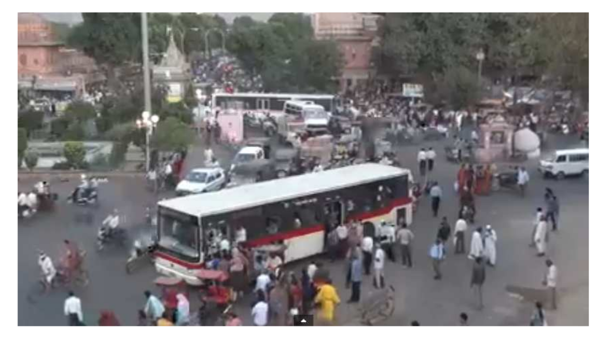

One way to approach this solution would be to shift a bit of the load from the individual agent to the network. This could be done if the cars are connected through a network based on 4G/5G technologies. Thus, in this case, we could view the cars as nodes communicating with each other and moving in some way. For each car, the regular functions - movement, mapping, obstacle detection, and avoidance, etc. - would be performed on the edge of this network while the coordinating function could be performed either centrally or in a distributed manner. Thus, the issue of modeling the Mobility and/or Modeling of the traffic flow, especially in the case of more uncertain scenarios, becomes extremely important.

#### Need for Modelling
1. The performance evaluation of such a large-scale network is bounded by simulation: Raw analytical analysis is too complex while conducting experiments is too expensive
2. Real-world traces are hard to find, either because they do not exist or are not publicly available (E.g City-Data).
3. Trivial representations of mobility might **bias** the simulation results. The available traces might not represent real-world situations very effectively and might have a lot of residual effects that can render them useful in very specific conditions, and thus, not generalizable.

#### The safe and sustainable mobility conundrum
Now if we were to go about this modeling, one of the central issues that would come up is that of optimality. The optimization here would be maximizing the usage of the road capacity while putting constraints in the form of driving rules and the safety of the driver and pedestrian. To better understand this, imagine we implement a model where a car is made to drive slow to increase safety. Now, this is fine for the individual driver, since the car always maintains a safe distance from another car in front of it. However, two problems come-up:

1. If the safe distance is too large, then a pedestrian might walk-in between leading to the car to halt
2. The speed of the car is slow and so, the general traffic speed is also slow. This might create problems on traffic bottlenecks, like a 7 lane highway leading to a 2 lane road, etc.

If we use the same policy on high-volume traffic conditions, then slow speeds and sudden halts can easily lead to shockwave propagation and Ghost Jams. Let us formalize this by looking at traffic in terms of flow

$$Flow = Density \times Speed$$

Thus, looking at this model we can see some safe directions to analyze this situation would be by controlling this flow through either reducing the speed or maybe keeping it and reducing the flow through density control. But more importantly, if we were to model the mobility by simulating this condition, we could develop interesting ways of cooperative navigation.

#### Vehicular Models
To analyze this network, we start looking at vehicles as nodes. Thus, the traffic becomes a MANET and our methods of simulation enable us to better understand this network.

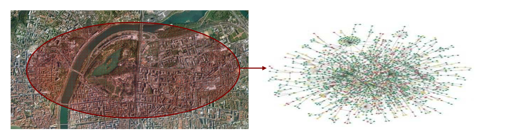

The impact of mobility is even more pronounced in the case of vehicular networks. The three factors that differentiate these networks from other networks are:

1. The speed of each node is not bounded in small intervals and is not smooth. It is highly variable
2. The movement is far from random. Thus, we cannot directly sample variables from standard distributions in realistic scenarios.
3. The nodes do not move independently, and in fact, have strong reciprocal dependencies

Consequently, the abstractions that this network viewpoint offers can be on three levels:

1. **Vehicular Traffic Model:** Abstraction of the large scale trajectories employed by the vehicles
2. **Vehicular Flow Model:** Abstractions of the physical inter-dependencies
3. **Vehicular Driver Model:** Abstractions of the actions of individual nodes, like breaks, turns, etc.

### History of Modeling 

- **Random Mobility Models:** These models come from the field of Computer Science and Telecommunications. The key idea is to think of Mobility as a perturbation in a system of particles and use stochastic analysis to create models. Thus, we would have models for how the particles move under constraints imposed by tunable hyperparameters, and we determine the stability and other related metrics of this system. A significant feature of these models is the need for the system to be at a steady-state, which is something that is not very realistic since if the system models something like traffic, it is very difficult to define what a steady-state would mean in this scenario. This will be discussed further below.
- **Flow Theory:** This model comes from the field of transport engineering and vehicle manufacturing where the view is to see mobility as flows between junctions i.e vehicles on a lane going from one street to another is a flow and thus, we can use metrics like speed and density to model this. one key distinguishing factor is that here we are interested in the exact opposite of Random Models - the transient phase - and we try to work with it. The issue with flow theory is the rules that it applies to the whole flow, which prevents it from being able to explain erratic behavior like accidents.
- **Behavioral Theory:** This comes from Traffic Telematics engineers, and the view here is to not have specific rules for the whole mass of movement as flow theory does but to look at mobility as a network of agents, with each agent behaving according to certain behavioral constraints. Thus, this view tries to bridge the gap between Flow theory and realism and is also able to explain stuff like accidents.


<!-- %%% -->
# MALIS: Gradients

## Gradient Descent

- **predicted value** $= intercept + slope$ 
- **metric** → $y = C + dy/dx x$

let $y'$ be the expected value:
- residual $= y' - y $ 
- sos = $(y' - y)^2$. 
- Thus, our optimization target becomes : $\frac{1}{2} \sum (y' - (C + Mx))^2$

How gradient Descent works is by taking steps towards the optimal target. This is different from least-squares since in the latter we numerically compute the optimal solution by differentiating the target w.r.t C and setting it to 0 to find the inflection, which will be the minimal point. Gradient descent, on the other hand, works by first selecting a random value of intercept, say  $C_1$ , and then moving a step in the direction of decrease in value. This step is determined by the learning rate $\alpha$ which is a hyperparameter. So, at $C_1$, we differentiate the SOS target w.r.t C and calculate the value by putting $C = C_1$ and then multiply this value by alpha to get the next intercept point → Thus, when we are far away from the inflection, we take larger steps and when we are closer to the inflection, we take smaller steps since the slope is saturating. evident in N-dimensional metrics → the same thing is happening on hyperplanes
- The learning rate $\alpha$ determines the size of the steps we take and tuning this is important, since if it is too small, our time to convergence is slower, while if it is too large, we overshoot the solution → Classic control phenomenon!
- One solution is to start with a large learning rate and make it smaller with each step! → **Schedule the Learning Rate**


## Stochastic Gradient Descent

The computations in the Gradient Descent step scale up pretty fast and thus, convergence becomes an issue. SGD resolves this by sampling points for the intercept residual calculation!  → Instead of using all points, we can randomly sample n points - **Mini-batch** - and use them → This is especially helpful when points are clustered in different clusters, since the points in one cluster wil more-or-less have similar residuals! 
- Again the sensitivity to $\alpha$ comes into picture and again we can adapt scheduling  to overcome this!


<!-- %%% -->
# MALIS: Generic ML Concepts

## Cross-Validation

Allows us to compare different ML methods! When working with a dataset for training a learner: 
- Naive Idea → Use all data 
- Better Idea →  Use x percent for training and y percent for testing

the issue is how do we know that the selection is good ? The lord answers through **K-Fold Cross Validation** → split data into K blocks → For each K-block train the data on the rest of the K-1 blocks and test it on K block and log the metric → Average out the performance and use this for comparison
- **Leave one out cv** → us each sample as a block 

## Confusion Matrix
Plot the Predicted Positives and Negatives vs, Ground truths : 

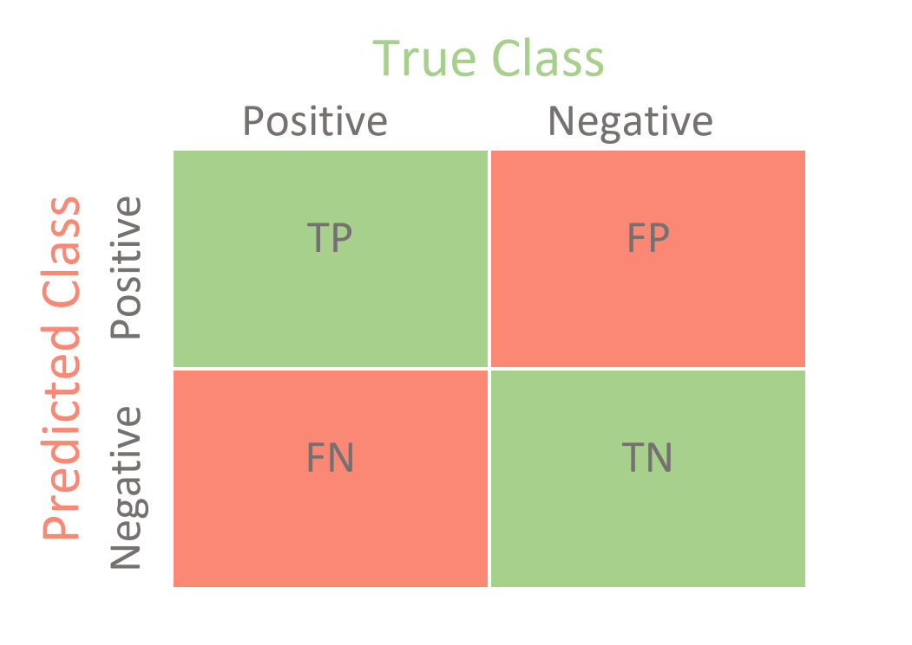

NOTE: 
- The diagonal always shows the True values
- The non-diagonal elements ar  always false

The major Metrics are: 
- **Sensitivity →** Positive Labels correctly predicted : $\frac{TP}{TP + TN }$
- **Specificity →** Negative Labels Correctly predicted : $\frac{TN}{TN + FN}$

Let's say we test out logistic regression against Random Forests to classify patients with and without heart disease. Then the algorithm with the higher sensitivity should be chosen if our target is to classify patients with heart disease, while the algorithm with higher specificity should be chosen if we want to classify patients without heart disease

### What about Non-binary classification 
Calculate these values for each label by treating the values as Label and !label. For if we have three labels, we take the true positives as all the classifications done for label i and the TN as all the misclassifications done for label i → This means that if the data actually belonged to the other classes and was still classified as belonging to i, then it is a False Positive. Similarly, we take True Negative as all the classifications done on all other classes except out current label and the false negatives as the classifications. Let's take the following example:

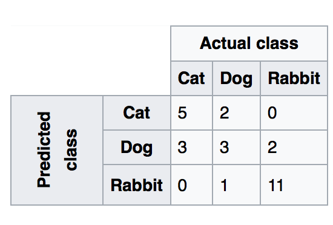

Here, for The class Cat, we get : 

- Sensitivity $= 5/(5 + 3 + 0) = 5/8 = 0.625$
- Specificity $= (3 + 2 + 1 + 11)/(3 + 2 + 1 + 11 + 2 ) = 17/19 = 0.894$

Other major metrics are: 
- **Accuracy** → $(TP+TN)/total = (100+50)/165 = 0.91$
- **Misclassification Rate** → $(FP+FN)/total = (10+5)/165 = 0.09$ = 1 - accuracy
- **Precision → $TP/predicted yes = 100/110 = 0.91$**
- **TP Rate** →  $TP/yes = 100/105 = 0.95$
- **FP Rate**  → $FP/No = 10/60 = 0.17$

The idea is to strike a balance between things and get hang of how our classifier is actually performing!

## Bias and Variance

- **Bias** → The inability for an algorithm to capture the true relationship in the data. Formally, it is the inherent error that we obtain from the model even with infinite training data due to the classifier being biased to a particular solution
- **Variance** → Difference in fits between the training and the testing data, i.e the error caused from sensitivity to fluctuations in the training set

High bias means the learned model is simpler and might not fit the training data very well and when it does not perform so well on the test set → **Underfitting**. High variance means that the learned model is has a better fit to the training set but does not perform so well on the test set → **Overfitting**

- What is happening is that the training set can be viewed essentially as a the true relationship curve plus some noise that scatters the data around the curve. This is the same for training and test sets. now, if our model fits so well to the training set that it is able to exactly pass through each data point, it has actually fitted to the the noise that scattered the data from the actual signal. Thus, is has so much variability that it won't perform good on other datasets which might inherently be sampled from the same curve with some random noise that scatters the data a bit differently. This is why the model has over-fitted to the training set by adapting to the noise.

In general, Error depends on the square of bias and the directly varies with variance and Noise:

$$
E= B^2 + V + N
$$

And this variation can be plotted as follows:

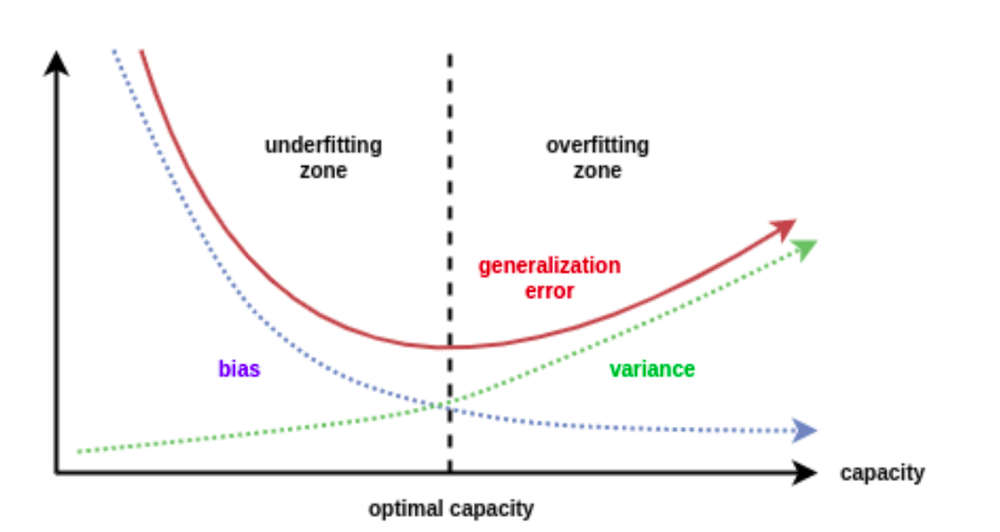

## ROC and AUC

The whole idea of ROC curve is adjusting our classification threshold for example in the case of logistic regression - to mess-around with the rates of TP and FP. We plot these values for each threshold against each other on a graph, as shown: 

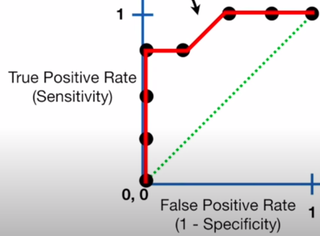
- Here, we have plotted sensitivity a.k.a the True positive rate against FP Rate a.k.a 1 - specificity. At point (1,1) we see that our classifier is classifying all samples as TP and FP. Now, let's say our problem is to predict whether the patient has a certain disease or not, then this is not acceptable since the FP Rate is high, and we can't afford False Positive classification. So, we adjust our threshold and see the sensitivity remain the same through the next two points on the left, but the FP Rate decrease, which means our model is getting better. Then we see that both the rates fall and then, finally, our model reaches a level where the TP Rate is positive while the FP rate is negative. This is a desirable performance for our purposes. In case we are willing to accept some FPs for a better TP classification, we can select points on the right that increase the TP but also end up having some misclassifications

AUC -Area Under the Curve - is used to compare the performance of two classifiers, as shown below:

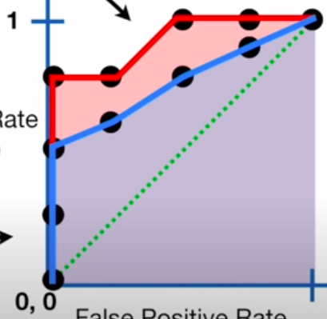

Since the AUC is greater for the red curve, and so the model that it represents is better since for the  same levels of FP, it delivers more TPs


<!-- %%% -->
# MALIS: Clustering

## Hierarchical Clustering
We take a group of points and cluster them according to similarity, or dissimilarity. Let's say we have N points, each parameterized by n dimensions. to measure the similarity, all we do is create a **meaning of distance between the points**,  which can be done in many  ways, two common ones being: 

1. **Euclidean Distance** → Take the difference of values across the n dimensions, square each one and add and then  take the square root 
2. **Manhattan Distance** → Sum the magnitudes of differences across n dimensions

So, we calculate the distances between all 2 combinations of samples and then see the one with the smallest distance → We combine them into a single cluster, for which we define the values across all dimensions based on the mean metrics of the point. These values are used for further selection, as we treat this cluster as a single point and repeat the procedure, this gives us a dendrogram diagram as shown below:

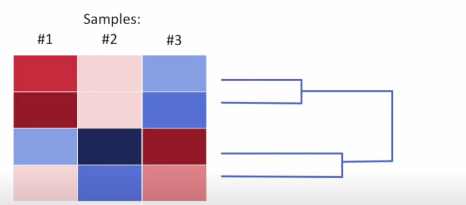

The way to figure out or each point, to which cluster it belongs, we can use three metrics: 

1. Average values of all points in the cluster → **centroid linkage** 
2. Closest point fro each cluster  → **single linkage** 
3. Furthest point from each cluster → **Complete linkage** 

There are two kinds of problems that might arise here: 

1. **Chaining:** in the case of single linkage, we are taking the best similarity out of all the points in the clusters → What if the clusters are too far spread out and thus, overlap? 
2. **Crowding:** In the case of complete linkage, we take the worst-case scenario → What if the points in different clusters are closer together than the point in consideration i.e the clusters are too compact?

Average Linkage resolves this → centroids FTW

## K-means Clustering

Here, we try to fit our points into K clusters: 

1. Select the value of K 
2. Take K points out of data randomly
3. Calculate distances of all other points from these K points 
4. Classify each point into the cluster to which it has the smallest distance 
5. Repeat the process with the reference points now being the centroids of the points in the cluster 
6. Stop when the clusters do not change
7. Repeat all the steps fro 2-6 with different initial points 

Let's say we conduct N experiments, we now need to see which cluster is the best → We do this by selecting the one with the **least total variation across all clusters** → Variation is calculated just like in PCA i.e sum squares of distances of all points in the cluster from the center and then divide it by the number of points in the cluster.

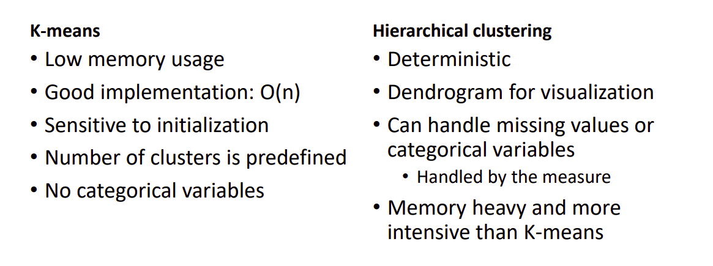


<!-- %%% -->
# MALIS: PCA
- source: [StatQuest](https://www.youtube.com/watch?v=FgakZw6K1QQ&t=1081s)

The main idea is dimensionality reduction: We have data of say n dimensions, where each sample depends on all the n dimension. No we can't really visualize this data and we can't really work with storing all the data all the time since the curse of dimensionality messes us up. So, we start to analyze the importance of each dimension on each sample and try to project then according to that → This groups the samples with similar impacts from the n dimensions together and allows us to see them in clusters. Let's take the case of 2 gene, for multiple cells. We do PCA in the following steps:

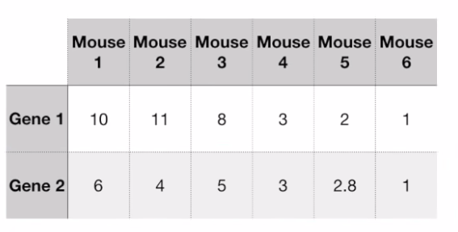

- On the two axes we take the mid-point of this data:  
    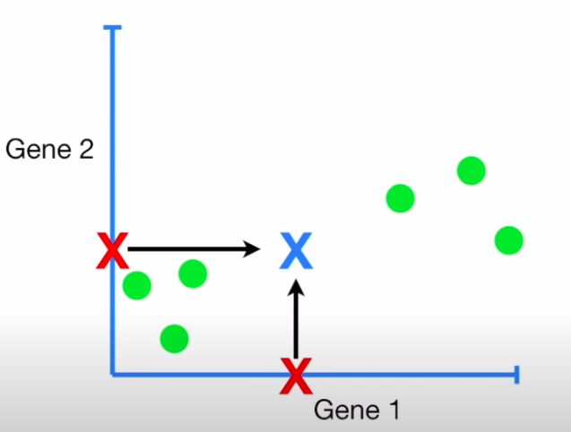
- We now center the points around this mid-point
    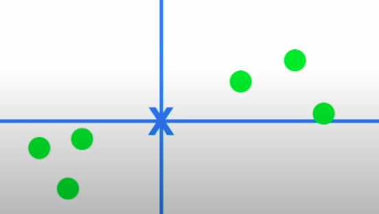
- We draw a random line that goes through the origin and then fit it through these points by projecting these points on to the line and then either minimizing the distances to this line or maximizing the distance of the projected points from the origin:
    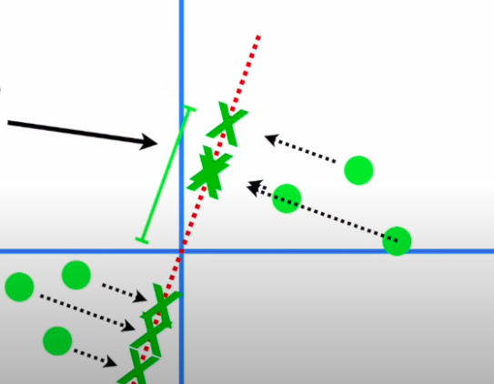
- The slope of this line to our original axes tells us the ratio of the importance of gene1 to gene2 i.e. if we were to make a call, we would need to mix 4 parts of gene1 and 1 part of  gene2 in this case
    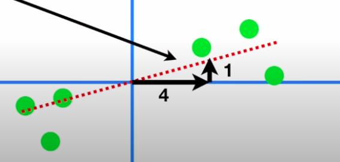
- The unit vector along this line → the **eigenvector** of this data → tells us these proportions through its span components : ( 0.97, 0.242 ) → **Loading scores**
- The square of the distances of the projected points on the eigen vector are the **eigenvalue of PC1: $\sum d_i^2 = EV_{PC_1}$**
    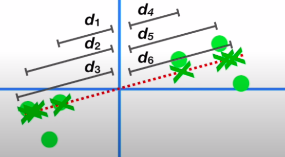
- Similarly,  we can get another principal component to this data through the process which will be perpendicular to PC1 and it will also have its eigenvector and eigenvalue 
    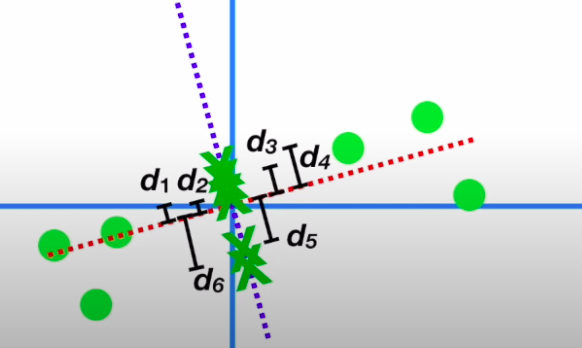
- Now we just remove the original axes and rotate the eigen vectors to see the points throgh the EVs, and the squared sum of the projected points on each PC gives us the original point
    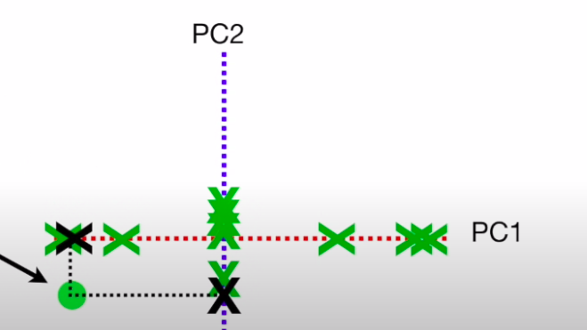
- We can convert the EVs into variations by dividing them by the sample size , and in this case, we V1 = 15 and V2 = 3 → Thus , PC1 contributes $\frac{15} {(15+3)} = 83%$ in importance, while  PC2 contributes $\frac{3} {(15+3)} = 17%$ in importance. These can be plotted on a **scree plot** , which tells us the importance of each PC 
    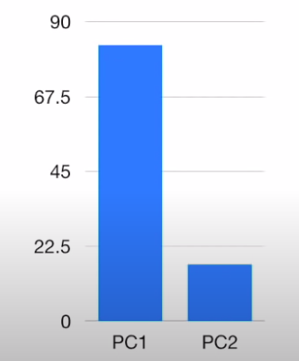


In theory, for genes there should be n components → So, even if we can't visualize them we can just see the scree plots and analyze the data and the principal components decrease in order of importance. So, we can roughly take the two most important ones and use them for understanding


<!-- %%% -->
# MALIS: AdaBoost

Learners can be considered weak or strong as follows: 
- **Weak** → Error Rate is only slightly better than random
- **Strong** → Error Rate highly correlated with the actual classification

**Adaboost combines a lot of weak learners to create a strong classifier!**. This is characterized by 3 key points: 

1. It creates an RF of **stumps** → trees with only one question used for classification → which act as weak learners
2. All stumps in this forest don't have equal **say**, some have more and some have less and they are used as  weights for the classification that each stump makes
3. The errors made by the previous stumps are taken into account by the next stump to reduce misclassification i.e the stumps sequentially try to reduce misclassification in contrast to a vanilla RF where the stumps are all separate

The steps are a follows:
- Start with the dataset, but assign each data point a weight i.e create a new column with weights, which have to be normalized, and at the start, all have equal values
    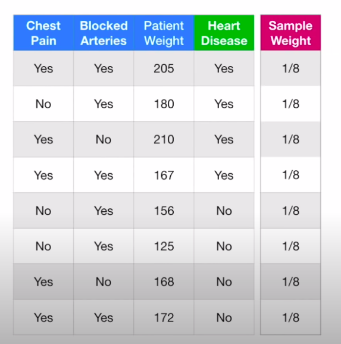
- Use a weighted impurity to classify nodes → We use the same formula, but for each label we use the associated weights in the gini calculation. Since all weights are the same, we ignore them for now and see that the gini for patient weight is the lowest, so we use it for our first stump:
- Now we see how many errors this stump made → in this case it is 1. We determine the say of this stump by summing the weights of the erroneously classified samples → $E = \sum W_i$ → and the total say as $S = \frac{1}{2} log(\frac{1 - E}{E})$ → we get the say as 0.47 for this stump
- Now we update the weight of the incorrectly classified sample using the formula: $w \leftarrow w * e^S$ and so, we get the new weight for the incorrect sample as 
- Now we will decrease the amount of weights for all the correctly classified samples by using the formula : $w \leftarrow w * e^{-S}$ which gives us the new weights of all other labels as 0.05
- Now we normalize the updated weight by dividing each weight by the sum all weights
    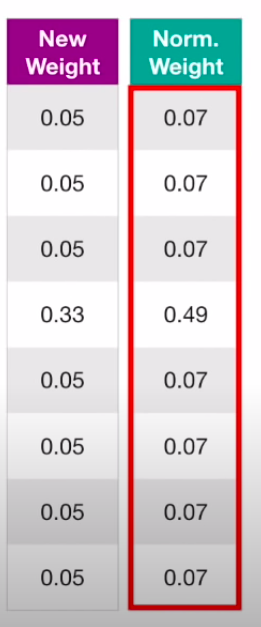
- We repeat the procedure using a weighted gini index or just creating duplicates of the samples with the large weights.  

The main thing that characterizes this algorithm is Boosting, which is a fancy name for when we train multiple weak classifiers to create a stringer classifier by taking errors of the previous classifiers into account. AdaBoost is creating a forest of stumps, but each new stumps uses the normalized weights to determine which kind of mis-classifications to focus on and thus, in a sense, uses the errors of the previous stumps to improve. 


<!-- %%% -->
# MALIS: Random Forests
-source[StatQuest](https://www.youtube.com/watch?v=J4Wdy0Wc_xQ)

The issue with Decision Trees is that they are not flexible to achieve high accuracy. So, we use Random Forests, which alleviate this problem by creating multiple trees from different starting points. The steps are as follows: 

- Create a Bootstrapped Dataset of the same size by selecting random samples with replacement 
    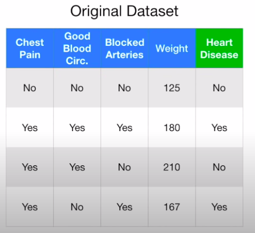
    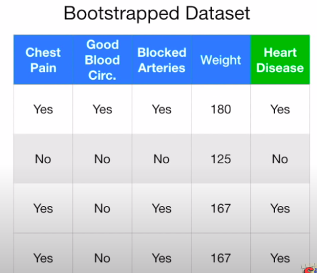
- Create a Decision tree by selecting questions at random from this bootstrapped dataset, and use the impurtiy function to segregate the metric to used
    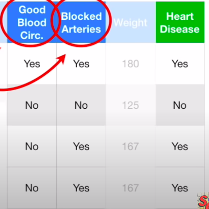
- Wherever a question needs to be asked, select the new metric randomly out of the metrics except the one used i.e in this case Good blood Circulation
    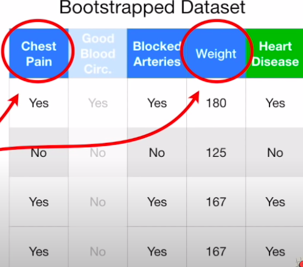
- Go back to step 1 and repeat to create a new bootstrapped dataset and repeat everything to create another tree → Do this process a fixed number of times.

Thus, by creating a variety of trees → A forest → We are able to get trees with different performances that can predict the labels. For new data items, run it down all the trees and keep a track of the classification - Yes and No - and then choose the classification with the bigger number → **Bagging = Bootstrapping + Aggregating**. Thus, Bagging is an ensemble technique where we train multiple classifiers on subsets of our training data and then combine them to create a better classifier.

## Evaluating RF

the entries that didn't' end up in the bootstrap dataset - Out of bag Data - are run through the tree to get the classification from all the trees and again use Bagging to see what the final classification is → For all out of bag samples, we evaluate the confusion matrix and calculate the precision, accuracy, sensitivity, and specificity  

## Hyperparameters in RF
The hyperparameters in the RF are :

1. m → The number of variables we are using out of the subset in bootstrap to create the tree 
2. k → the number of trees we have in the forest 

We can do the Out-of-Bag stuff on different random forests and select the one with the best accuracy

<!-- %%% -->
# MALIS: Decision Trees
- Source: [StatQuest](https://www.youtube.com/watch?v=7VeUPuFGJHk)

Basically a way of codifying decisions as tree data structures. The tree has the same concepts as trees in basic data structures with: 

- Root Node→ starting node of the tree
- Intermediate nodes → All the nodes that come after the root node that need to be parsed in a depthwise search
- Leaf Nodes → The terminal nodes of the tree

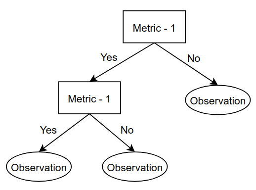

The main idea is to start from the root and traverse along the intermediate nodes to reach decisions on observations and actions. 

## Creating a Tree

Based on the video from, Let us predict heart disease based on metrics :

- Chest Pain
- Good Blood Circulation
- Blocked Arteries

and we have the following table:

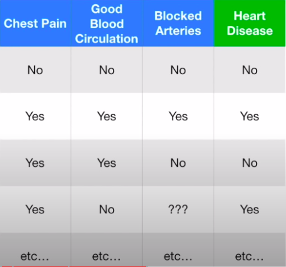

Let the observation nodes be represented as x/y, where x represents heart disease while y represents no heart disease. For chest pain, suppose we get the following observations from the labels:

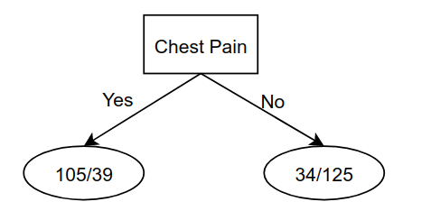

For Good blood circulation:  

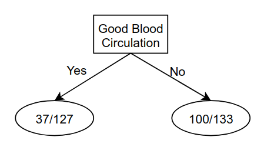

And for Blocked arteries:

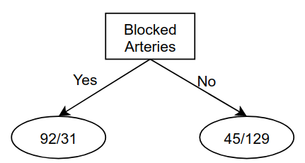

Here, the total number of patients for each of these metrics is different, since some patients did not have observations for all metrics. Now, since none of the leaf nodes have 100% observation on whether the patient has heart disease, they are considered impure → We need a way to measure and compare this impurity to determine which metric is better and use that as a higher level node.

### Gini Impurity

The Gini impurity is mathematically written as :

$$
G(s) = 1 - \sum_{i=1}^Kp_i(1-p_i)
$$

Here, $p_i$  are the probabilities of the sub-observations → take one metric and divide it by total observations in that leaf node. In our example, for the case of chest pain, the gini for the leaf node corresponding to the observations that come when chest pain is detected, can be calculated as: 

$$
1 - (\frac{105}{105+39})^2 - (\frac{39}{105+39})^2 = 0.395
$$

Similarly, the gini of the other leaf node for chest pain is: 

$$
1 - (\frac{34}{34+125})^2 - (\frac{125}{34+125})^2 = 0.336
$$

Since the total number of heart patients in the leaf nodes for chest pain is not the same, we take a weighted average of Gini impurities as the Gini impurity for chest pain : 

$$
G_{cp} = (\frac{144}{144+159})0.395 + (\frac{159}{144+159})0.336 = 0.364
$$

Similary the coefficient blood circulation is →  $G_{GBC} = 0.360$ and the coefficient for blocked arteries is → $G_{BA} = 0.381$

Since good blood circulation has the lowest Gini value, it has the lowest impurity → it separates the heart disease the best! Thus, we will use is as the root node, and so our tree is:

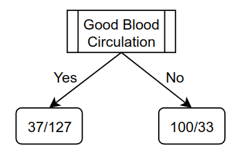

So, in our decision we start with looking at good blood circulation. If the patient has good blood circulation then there are 37 such patients wth heart disease and 127 without, and if they don't have good blood circulation, then 100 such patients with heart disease and 33 without. Now, in the left node we again compute the sub-trees for Chest pain and blocked arteries, out of these 37 patients **from the table** to get the following possible branches:

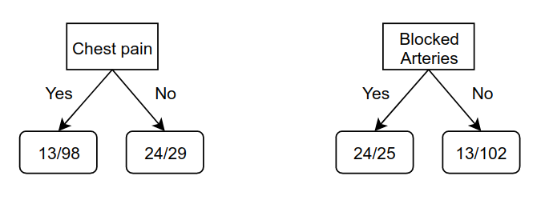

The Gini values are:

$$
\begin{aligned}
&G_{CP} = 0.3 \\
&G_{BA} = 0.290
\end{aligned}
$$

Thus, blocked arteries is a better metric after Good blood circulation, and so we update it in the tree:

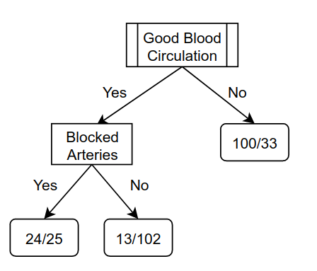

Now, we repeat this procedure for the left and right nodes of blocked arteries. For the left child of blocked arteries to get the chest pain values as:

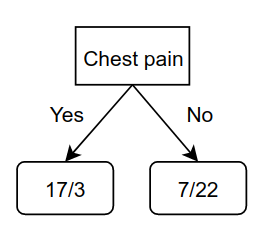

This will be added to the left child of blocked arteries. Ideally, we would repeat this procedure for the right child, but there is one important factor that comes into play here, which is that the Gini impurity of the right child of Blocked arteries is: 

$$1- (\frac{13}{13 + 102}) + (\frac{102}{13 + 102}) = 0.2$$

While the Gini for the chest pain in this case is:

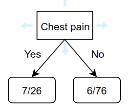

$$
G_{CP} = 0.29
$$

Thus, the right child of blocked arteries is by itself a better separator than chest pain, and so, we let it be! Hence, we can summarize the steps followed as: 

1. Calculate the Gini scores 
2. If the Gini of the node is lower, then there is no point separating patients and it becomes a leaf node.
3. If separating the data improves the gini, then separate it with the separation of the lowest gini value

We repeat these steps for the right child of the root node, and the final tree comes out to be:

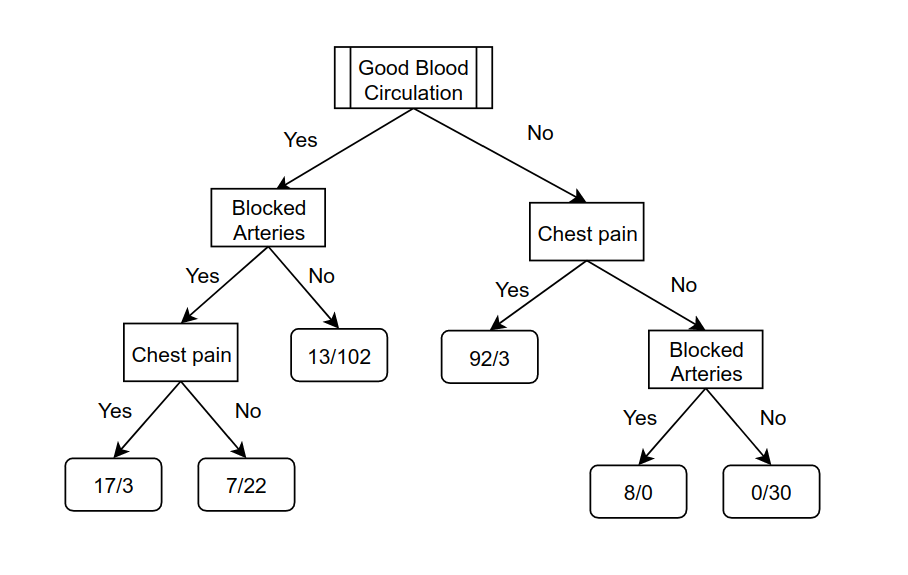

## Other Impurities

Gini is just one of the ways to measure the impurities. It is used in the CART algorithm. Another measure for quantifying impurity is Entropy: 

$$
H(S) = - \sum_i p_i log(p_i)
$$

It is primarily used to define information, which is defined in terms of the change in entropy. It used in the ID3 algorithm, which does similar stuff as described above. The basic idea of working with trees remains the same → Use an impurity function to determine if the node needs further improvement, and then improve it by asking the question that would lead to the best separation.

## Feature Selection

If we are to follow the procedure described previously for trees, then the issue that comes is that of over-fitting and to deal with this, we can do feature selection to simplify the tree. For example, if chest pain in the previous example never gave an improved separation as compared to the leaf nodes, then we can just remove this feature and thus, the tree would only have good blood circulation adn blocked arteries. Similarly, we could also specify a threshold for separation saying if te gini is low than this threshold, then we consider the separation good and thus, if any feature is unable to separate below this threshold, we discard it! 


<!-- %%% -->
# MALIS: Kernels

The basic idea of Kernels is the problem of separating randomly distributed data, as shown below:

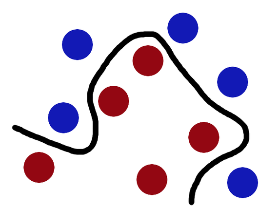

The separating hyperplane is not exactly a line in this 2D space. So, how can we learn this separation? One trick is to Transform this data by mapping each data point into a new space for computation, learn the separator in that space, and then transform this data back to our original space. This is a similar technique to what we do in the time-frequency transformations of signals using Fourier transforms, to better understand some characteristics in time and frequency domains. The naive way to do this transformation is through a kernel is to the variable x from our initial space to a variable $\phi(x)$ in the new space. Thus, if this problem is transformed into a linear classification problem in this new space, then we are essentially applying a linear classifier to a non-linear classification problem. The only issue with this is the issue of computation that comes with higher dimensional problems! To alleviate this, we use Kernels

## Kernel Trick

Let's say we have the base features $x_i$ and we apply a transformation on them $\phi(x_i)$ which  transforms each point according to some set rule. Now, if we were to apply any technique, say linear regression, on the original points, our problem would be to calculate the weights: 

$$
w = (X^TX)^{-1} X^TY
$$

And so, with the transformations, it becomes: 

$$
w = (\phi^T\phi)^{-1} \phi^TY
$$

If we add regularization to it, we just add the ridge regression term to it:

$$
w = (\phi^T\phi + \lambda I)^{-1} \phi^TY
$$

The problem is, calculating $\phi(x)$ is hard! And when we look at high volume data and the central role that these transformations might play in the case of SVMs, calculating this transformation for every point just adds complexity. Let's try to simplify this a bit, by looking at our ridge-regressor:

$$
\begin{aligned}
&J(w) = \sum_{i=1}^N(y_n - w^T\phi(x_n))^2 + \frac{\lambda}{2} \sum_{i=1}^N ||w||^2 \\
\implies &\bm{w}^* = \frac{1}{\lambda} \sum_{i=1}^N (y_n - \bm{w}^T\phi(\bm{x}_n))\phi(\bm{x}_n)
\end{aligned}
$$

Let first term be:                    
$$
\alpha_n = \frac{1}{\lambda} \sum_{i=1}^N (y_n - \bm{w}^T\phi(\bm{x}_n))
$$

Thus, we can re-write the weights as:

$$
\bm{w}^* = \bm{\phi}^T\bm{\alpha}
$$

Thus, if we substitute this value in the expression for $J(\bm{w})$ , we get a dual form that depends on the $\bm{\alpha}$  and $\bm{\phi}^T \bm{\phi}$ , very similar to what we get in the dual form of SVMs. This dot product transformation can be written as a **Kernel Matrix**:

$$
\bm{\phi} \bm{\phi}^T = K = [\phi(x_i)\phi(x_j)] \,\,\,\,\,\, \forall \,\,\,\,\,\, i,j = 1, ..., N 
$$

This matrix has 2 properties: 

1. It is Symmetric → $K = K^T$
2. It is Positive Semi-Definite → When we multiply it by some other matrix and its transpose, we get a result greater tha or equal to 0 i.e  $\alpha^T K \alpha \geq 0$

When we put this in our simplification term, we get the following result:

$$
\bm{\alpha}^* = (\bm{K} + \lambda ' \bm{I})^{-1} Y
$$

The difference between the original problem to this problem is simple → Before we had to compute $\bm{\phi}^T \bm{\phi}$  but now we have to compute $K = \bm{\phi} \bm{\phi}^T$ which seems similar but there is a catch: 

According to Mercer's Theorem, any Symmetric and PSD Matrix can be expressed as an inner product 

$$
K(x,y) = \langle \phi(x), \phi(y) \rangle
$$

In other words, we can write K as an inner product of the original features:

$$
\bm{\phi} \bm{\phi}^T = K = [\phi(x_i)\phi(x_j)] = [K(x_i,x_j)]
$$

This is the Kernel Trick!  To better elaborate, let's take a transformation: 

$$
\phi: x \rightarrow \phi(x) = [x_1^2 \,\,\,\, \sqrt(2)x_1x_2 \,\,\,\, x_2^2]^T
$$

A dot product of this transformation can be re-written as

$$
\begin{aligned}
&\phi(x_m)^T\phi(x_n) = x_{m1}^2x_{n1}^2 + 2x_{m1}x_{n1}x_{m2}x_{n2} + x_{m1}^2x_{n1}^2 \\
\implies &\phi(x_m)^T\phi(x_n) = (x_{m1}x_{n1} + x_{m2}x_{m2})^2 = (\bm{x^T_m}\bm{x_n})^2
\end{aligned}
$$

Thus, all we need is this final form of the kernel to work since the whole optimization relies on this dot-product and we don't really need to transform every feature through the original expression! For predictions, originally we needed to calculate the weights since :

$$
y = \bm{w}^T \phi(x)
$$

But, as we have shown these weights depend on the dot-product which can be expressed as a Kernel

$$
\bm{w}^T \phi(x) = y(\bm{K} + \lambda ' \bm{I})^{-1} k_x
$$

And to compute this Kernel, we don't need to know the true nature of $\phi(x)$ !  This is what allows the SVMs to work in higher dimensions.


<!-- %%% -->
# MALIS: State-Vector Machines

## Intuition
Classification is essentially finding a boundary that separates the data points into two segments so that when we get a new data point, the segment that it falls on determines the label it belongs to! The real challenge is positioning this boundary → which is the focus of every classifier.  Let's take the figure shown below as an example

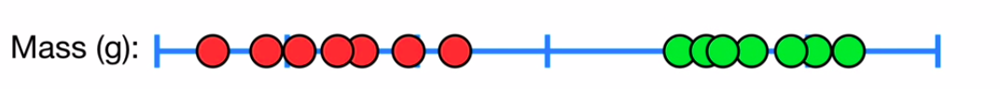

Here, the data is 1D - Mass(g) - and we need to classify the person as Obese (Green) or Not Obese (Red). If we put the decision boundary at the edge of the red points, as shown below, our classifier would work for points inside the respective clusters, but for a point at the boundary, as shown, it would classify it as not obese even though this point is closer to the red cluster. 

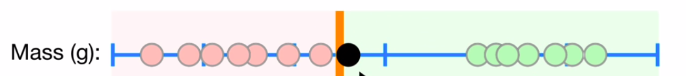

This is clearly not desirable, and this would also be the case if we move this boundary very close to the green points. Let's define the shortest distance between the observations and the boundary as the Margin. One way to get a decent classifier would be to place this boundary in such a way so that the margins are equal → This is possible in the case where we put the boundary at exactly half the shortest distance between the data-sets, as shown below 

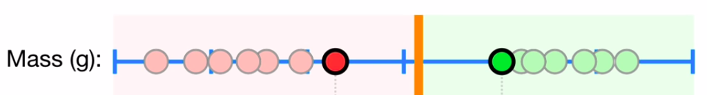

This is called the Maximum Margin Classifier since the margins, in this case, have the largest value than any other possible case. But the shortfall of this is that it is sensitive to outliers:

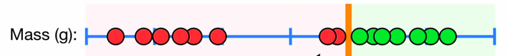

Here, the outliers push the Max Margins very close to the green cluster and thus, overfit the boundary to the training set as clearly a more equally distributed test set would have to make some misclassifications! Thus, to make a boundary that is more robust to these outliers, we must allow misclassifications by introducing soft margins around our boundary that signify regions in which misclassifications are allowed:

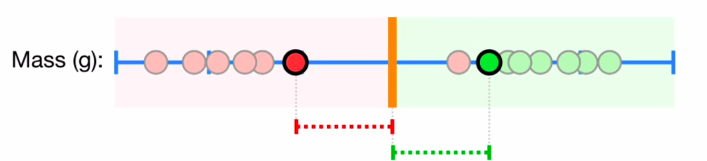

Thus, any red data point within this soft margin that falls in the green zone would be classified as green while the data in the red zone would be classified as red. This soft margin, in contrast to the margin above, need not be the shortest distance from the data to the boundary but can be tuned through cross-validation. This classifier is called a **Support Vector Classifier →** The observations within the soft margins are called support vectors which  can be tuned. In 2D, the boundary  would be a line, in 3D a plane → In general, it is called a hyperplane. 

### Non-linearly seperable data
Now, let us look at new case of drug dosage classification, where the dosage is only safe within a certain range of values and unsafe outside it:


Here, the data is not linearly separable since no single boundary can separate it. Thus, support vector classifiers fail here! One way to tackle this is by transforming this data into a higher dimensional plane. If we square each data point and look at the 2D data, then we see that it is now linearly separable!  

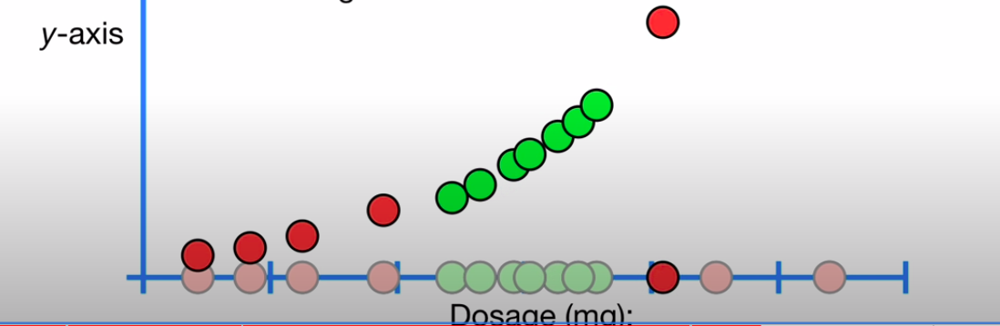

Now, we can create a boundary in this new higher dimensional plane and just map that back to our original plane. This is called a **Support Vector Machine.** The transformation we performed on the data is called a **Kernel,**  and in this case, the Kernel is a $d^n$ kernel with n having the value of 2 → Polynomial kernel.Technically, the support vector classifier is also an SVM in is dimension.


## Math of SVM

### Hard MArgin SVM

For a set of training data $\{x_i, y_i\}$, with $x \in \R^M$  and $y \in \{-1,+1\}$ with the classifications being -1 and + 1 and $i = 1, ...., N$  , let us apply a transformation first

$$
\phi: \R^M \rightarrow \R^D \,\,\, s.t. \,\,\, \phi(x) \in \R^D
$$

Our objective is to fit a line through this data, and so our model is 

$$ 
\hat{y}(\bm{x}) = \bm{w}^T \phi(\bm{x}) + w_0
$$

which implies that classifications are:

- $y_i(\bm{w}^T\phi(x_i) + w_0 ) > 0$ if the classification  is correct
- $y_i(\bm{w}^T\phi(x_i) + w_0 ) < 0$ if the classification is incorrect.

The distance of any training sample from the seperation line line is → $d(\phi(x_i), L) = \frac{y_i}{||\bm{w}||}(\bm{w}^T\phi(x_i) + w_0 )$ 

Now, our optimization problem is to **maximize the minimum distance for each class,** which can be formalized as  

$$
\argmax_{\bm{w}, w_0} M = \argmax_{\bm{w}, w_0} \{\min_i d(\phi(\bm{x_i}),L) = \argmax_{\bm{w}, w_0} \frac{1}{||\bm{w}||} \{ \min_i y_i (\bm{w}^T\phi(\bm{x_i}) + w_0 ) \}
$$

Now, we add some constraints to our Margin → Set $M = 1/||\bm{w}||$ , which essentially means that the minimum distance for our problem has been set to 1 so that we only have to worry about $\frac{1}{||w||}$. In other words, we need to have: 

$$
|\bm{w}^T \phi(\bm{x_i})* + w_0| = 1 
$$

This is only possible if data points satisfy: 

$$
y_i(\bm{w}^T \phi(\bm{x_i}) + w_0 ) \geq 1
$$

If we look at the problem of maximizing $1/||w||$, it is the same as minimizing $||w||$  → Let's add two transformations to it :

1. $||w|| \rightarrow ||w||^2$
2. $||w||^2 \rightarrow \frac{1}{2}||w||^2$

We  see our minimization of $||w||$  is still satisfied since minimizing half of its square will still give us the same result and so minimizing $\frac{1}{2}||w||^2$  should be the same as maximizing $||w||^{-1}$, which was out the original problem. Thus, we now have to find:

$$
\min_{\bm{w},w_0} \frac{1}{2}||\bm{w}||^2  \,\,\, s.t. \,\,\, y_i(\bm{w}^T\phi(\bm{x_i}) + w_0 ) \geq 1 \,\,\,\, \forall \,\,\,\, i = 1, ...., N
$$

This is called the **primal form** → the form we reached using our intuition. We had a maximization type optimization and we converted it to a minimization problem without messing with our original goal. We now have to solve a constrained minimization problem. We solve this by creating a Langrangian Formulation →  a function of the form: 

$$
L(x,y,\lambda) = f(x,y) - \sum \lambda_i g_i(x,y) 
$$

where f is our optimization target and we put constraints on it in the form of $g_i$  which are $\lambda_i$ is the Lagrange multipliers. Our approach to solving this is to differentiate the Lagrangian w.r.t the variables to get critical points

$$\nabla L(x,y,\lambda) = 0 \longrightarrow \nabla f(x,y) = \lambda \nabla g(x,y) $$

and substitute it back into $L$ to get a **Dual Formulation**. So, formalizing our SVM minimization as a Lagrangian with $\alpha$ as our multiplier, we get: 

$$
L(\bm{w}, w_0, \bm{\alpha}) = \frac{1}{2}||\bm{w}||^2  - \sum_{i=1}^{N}\alpha_i [y_i(\bm{w}^T \phi(\bm{x_i}) + w_0 ) - 1]
$$

To minimize this  function, we first differentiate L w.r.t $\bm{w}$ : 

$$
\begin{aligned}
&\partial L/\partial \bm{w} = \bm{w} - \sum\alpha_iy_i \phi(\bm{x_i}) = 0 \\
\implies &\bm{w} = \sum\alpha_iy_i \phi(\bm{x_i}) \\
\end{aligned}
$$

Then, we differentiate L w.r.t $w_0$ as follows:

$$
\begin{aligned}
& \partial L/\partial w_0 = - \sum\alpha_iy_i = 0\\
\implies &\sum \alpha_iy_i = 0 \\
\end{aligned}
$$

Then we differentiate w.r.t w :

$$
\begin{aligned}
& \partial L/\partial \bm{w} = \bm{w} - \sum\alpha_iy_i\phi(x_i) = 0 \\
\implies & \bm{w} = \sum \alpha_iy_i\phi(x_i) \\
\end{aligned}
$$

We now plug the values into our lagrangian: 

$$ 
\begin{aligned}
&\frac{1}{2}||\bm{w}||^2  - \sum_{i=1}^{N}\alpha_i [y_i(\bm{w}^T \phi(\bm{x_i}) + w_0 ) - 1] \\
 &= \frac{1}{2}(\sum\alpha_iy_i \phi(\bm{x_i})  \sum\alpha_jy_j\phi(\bm{x_j})) - (\sum\alpha_iy_i\phi(\bm{x_i}) \sum\alpha_jy_j \phi(\bm{x_j})) - (\sum \alpha_iy_iw_0) + \sum \alpha_i \\
\therefore \,\,\, & L(\bm{\alpha}) = \sum \alpha_i - \frac{1}{2}\sum_i \sum_j \alpha_i \alpha_j y_i y_j  [\phi(\bm{x_i}) . \phi(\bm{x_j})] \\
\end{aligned}
$$

The new Expression → $L(\bm{\alpha}) = \sum \alpha_i - \frac{1}{2}\sum_i \sum_j \alpha_i \alpha_j y_i y_j  [\phi(\bm{x_i}) . \phi(\bm{x_j})]$ is the **Dual Form** of the Maximum Margin Problem. An important thing to notice is that our dual form only depends on the dot products of our data points and thus, we can take advantage of Kernelization to make this independent of the nature of $\phi$ :

$$L(\bm{\alpha}) = \sum \alpha_i - \frac{1}{2}\sum_i \sum_j \alpha_i \alpha_j y_i y_j K(\bm{x_i}.\bm{x_j})$$

And for classifying any new point, all we have to do it replace it in the place of $x_j$ as shown: 

$$\hat{y}_{test} = \sum_{i=1}^{N} \hat{\alpha_i} [y_i(\phi(\bm{x_i}).\phi(\bm{x_{test}}) + w_0 )]$$

and this should satisfy the Karush-Kuhn-tucker conditions: 

1. $\alpha_i \geq 0$ 
2. $y_i(\bm{w}^T\phi(\bm{x_i}) + w_0 ) - 1 > 0$ 
3. $\alpha_i [y_i(\bm{w}^T\phi(\bm{x_i}) + w_0 ) - 1] = 0$

This is the key to SVMs → If $\alpha = 0$ then the point is not contributing to the margin and is not a support vector and for all $\alpha > 0$ , the point $\bm{x}$  is a support vector and contributes to the margin.


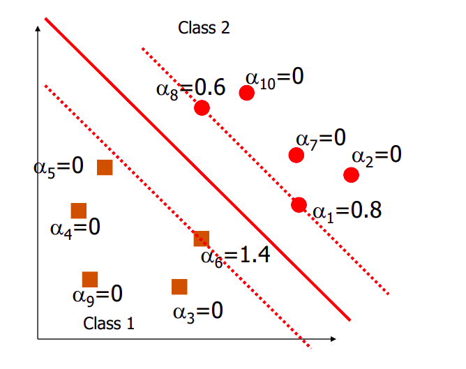

Thus, in summary, the dual expression gives us a set of $\alpha_i$ that represent points that are either support vectors or not. If we want to find the best boundary for these hard margins, all we have to do is compute   

$$
\bm{\hat{w}} = \sum \hat{\alpha_i} y_i \phi(\bm{x_i})
$$

Which we then substitute into the third KKT condition, t get $w_0$ as follows: 

$$
\begin{aligned}
&\alpha_i [y_i(\bm{\hat{w}}^T\phi(\bm{x_i}) + w_0 ) - 1] = 0 \\
\implies &y_i(\bm{\hat{w}}^T\phi(\bm{x_i}) + w_0 ) = 1 \\
\end{aligned}
$$

Now, the y labels are either +1 or -1, and so, $w_0 = 1 - \bm{\hat{w}}^T\phi(\bm{x_i})$  or $w_0 = -1 - \bm{\hat{w}}^T\phi(\bm{x_i})$ , which we can also write as:   

$$
w_0 = y_i - \bm{\hat{w}}^T\phi(\bm{x_i}) 
$$

In practice, we compute $w_0$  by summing multiple such expressions and dividing by $\alpha_i$. A new point will be classified to 

- Class 1 if $\bm{\hat{w}}^T\phi(\bm{x_i}) + \hat{w}_0 > 0$
- Class 2 if $\bm{\hat{w}}^T\phi(\bm{x_i}) + \hat{w}_0 < 0$

### Soft-Margin SVM

The hard-margin constraint is very strong but does not work very well for overlapping classes or spread out data. Thus, we relax the constraints by allowing points to violate the margins → this is quantified by the slack variable $\xi_i \geq 0$ for each point i, which measures the extent of violation.

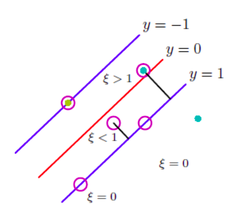

Thus, for point outside the margins $\xi_i = 0$ and for points inside the margin $\xi_i = |y_i - \hat(y(\bm{x_i})|$, and now, our constraint becomes 

$$
y_i(\bm{w}^T\bm{x_i} + w_0 ) \geq 1 - \xi_i
$$

And so, our problem becomes:

$$
\min_{\bm{w},w_0, \bm{\xi}} C \sum \xi_i + \frac{1}{2} ||w||^2 \,\,\,\, s.t \,\,\,\, y_i(\bm{w}^T\phi(\bm{x_i}) + w_0 ) \geq 1 - \xi_i \,\,\,\, \xi_i \geq 0 \,\,\, \forall n
$$

We again formulate the Lagrangian:

$$
L(\bm{w}, w_0, \bm{\xi}, \bm{\alpha}, \bm{\lambda}) =  = \{\frac{1}{2}||\bm{w}||^2 + C\sum_i \xi_i \}- \sum_{i=1}^{N}\alpha_i [1 - \xi_i - y_i(\bm{w}^T \phi(\bm{x_i}) + w_0 )] + \sum_i \lambda_i(-\xi_i)
$$

Which, when differentiated gives the follownig expresions:

$$
\begin{aligned}
&\bm{w} = \sum\alpha_iy_i \phi(\bm{x_i})\\
&\sum \alpha_iy_i = 0 \\
&C - \alpha_i - \lambda_i = 0
\end{aligned}
$$

The interesting thing is that the third expression helps us eliminate $\xi_i$ from the Dual form to get the expression:

$$\sum \alpha_i - \frac{1}{2}\sum_i \sum_j \alpha_i \alpha_j y_i y_j \phi(\bm(x_i)).\phi(\bm(x_j))$$

Which is the same as before. Thus, we can see that the only impact $\xi$ has is in shifting translating the constraint to include misclassifications. Thus, soft-margins allow us to perform the same optimization with an added impact on the classification constraint.

<!-- %%% -->
# MALIS: Naive Bayes Classifier

source: StatQuest

## Multinomial Naive Bayes

Let's take the case of spam classification → we have emails with the combination of words tha  we want to use to classify future emails as spam or not. Let's say they have the combination of the four words : **Dear, Friend, Lunch, Money**. Now, we just count the frequency of these 4 four words in the normal emails and then assign **Likelihoods** to each as follows. Say D = 8, F = 5, L =3, M=1:

$$
\begin{aligned}
&P(D|N) = 8/17 = 0.47 \\ 
&P(F|N) = 5/17 = 0.29 \\
&P(L|N) = 3/17 = 0.18 \\
&P(M|N) = 1/17 = 0.06 \\
\end{aligned}
$$

Now , we do the  same for 7  spam emails:
$$
\begin{aligned}
&P(D|S) = 2/6 = 0.29 \\
&P(F|S) = 1/7 = 0.17 \\
&P(L|S) = 0/7 = 0 \\
&P(M|S) = 4/7 = 0.57 \\
\end{aligned}
$$

Then, we define the ratios for the Normal (N) and Spam (S) : 

$$
\begin{aligned}
&P(N) = 0.67 \\ 
&P(S) = 0.33 \\
\end{aligned}
$$

Thus, now every word combination we get, we just multiply the priors with the likelihoods and compare. For example, If we get **Dear Friend :**

$$
\begin{aligned}
&P(N) * P(D|N) * P(F|N) = 0.09 \\
&P(S) * P(D|S) * P(F|S) = 0.01 \\
\end{aligned}
$$

The key realization is that the product of the priors and likelihood, according to the Bayes theorem,  should be proportional to the Likelihood of email being normal given the letters seen i.e P(N) and the same for spam. Thus, directly comparing the two values above tells us that the email has more chance of being normal → We classify it as normal. But, what if the a word not previously encountered in spam is seen in the email? → Take the example of **Lunch Money Money Money Money  :** 

$$
\begin{aligned}
&P(N) * P(L|N) * P(M|N) ^4 = 2e-5 \\
&P(S) * P(L|S) * P(M|S) ^ 4 = 0  \\
\end{aligned}
$$

This is a problem since it limits our ability to classify → We alleviate this by introducing **placeholder observations** into the spam group. These observations are $\alpha$ in number and can be included in the counting process for frequentist likelihoods to eradicate this problem → so, for the value of 1 additional observation, we get 

$$
\begin{aligned}
&P(D|N) = 9/(17 + 4) = 0.43 \\ 
&P(F|N) = 6/(17 + 4) = 0.29 \\
&P(L|N) = 4/(17 + 4) = 0.19 \\
&P(M|N) = 2/(17 + 4) = 0.10 \\ 
&\\
&P(D|S) = 3/(7+ 4)  = 0.27 \\
&P(F|S) = 2/(7+ 4) = 0.18 \\
&P(L|S) = 1/(7+ 4) = 0.09 \\
&P(M|S) = 5/(7+ 4) = 0.45 \\
\end{aligned}
$$

Using hte  same prior values,  we get :

$$
\begin{aligned}
&P(N) * P(L|N) * P(M|N) ^4 = 1e-5 \\
&P(S) * P(L|S) * P(M|S) ^ 4 = 1.22e-5  
\end{aligned}
$$

Now, we see that the email is more likely to be spam!

### why Naive ?  
Naive bayes treats language as just bag of words and so the score for **Dear Friend** would be the same as **Friend Dear →** In the general sense, for any such problem, the Naiive bayes does not exploit inter-dependencies in value, as seen from the probability segregation into disjoint sets while calculation

## Gaussian Variant

We do the sam process, but this time we create gaussian distributions for the variables to represent likelihoods and thus, we take the points on these gaussian curves as the likelihood values that need to be multiplied by the prior to generate the score

- To manage underflow, we take the log of all probabilities and add them to calculate the score
- The score with the higher log value is the class into which the new observation should be classified

One way to study the impact of different variables is to weight the different classes → weighted log-loss. Cross validation helps in determining which class has more impact

<!-- %%% -->
# MALIS: Maximum Likelihood Estimation

Main Idea: 

1. Make an explicit assumption about what distribution the data was modeled from 
2. Set the parameters of this distribution so that the data we observe is most likely i.e maximize the likelihood of our data 

For  a simple example of coin toss, we can see this as maximizing the  probability of observing heads from a binomial distribution: 

$$
p(z_1, ..., z_n) = p(z_1 ...., z_n|\theta)
$$

If we assume I.I.D condition, we should be able to break this down into:

$$
p(z_1|\theta)p(z_2|\theta)....p(z_n|\theta) 
$$

Formally, let us define a likelihood function as:

$$
L(\theta) = \prod_{i=1}^N p(z_i|\theta)
$$

Now, our task it to find the $\hat{\theta}$ that maximizes this likelihood:

$$
\hat{\theta}_{MLE} = \argmax_{\theta}\prod_{i=1}^N p(z_i|\theta)
$$

Instead of maximizing a product, we can also view this problem as minimizing a sum if we take the log of all values:

$$
\hat{\theta}_{MLE} = \argmax_{\theta}\sum_{i=1}^N Log(p(z_i|\theta))
$$

Let us use this idea for the regression problem. We assume that our outputs are distributed in a gaussian manner around the line w  have to find out. This basically means that our $\epsilon$  is a gaussian Noise that is messing up our outputs from the fundamental distribution, as shown below 

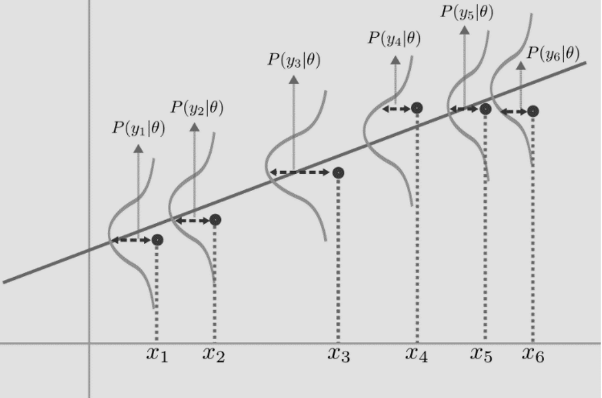

Thus, our equation for getting this probability of our output would be :

$$
p(y_i|x_i; w_i, \sigma^2) = \frac{1} {\sigma \sqrt {2\pi } } exp\{ \frac{ - (y_i - x_iw)^2 }{2 \sigma^2} \}
$$

Our task, therefore, is to estimate $\hat{w}$ such that the likelihood of p is maximized. This, in other words, means find the value of $w$ that maximizes the above expression:

$$

\begin{aligned}
&\hat{w} = \argmax_{w}\prod_{i=1}^N p(y_i|x_i; w_i, \sigma^2) \\
\implies &\hat{w} = \argmax_{w}\prod_{i=1}^N \frac{1} {\sigma \sqrt {2\pi } } exp\{ \frac{ - (y_i - x_iw)^2 }{2 \sigma^2} \} \\
\end{aligned}
$$

we can again do the log trick to make this a sum maximization:

$$
\begin{aligned}
&\hat{w} = \argmax_{w} \sum_{i=1}^N Log(\frac{1} {\sigma \sqrt {2\pi } } exp\{ \frac{ - (y_i - x_iw)^2 }{2 \sigma^2} \})\\
\implies &\hat{w} = \argmax_{w} \{ \sum_{i=1}^N Log(\frac{1}{\sigma \sqrt {2\pi}}) + \sum_{i=1}^N  Log(exp\{ \frac{ - (y_i - x_iw)^2 }{2 \sigma^2} \}) \} \\
\implies &\hat{w} = \argmax_w -\sum_{i=1}^N \frac{(y_i - x_iw)^2}{2 \sigma^2} \\
\end{aligned}
$$

This is basically the same as the normal expression we had, the only difference being the normalizing factor $\sigma$, if we change the negative maximization to minimization:

$$
\hat{w} = \frac{1}{2 \sigma^2} \argmin_w \sum_{i=1}^N (y_i - x_iw)^2
$$

Which is the same as minimizing:

$$
\hat{w} = \argmin_w \sum_{i=1}^N (y_i - x_iw)^2
$$

and the solution is: 

$$
\bm{w} = (\bm{X}^T\bm{X})^{-1} \bm{X}^T\bm{y}
$$

Surprise, Surprise!!


<!-- %%% -->
# MALIS: Linear Regression

**Main ideas :**

- Use Least squares to fit a line to Data
- Use R square
- Use p value

**Fitting the Line →** Try to minimize a metric that represents the fit

- Let the Line be $y(x) = w_0 + w_1x$
- Now, our optimization goal is to find the values of $w_0, w_1$ so that the variation around this line is minimal → We do this by minimizing the squared Errors

To know if taking into the samples actually improves anything or not, all we have to do is calculate the variance around the fit and compare it with variance around the mean of the y values of the point, and give an answer in percentages! This is called the $R^2$ value: 

$$
R^2  = \frac {Var(mean) - Var(fit)}{Var(mean)}
$$

Thus, if this value is 0.6 , we get a 60% improvement in the variance by taking the x features into account. 

Let's go to the interesting stuff → The Math of this all 

## Math of Regression 

Let's take the  case of a set of multidimensional features $\bm{X} \in \R^D \,\,\,$where, $i= 1,...,N$. For each of these set of D dimensional inputs, we have one output $\bm{y} \in \R$. Thus, we have our data as $\{(X_i,y_i)\}$ to which we have to fit a D dimensional hyperplane so that the variance around this hyperplane is minimal. Let's start by defining our model:

$$
\begin{aligned}
&y_i(X_i) = f(X_i) + \epsilon \\
&\hat{y_i} = \hat{f}(X_i) \\
\end{aligned}
$$

Here, the actual data is a function $f: \R^D \rightarrow  \R$ and our hyperplane is function $\hat{f}: \R^D \rightarrow \R$ which produces the targets $y$  and prediction $\hat{y}$, respectively. So, we can check the error between our actual data and the predicted data, which  we call the Sum-of-square error:

$$
\begin{aligned}
&\bm{e} = (\bm{y} - \bm{\hat{y}})^2 \\
&\bm{e} = (\bm{y} - \bm{\hat{y}})^T(\bm{y} - \bm{\hat{y}})\\
\end{aligned}
$$

Here, I have used bold to represent vector notation. since our model is linear, we can define it as:

$$
\hat{f}(\bm{X}) = \bm{X}\bm{w} 
$$

- **Note:** to make this work by taking bias into account we let $\bm{w}  \in \R^{D+1}$ where the D weights are corresponding to D features and the extra weight is the bias. Thus, $\bm{X} \in \R^{NX(D+1)}$ which basically means that our N observations are stacked vertically and each observation is of D dimensions, but to make the notation work, we add a 1 at the start, which will be the multiplier for our bias term, and thus, have D+1 as the dimension of the row.

Thus, our error now becomes

$$
\begin{aligned}
&\bm{e} = (\bm{y} -\bm{X}\bm{w}  )^T(\bm{y} - \bm{X}\bm{w}) \\
\implies &\bm{e} = (\bm{y} -\bm{w}^T\bm{X}^T  )(\bm{y} - \bm{X}\bm{w}) \\
\implies &\bm{e} = \bm{y}^T\bm{y} -  \bm{y}^T\bm{X}\bm{w} - \bm{w}^T\bm{X}^T\bm{y} + \bm{w}^T\bm{X}^T\bm{X}\bm{w} \\
\end{aligned}
$$

Now, to get our optimal weights we follow the method to get the minima of e i.e differentiate e w.r.t $\bm{w}$ and then set it to 0:

$$
\begin{aligned}
&\nabla_w\bm{e} = 0 \\
\implies &\nabla_w(\bm{y}^T\bm{y} -  \bm{y}^T\bm{X}\bm{w} - \bm{w}^T\bm{X}^T\bm{y} + \bm{w}^T\bm{X}^T\bm{X}\bm{w} ) = 0 \\
\implies &\nabla_w(\bm{y}^T\bm{y}) -  \nabla_w(\bm{y}^T\bm{X}\bm{w}) - \nabla_w(\bm{w}^T\bm{X}^T\bm{y}) + \nabla_w(\bm{w}^T\bm{X}^T\bm{X}\bm{w}) = 0 \\
\implies &-2\bm{y}^T\bm{X} - 2\bm{w}^T\bm{X}^T\bm{X} = 0 \\
\implies &(\bm{X}^T\bm{X})\bm{w}^T = \bm{y}^T\bm{X} \\
\therefore \,\, &\bm{w} = (\bm{X}^T\bm{X})^{-1} \bm{X}^T\bm{y}\\
\end{aligned}
$$

Hence, all we need to do is plug-in $\bm{w} = (\bm{X}^T\bm{X})^{-1} \bm{X}^T\bm{y}$ into our original equation and we get the solution. Of course, this is the optimization variant of our regression problem and gradient descent goes around this by computing this solution iteratively by taking an initial guess of \bm{w} and then moving towards the direction of decrease, and moving proportionally to the rate of decrease. However, the solution to which it should end up converging is the same! We can also do all sorts of gymnastics around this solution to make the variance go down even further. For example, we could transform our input $\bm{X}$ to a new space by $\bm{\phi(\bm{X})}$, in which subject to 1-1 mapping, our solution would simply become

$$
\bm{w} = (\bm{\phi(\bm{X})}^T\bm{\phi(\bm{X})})^{-1} \bm{\phi(\bm{X})}^T\bm{y}
$$

The essence of regression remains the same. in the case where $D= 2$, we use this same technique on 2D matrices and those simplistic equation for the starting points of regression that we see in most places.


<!-- %%% -->
# Clouds: Agreement in Distributed Systems

Agreement is the crown problems in Distributed systems → How to make different nodes work together even while they have different view. The Agreement Problem is essentially the scenario that **some nodes propose value v and some nodes propose value v' and now all nodes need to have a way to decide which value to accept!**. The values that these nodes agree on can be something  like 

- whether or not to commit transaction to DB
- Who has a lock in a distributed lock service, when multiple clients are requesting it
- Whether to move to a new stage etc.

The fundamental requirements here are:

1. **Safety →** All nodes agree on the same value, which is  proposed by some node 
2. **Liveness** → If less than some fraction of nodes crash, the rest should still reach an agreement


Failure Models help us understand classes of failures, ad in this case we use 2 models: 

- **Synchronous Systems** → We set a timer and compare the activity of each machine to that. Thus, if the machine is inactive after the timeout, we know there is a failure because either hte machine crashed or the network is slow
- **Asynchronous Systems →** systems can arbitrarily be delayed and so there is no proper way to tell if the machine is just slow or if it has crashed.

Agreement problem comes in two flavors: 

1. **Atomic Commitment Problem** → Participants need to agree on a value but each has its own specific constraint on what makes a value acceptable. Thus, the issue is whether a participant can individually commit or not. For example, people agreeing on a time to meet together is a commitment problem since everyone might not be comfortable at all times.
2. **Consensus Problem** → Participants need to agree on a value and they are willing to accept any value. For example, people have decided when to meet and now the issue is where to meet and everyone is 'fine with any place' as long as they get to meet


## Atomic Commitment

The origin of this problem comes from partitioning DB to store and access them in a distributed manner. For example, in the way of 3 copies of chunks in GFS, and this creates Semantic Challenges → We usually segregate the DB into shards based on certain criteria. For example, a Banking application getting end-client requests from users might segregate it into 3 shards based on User-ID . However, what happens when transactions span multiple shards ? For example, a transaction involving a user in one node and another user in another shard → How do we manage agreement and the related issues of atomicity and sharing ?   

### Single Phase Commit

This is a simple way of managing atomicity in which a transaction coordinator is assigned with the following responsibilities: 

1. It begins the transaction and assigns unique IDs
2. It is responsible for commits and aborts

Many systems allow any client to be the co-ordinator and thus, the servers with the data would be the participants. When a commit is validated by the coordinator, it broadcasts **'commit'** and waits for all participants to acknowledge

- **Issue** → What if one participant fails? The other participants cannot undo what they have already committed, as instructed by the coordinator

### 2-Phase Commit 

Here we break down the comi into 2 phases: 

1. **Voting** → Each participant prepares to commit and votes on whether it can commit or not commit
2. **Commit →** Each participant commits or aborts 

This can be realized through the following operations : 

- `canCommit(V)` → Coordinator asks the participants whether they can commit the value V
- `doCommit(V)` → the Coordinator asks the participant to actually commit the value V
- `doAbort(V)` →  The Coordinator asks te participant to abort the commit process
- `haveCommitted(participant, V)` → Participant tells the coordinator if it actually committed value V
- `getDecision(V)` → Participant can ask the coordinator if V can be committed or not

In the voting process, the coordinator asks the participants whether they can commit or not through `canCommit`. The participants prepare to commit using **permanent storage** and write `prepare-yes` to the log. Once the participant replies yes to the `canCommit`, they are not allowed to abort. However, the outcome of event V is uncertain till the doCommit or doAbort happens. The coordinator, then, collects all the votes. If there is a unanimous yes from the participants, then the commit is a go. However, even if one participant votes No, then the commit is aborted. After Voting the coordinator records the fate in permanent storage and then issues the `doCommit` or `doAbort` to the participants. Following is a timeline of this process:

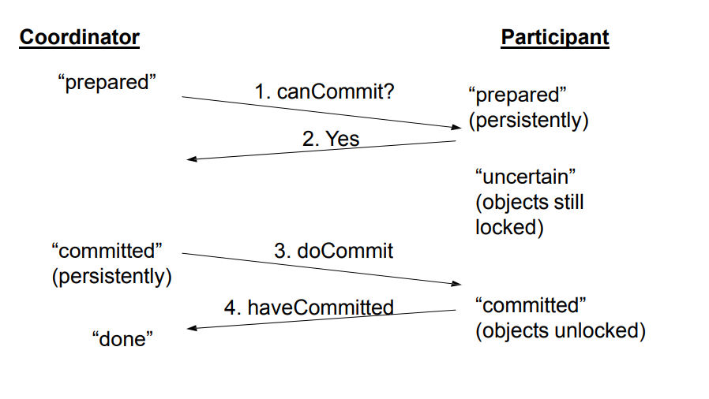

The following figure shows the state transitions for participant and coordinator:

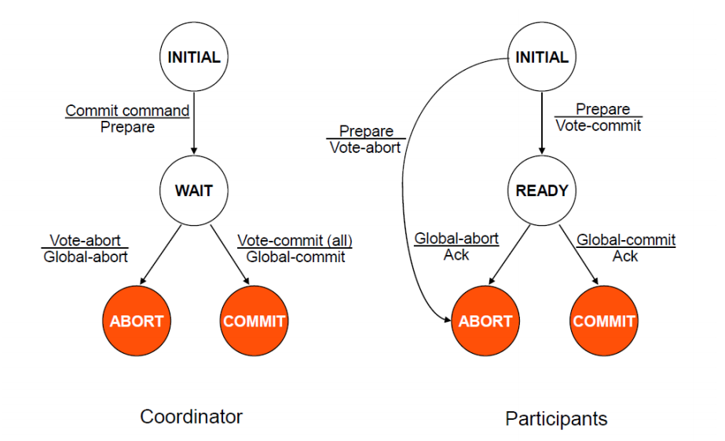

Now, we can see that that recovery in this scenario is easy → since the participants have been logging their state changes, we can track them. However, these can be differentiated on the basis of timeouts and failures. In timeouts, the issue is that the `ACK` has not been sent by the participant while in failures, there will be an `ACK`.

#### Handling Timeouts
From the coordinator's perspective, two timeout scenarios are relevant: 

1. **Timeout happens in the wait state** → In this case the coordinator cannot unilaterally commit or abort
2. **Timeout in Commit or Abort States** → Here, since the commit has already begun, there is nothing that the coordinator can do but wait for `ACK`.

From the perspective of the participants, following scenarios are possible : 

1. **Timeout in Initial State** → The only way this is possible is if the coordinator has failed the change. Thus, unilaterally Abort
2. **Timeout in Ready** →  Since the participant is in an uncertain state where the decision to commit or abort hasn't been made, a **termination protocol** needs to be activated, which can be blocking or co-operative:

In **Blocking** protocols, we the node waits until communication can be re-established. In **cooperative** protocol, 
the node asks the other participants about the information of the commit and proceeds as follows:
    - Q in commit → P can move to commit
    - Q in Initial → P must Abort
    - Q in Abort → P must abort
    - Q in Ready → Contact another proces
    - The protocol blocks if everyone is in READY 

#### Handling Failures

From the coordinator,  the following scenarios are possibe : 

1. **Failure in Initial state** → Start the commit upon recovery 
2. **Failure in Wait state** → Restart the commit after recovery 
3. **Failure in Abort or Commit States** → If all ACKs have been received, do nothing. Otherwise, a **termination protocol** is needed

From the participant , the following scenarios are possible : 

1. **Failure in  Initial** → Unilaterally Abort 
2. **Failure in Ready State** → The Coordinator has been informed already, follow the termination protocol, blocking or cooperative 
3. **Failure in Commit or Abort** → Nothing special needs to be done


**The 2 phase commit is called a blocking protocol because it cannot make progress during failures**. For example, if the TC sends a message to a node and it commits, but then both crash, then all other nodes need to keep waiting for them to recover since they can't be sure of what to do → A could have sent either yes or no to canCommit and so, they can't move forward! → T**his also makes  2PC vulnerable to the failures of the TC Node.** **Thus, 2PC is safe, but not live!**

### 3-Phase Commit

The idea here is to alleviate the blocking nature of 2PC by splitting commit into 2 phases: 

1. Communicate te outcome to everyone 
2. Let them commit only after everyone knows the outcome === ACK


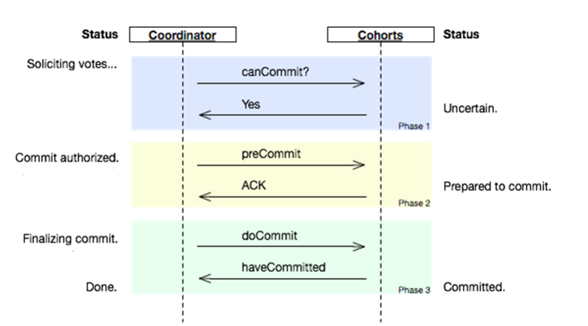

It is clear in the timeline, we now have a preCommit message and an associate ACK, after which the commit can happen. The relevant state transitions now become :

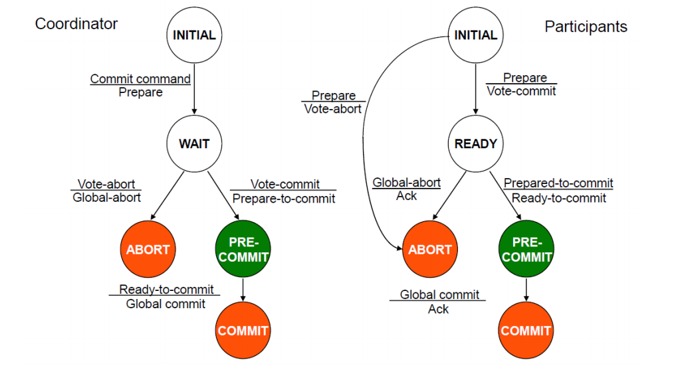

The blocking issue of 2PC can now solved as follows : If both TC and a node fail :-  

- If even one of the nodes has received a pre-commit → They all commit
- If no one received a preCommit → Unilateral Abort

Thus, we now have a live protocol. However, while it is safe in the case of the failure of TC and node,  it is not safe in the cases where TC or node are just offline and not actually crashed. The following Scenario is a good example:

- A receives prepareCommit from TC
- Then, A gets partitioned from B/C/D and TC crashes
- None of B/C/D have received prepareCommit, hence they all abort upon timeout
- A is prepared to commit, hence, according to protocol, after it times out, it unilaterally decides to commit


This is a classic example of Asynchronocity! 3PC guarantees safety and liveness for synchronous machines since in that case we know the upper bound for message delays and can see if timeout exceeds that to determine if a system has crashed or not!

### Fischer-Lynch-Paterson Impossibility Result (FLP)

- Thus, we see that **3PC trades safety for liveness, while 2PC trades liveness for safety.** The obvious question is "**Can we design a system that is both safe and live in the general scenario ? "**
- The answer is **NO!** 
- According to the FLP Result,  It is impossible for a set of processors in an asynchronous system to agree on a binary value, even if only a single process is subject to an unannounced failure.
- However, the FLP result does not talk about asymptotic sense with safety and liveness i.e. it never specifies how close a system can get to Safety and Liveness, without actually ideally reaching it!! This leads us to Consensus protocols like Paxos, Raft that actually get close in practice


## Consensus

The consensus problem for a collection processes $P_i$ can be described as follows:

- The  processes propose values $V_i$ and send messages to others to exchange proposals
- Different processes propose different values, but they all need to accept a single value, which can be any one of the proposed value
- Only one of the proposed values can be chosen and all nodes need to know this one value


This puts the following constraints: 

1. **Consistency** → Once a value is chosen, the chosen value for all working processes is the same 
2. **Validity →** The chosen value was proposed by one of the processes
3. **Termination** → Eventually all processes agree on the same value


### Process Reliance
The core idea behind process resilience is that even if some processes fail, we should be able to deliver to the client's request. to achieve this, we develop methods to **replicate the process** so that we have ways of getting a backup process running

- **K-Fault Tolerant Group** → A group of processes that can mask any K-concurrent failures of their member processes. Here, **k is called the degree of fault tolerance**. 

In this group, we make assumptions about the members:

1. They are all working identically
2. They process commands in the same order

Thus, now we basically need a way to ensure that **Non-faulty group members reach a consensus on which command to execute next**

## Flooding-Based Consensus

### Model

1. The process group is $\bm{P} = \{P_i\}$
2. Every process either fails or runs, there is no mid-way. Thus, the process has a **Fail-Stop model** in which on failure it stops and this allows us to reliably detect failures
3. Each process maintains a list of proposed commands 
4. A client contacts process $P_i$ to request it to execute a command

The fail-stop model basically allows us to detect errors reliably. Thus, we need at least (k + 1) processes running so that if k processes go wrong, we know at least 1 process will go right

### Algorithm

For each round r :

1. At the start of the round, each process $P_i$  multicasts its list of commands $C^r$ to all other processes 
2. At the end of the round, all the commands in the lists of all processes in $\bm{P}$ are merged together into a new set $C$
3. the next command is selected through a **globally shared deterministic function** from the this new set of merged commands : $cmd  \leftarrow select(C_j^{r+1})$

### Example

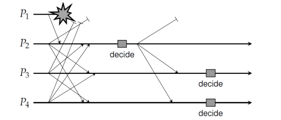

Here, there are 4 processes → $\bm{P} = \{P1, P2, P3, P4\}$ → and at the start of our observation, they all try to share their commands with each other process.  However, in the process of sharing its commands, P1 fails, and thus, only P2 receives the commands from P1. Now, P2 has received the commands from all processes and thus, proceeds to make a decision, but P3 and P4 have not received the command from P1. Since they are maintaining a timer with them, they will be able to reliably detect that P1 has failed, but are not sure if it was able to share any command with P2 or not. Thus, here P3 and P4 do not proceed forward and wait for the next round, in which they move with the knowledge that P1 has failed and so they don't need to wait. Thus, in the next round, when they receive the command from P2, and they make their decision. This works because P2 has factored-in P1's proposed command and since P3 and P4 only wait since they can reliably detect failure, they are able to rely on the next command of P2 since it made its decision based on having received P1's command. 

- In the worst case, we would have only process moving forward since it is the only non-faulty one!

While this model works, its **Fail-Stop assumption makes it non-realistic**. Moreover, the reliability assumption is also not the most realistic one!

## Building up to Paxos 

### Assumptions 
1. Partially synchronous system (Can be even asynchronous)
2. Communication between processes may be unreliable since the messages can be lost, duplicated or  re-ordered
3. Corrupted messages can be detected
4. Deterministic operations → Once an execution starts, we know exactly what it will do 
5. Processes can exhibit Crash failures, but not arbitraty failures
6. Processes do not collude

Here, we need at least ( 2k + 1 ) processes, where if k processes can arbitrarily go wrong, we need k +1 other processes to be non-arbitrary so that we can reliably detect the failure and in the end, at least 1 process will run.

### Starting Point 

We assume a client-server architecture with initially one client. To this, we add a backup server, so that one server is the primary server and the other is the secondary server. To ensure that commands are executed in order, we assign sequence numbers to them, and so, each server executes commands in the same order - whatever that may be

#### 2 Server situation 

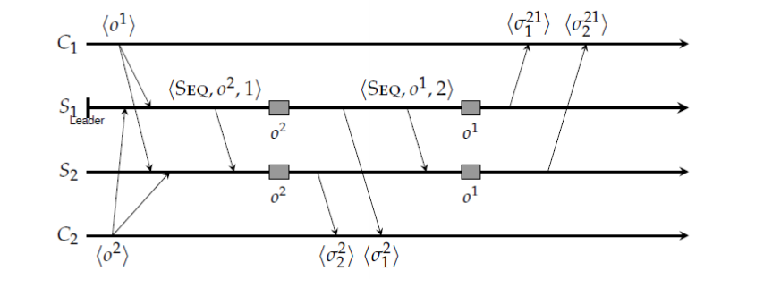

- In this scenario we have servers S1 and S2, where S1 is the primary server - also called the Leader - and S2 is the secondary server. There are two clients C1 and C2, which are requesting operations $o^n$  from the servers. The servers respond to these commands as $\sigma^i_j$ where i is the number of the server and j is the sequence number of the operation.
- In Paxos, a leader sends an accept message  - `ACC(o,t)` - to the backups when it assigns a timestamp t to operation o, and the backup server responds by sending a learned message - `LRN(o,t)`. If the leader notices that it has no received `LRN` from the backups, it re-transmits the `ACC`.
- In the first case, we think of a situation where the primary sends the ACC and then decides to move forward with accepting operation o1, in which case it assigns it sequence number 1 and sends $\sigma^1_1$ to C1. However, S2 never received the ACC and so, looks at its timeout counter for failure and notices that it has been exceeded. It assumes the leadership role and decides to go for o2 first, thus, assigning it sequence 2 and sending $\sigma^2_2$ to C2. **This is a consensus violation.**

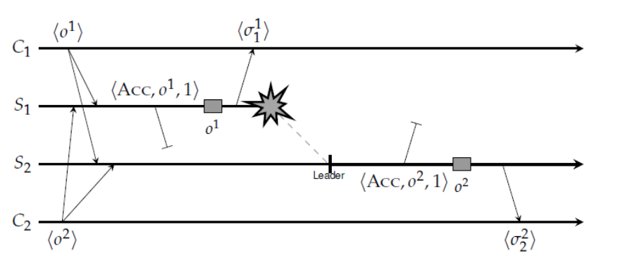

**Solution → Never execute an operation before it is clear that it has been learned**. Thus, if  S1 does not move forward without receiving an LRN from S2, the above situation is rectified since now S1 re-transmits the message till it receives `LRN`, and then both S1 and S2 have a consensus on which operation to perform.

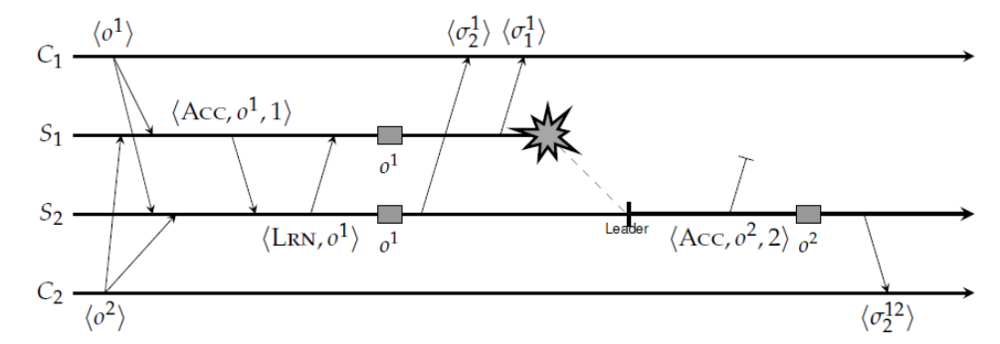

#### 3 Servers with 2 crashes

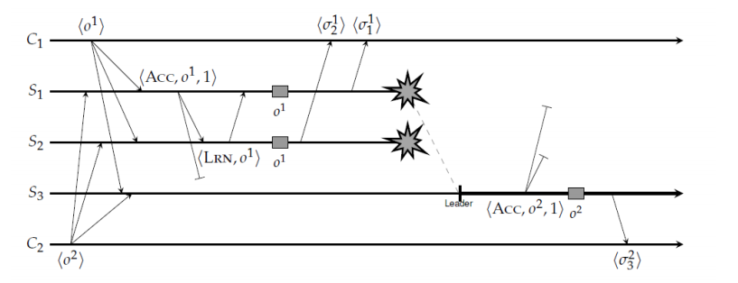

- In this case, we see the same issue and we realize that we need to extend the requirement of not moving forward before receiving LRN to S2 and S3 both. Thus, S1 should not execute unless it gets a LRN from both, S2 and S2. 
- But what if LRN from S2 never reaches S1 ? →  even if the LRN from S2 to S1 is lost, it should wait till it gets LRN(o1) from S3 before proceeding. 

Thus, the **Paxos Fundamental Rule → A server S cannot execute an operation o until it has received `LRN(o)` from all other non-faulty servers.**


### Removing the Failure Detection Assumption

**Let's remove the assumption that the processes can reliably detect crashes.** Thus, in an asynchronous system the only solution is **Heartbeat →** Each server periodically sends an `ALIVE` signal to all the servers, and tracks for this signal using a timer from each server. On timeout, it tries to ping the server to determine if the server is still alive.
- But what if the Heartbeat is delayed ? → Say the heartbeat of S2 is delayed, S1 will assume the leadership and execute and S2 will assume the leadership and execute if S1 is delayed!!

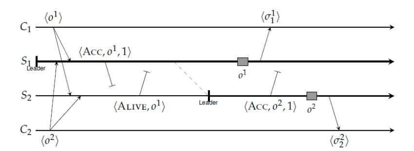

Thus, in this scenario, we need at least 3 servers so that for each server it needs 2 heartbeats to get a majority and then execute consensus. **Extending this to k faults, we need (2k+1) servers to get a majority!**

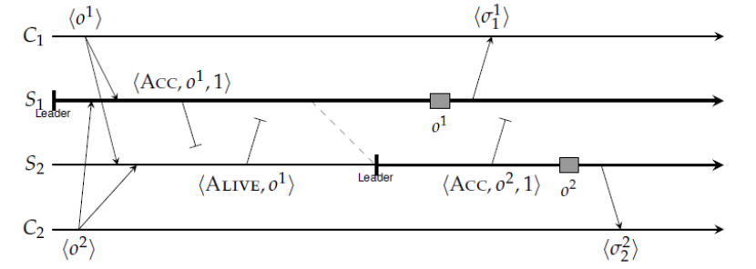

- **Adapted Fundamental Rule** →  In Paxos with three servers, a server S cannot execute an operation o until it has received at least one (other) LRN(o) message so that it knows that a majority of servers will execute o.

Now in this 3 server 1 failure scenario let's look at another possibility. Let's say the Leader crashes after executing o1. In this case, let's say S1 executes o1 and dies, then 2 things can happen:
1. **S3 has no idea of the activity of S1** → S3 never received the `ACC` from S1 so it waits. However, S2 received the `ACC`, after which it detected the crash and became the leader. S2 now sends the `ACC(o2, 2)` to S3, at which point S3 sees the unexpected timestamp 2 and sends a negative back to S2 that it missed o1. Thus, S2 re-transmits `ACC(o1,1)`, and S3 is able to catch-up
2. **S2 missed ACC(o1,1)** → S2 detects the crash and becomes the leader and either sends `ACC(01,1)` to S3, which then either transmits `LRN(o1)`, or it sends `ACC(o2,1)` in which case S3 notices that it was expecting o1 and sends a negative allowing S2 to catch-up

**Thus,  Paxos (with three servers) behaves correctly when a single server crashes, regardless of when that crash took place.**

### False Crash Detection

What if the ACC by S1 is highly delayed? → In this case, S2 detects a failure and becomes a leader, while S3 receives `ACC(o1,1)` after `ACC(o2,2)`. This can be solved by adding the identity of the current leader in messages. 

- However, Paxos can still come to grinding halt when LRN form S3 is lost, which blocks S1 and S2 from doing anything → It is not Live

### Liveness in Paxos
To deal with Liveness, we add an explicit Takeover of leadership where before a takeover, the server  has to deal with any outstanding tasks by the former leader → This takeover needs to be communicated explicitly to all the servers


## PAXOS Actual Protocol

### General Rules on Protocols 

Each proposal has a unique number, so that:
- Higher numbers take priority over lower numbers
- The proposer should be able to choose this number to be higher than anything it has ever received or seen.This can be implemented by setting Proposal Number to be a concatenation of Round Number and Server ID, so that each server stores the maxRound - the Largest round number it has seen so far and a new proposal number can easily be generated by incrementing the maxRound and concatenating it with server ID. 

Each Node maintains four variable  : 
- `my_n` → my proposal number in the current Paxos
- `n_a` → higher proposal number accepted
- `v_a` → value corresponding to the highest proposal number
- `n_h` → highest proposal number seen

### Propose Phase
- A node decides to be the leader and propose
- proposer chooses `my_n > n_h`
- leader sends `<preapre, n>` to all nodes 
- Upon receiving `<preapre, my_n>`: if `n < n_h` → reply `<prepare-reject>`, else → reply `<prepare-ok, n_a, v_a>` and update `n_h = n`.

### Accept Phase
- If the leader gets a majority of `<prepare-accept>` → It sends `<accept, my_n, V>` to all nodes, where V is `n_a` if it is not null, or a random value
- If majority is not there, then restart Paxos
- Upon getting `<accept, n, V>`, the nodes: reply with `<accept-reject>` if `n < n_h`,  else → update `n_a = n,  v_a = V, n_h = n` and send `<accept-ok>`

### Decide Phase
- If the leader gets a majority of `<accept-ok>` then it sends a `DONE`  to the client
- It keeps sending `<Decide, v_a>` to all nodes until it gets `<Decide-ok>` to ensure no nodes are left behind


<!-- %%% -->
# Clouds: Concurrency and Consistency 

The major issue here is solving the scenario of multiple people trying to access the same database. For this, let's assume we have a pointer to the DB or its attribute, or whatever  → X. We can read and write to X. Now, if we want to do two operations on X, say subtracting 20 and adding 10, we need to do these operations in isolation. If we interleave these operations, we can get a situation where subtracting 20 and adding 10 to 100 might result in a final value of 110. The clearest solution is Do not perform simultaneous R/W to the Db. However, this does not exploit the fact that most DBs are on multiple cores and thus, can actually benefit from parallel execution of queries. Moreover, if this value 100 is, say, the value in our bank account and while executing the query there comes a failure, then how do we handle that? → We need to build failure tolerance into it.

## Transactions
Transactions are a sequence of one or more SQL operations treated as a unit. These transactions appear to run in isolation and changes are only registered if they are complete. Thus, if our system fails, then we restart the incomplete transaction which would be the ones that were not registered. The correctness of transactions is determined by the **ACID Properties**:
- **A**tomicity →  Either all actions in the transaction happen, or none happen. In other words, transactions can't be done partially → They are atomic.
- **C**onsistency → If the DB starts consistent, and all transactions are consistent, then the DB ends up consistent
- **I**solation → Execution of one transaction is isolated form another transaction.
- **D**urability → If a transaction commits, its effects persist.

### Atomicity
A transaction might **commit** after completing all of its actions, or **abort** after completing none or partial action. The key point is that from the user's point of view, a transaction always executes all, or none, of its actions → There is no sense of partial completion. This can be implemented in 2 ways :

- **Logging →** DBMS logs all the actions so that it can undo actions for non-atomic transactions in case of failures (Think Github )
- **Shadow Paging →** While executing a new transaction, the execution is done on a shadow of the original DB units, so that any intermediate failures will not hamper the concurrency of the original unit (Think caching). Once the  transaction is complete, all the units that referred to the original page are updated to refer to the shadow page

### Durability
It has 3 phases when a crash occurs

1. **Analysis →** Scan the log from the most recent checkpoint to see for all the actions that were active when the crash happened
2. **Redo →** Redo the updates as needed so that all the logged updates are carried-out and written to the disk.
3. **Undo →** Undo the write of all the transactions that were active at the crash.


Thus, at the end only the commited updates are reflected in the database

### Consistency
We need to enforce the integrity constraints in the database so that the input and the output of consistent transactions are consistent Databases

### Isolation
Each transaction operates as if it were the only transaction running.  This is done by the database in a fashion where the interleaving of operations do not result in simultaneous updates. For example, transaction $T_1, T_2$ are shown below which operate in isolation

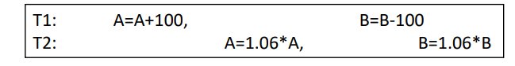

## Anomalies in Concurrency 

There are 3 kinds of anomalies that usually occur: 

- **Reading Uncommitted Data** → When the data has not been committed and we read it in the middle of interleaving, it creates **dirty reads**. So, in the example shown below, T1 did not commit after Reading and Writing to A and the un-committed value was read by T2 from A and was committed, which is wrong. 

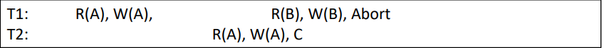

- **Unrepeatable Reads** → The reads do not produce the same value. In the below example, T1 reads A and then again reads it to verify, but T2 comes in the middle and Writes something leading to the 2 reads of A by T1 not producing the same result.

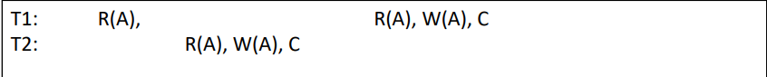

- **Overwriting Uncommitted Dat**a → Data is written over before being committed, as seen in the example below where T1 writes to A and B and commits, but before it committed, T2 has already written values to A and B, and thus, the data is  not the same.

**We solve this through serializability!** But for that we need to define **Conflicting Operations** → Two operations conflict if they are performed on the same data by different  transactions and one of them is a write


## Schedules
Scheduling is creating a schema Interleaved actions from different transactions. These can be done in three manners: 
1. **Serial** → does not interleave data
2. **Equivalent** → 2 schedules creating equivalent effect. Schedules are conflict equivalent  if they involve the same actions on the same data and the conflicting actions are ordered the same way
3. **Serializable**→  A schedule that is equivalent to some serial execution of the transactions. Schedules are conflict serializable iff a schedule is conflict equivalent to a serializable schedule

Let's take an Example:

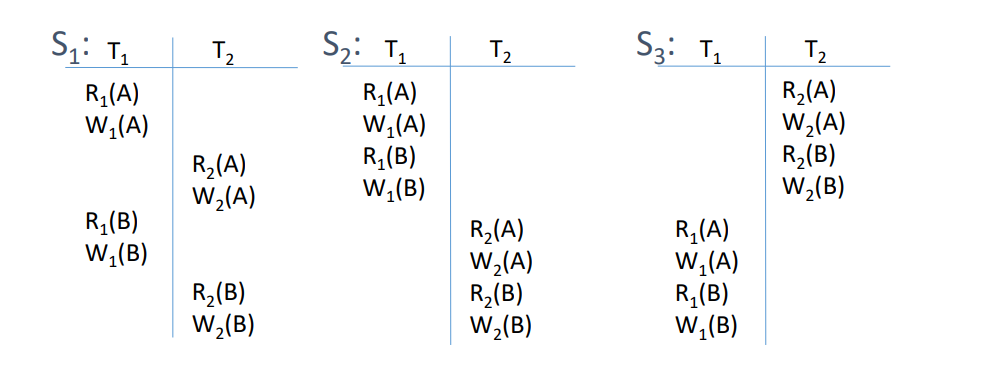

Here, we have schedules $S_1, S_2, S_3$  working on DBs A and B, and the conflicting operations are: 

$$
\begin{aligned}
&R_1(A) \leftrightarrow W_2(A) \\
&R_2(A) \leftrightarrow W_1(A) \\
&W_1(A) \leftrightarrow W_2(A) \\
&R_1(B) \leftrightarrow W_2(B) \\
&R_2(B) \leftrightarrow W_1(B) \\
&W_1(B) \leftrightarrow W_2(B) \\
\end{aligned}
$$

Now, in $S_1$ and $S_2$ we see that for the case of both A and B, $R_1$ and $W_1$ precede $W_2$ and $W_1$ precedes $W_2$ in the same manner. Thus, $S_1 \equiv S_2$ . Moreover, we see that $S_2$  is a serial schedule, thus, $S_1, S_2$  are serializable, but this is not the case with $S_1, S_3$ since the actions of the T2 come before T1.

### Precedence Graphs

We can formalize the check for conflict serializability in schedules by the simple process of swapping adjacent non-conflicting schedules to see if we get a serial schedule or not, as shown below 

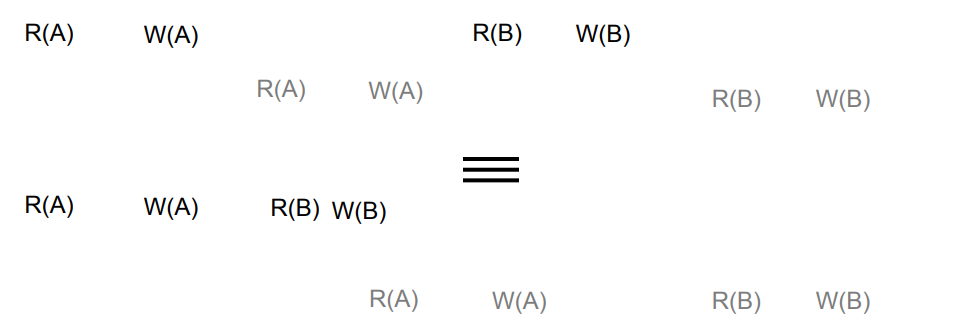

But an even better way is to see it in terms of a precedence graph. So, we just go along the order of operations in a schedule and for each conflict, we see if which transaction's operation precedes, and we make a connection on the nodes name after transactions in that order. For example, in the schedule below, we see that in the cases of A and B both, the operations of the first transaction precede that of the second, and so we have a single like from the first to second in the graph.

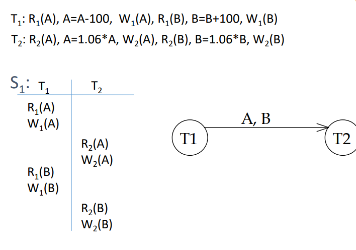

If we have a graph with cycles, then we know that the  schedule is not conflict serializable, as shown in the example below

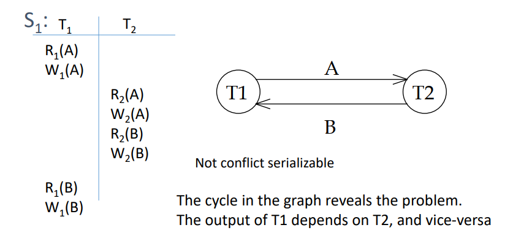

Voila! now we have a framework that tells us that if our schedule of interleaved operations is conflict serializable, then it is a valid schedule, and thus, the transactions would crate valid databases if acting on a valid Database! Voila! now we have a framework that tells us that if our schedule of interleaved operations is conflict serializable, then it is a valid schedule, and thus, the transactions would crate valid databases if acting on a valid Database! 

## 2PL Locking 

There is a better way to ensure that our schedule is conflict serializable → Locking. We create two kinds of locks

- **Shared Lock** → Acquired by the Transaction for reading the  object and can be acquired by multiple transactions at the same tie - hence, the name shared
- **Exclusive Lock** → Acquired b the transaction while writing to an object and can only be acquired by one transaction at a time

The rule is → once a transaction releases a lock, then it can't acquire any more locks. Thus,  we can have a graph showing the slow growth phase of acquiring locks nad a release phase of  releasing locks

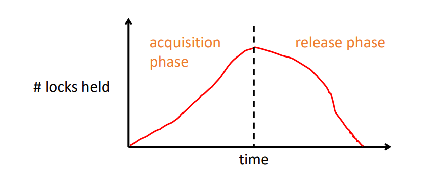

Thus, if our system sticks to this schedule, then it will be conflict serializable. However, this leads to a problem of cascaded Aborts, where the issue is that in case a data  object is written to before the first transaction aborts the operation, then it might lead to issues, as shown below: 

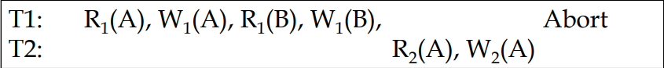

To alleviate this we create a stricter 2PL where the release happens all at once for each lock and thus, after acquiring alll locks the transactions wait to complete everything and then release the locks, resulting in the graph shown below:

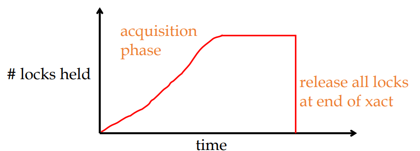

## Networked File System (NFS)

It allows remote hosts to mount file systems over a network and interact with those file systems as though they are mounted locally. This enables system administrators to consolidate resources onto centralized servers on the network. The schematic is shown below: 

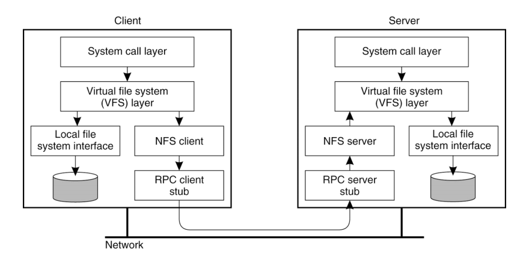

- The communication is over TCP/IP and Remote Procedure Calls (RPC) encapsulates the low-level data handling on the network into a set of procedures that can be used by the code, by creating procedures for API calls on client-side and executing these procedures on the server-side. Some common RPC frameworks are → **SOAP, gRPC, Thrift** 
- So, the naive way to design the FS would be to forward every Fs operation over RPC to the server and thus, make the system operate as if they are working on the same filesystem. However, **the volume of RPC calls adds latency** → So we add client-side caching to this!

### What do we cache?
- Read-only files
- Data written by client machine → **write-back caching →** Issue of failure tolerance
- Data written by other machines → Issues with consistency

### What about Consistency?
- NFS Caches Data and File Attributes. The data never expires, but the file attributes expire after 60 seconds → so if a file is modified, the new time is reflected in its attribute in the server, and thus, it can be checked and updated on each client.
- Dirty data are buffered in the client machine until the file closes or till 30 sec → If the machine crashes between that, everything is lost
- Thus, **NFS sacrifices consistency for less traffic**
- **Close-to-open consistency →** We can write a way to ask the server for the latest file everytime before opening it!
- NFS does not provide any guarantee for multiple writes.

### What about Failures?
- NFS uses a stateless server → The NFS server does not track anything but instead checks for permission for each operation
- No pending R/W operations across crash
- Read request needs to get an exact positin of hte file →
- Operations ar  Idempotent → operations use unique ID of files and so, cannot be confused
- Write-Through Caching

## Andrew File System (AFS)

In this, the files share the same namespace across machines but work with the assumption that the client-side machines cannot be trusted → thus, they must prove that they have the rights to perform certain operations → this is implemented through modifying RPC to Secure-RPC. TThe client Machines have disks and these can be used for caching. Thus, they  realized the following characteristics, which were then incorporated: 
- It's very rare for simultaneous R/W → they found this through analysis. Thus, they started aggressively caching on local disks to reduce the traffic load → **Close-to-open consistency is fine!**
- **Prefetching** → Large reads are faster than a lot of small reads on local disks and so, they fetched the whole data of the file
- **Invalidation Callback**  → Clients registers with the servers when they have a copy of the file  and when this file changes, the server tells them to invalidate this copy → If the server caches, then we reconstruct callback  information by asking every client what file they have cached

## Google File System (GFS)

Here, the following desing constraints are taken into account 

1. Machine Failures are normal 
2. Designed for Big-Data workloads
3. Many files are written once and they are read sequentially 
4. High bandwidth is more important than latency 

Thus, the GFS is geared towards these characteristics and the google applications are designed to work with this. A file is divided into chunks and labeled with 64-bit global IDs - called handles - which are then stored on **chunk servers.** Each chunk is stored 3 times on 3 different chunk-servers, and the master keeps a track of the metadata → which chunks belong to which files

## Theory of Consistency
- Consistency concerns arise when we are replicating or caching files.

**Replication** → Maintain data in multiple computers. It is necessary for
- Improving performance → Closer data is faster
- Increasing availability of services → To handle server and client crashes
- Enhancing the scalability of systems → E.g. CDNs  that store the data locally and then
- Securing against malicious attack

In a Distributed system, we store data in distributed shared memory, distributed databases, or distributed file systems → **referred to as data-store** 

- Multiple processes can access shared data by accessing any replica on the data-store

## Distributed Shared Memory

Communication in Distributed system happens through either sharing the memory or message passing. Shared-memory is more intuitive for consistency and so is more popular. The goal, thus, is to create a distributed system of memory shared by multiple systems, but each system thinks that it is accessing the same memory from the large memory pool! 

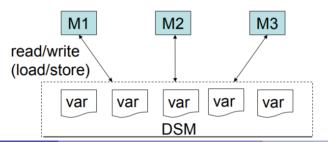

The naive way to do this would be through local copies of the whole memory with all the machine so that
- **Read** → Machine reads from local memory → Fast
- **Write** → The updates are sent to all the memory copies, while the machine does not wait for this to complete

So, in a way, this approach is basically message-passing applied to shared memory. This is fast, but has the following problems:
1. Since we  are not waiting for ACK after a write operation, what if the message gets lost and the order of delivering messages gets messed up → Since we have no control, we will see weird behavior
2. Since we have no control over the order of updates, what if there are disagreements in udpates ?


## Models of Consistency

In brief, consistency can be summarized as a contract between nodes that the last write of the data is shared. Let's take an example, that we will use again and again, to explain consistency models. Here, we have P1, P2, P3, and P4 as processes that are trying to read and write to the same variable x in the shared memory. The question is that if P1 writes a and P2 writes b, then what do P3 and P4 read?

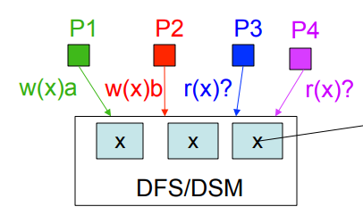


### Strict Consistency

Each operation has a global timestamp and the order of execution is determined by sorting this. The rules are 

1. Each operation gets the latest value of the variable → Reads are never stale  
2. All operations are executed in the order of their timestamps 

In this case, P3 and P4 will always observe b due to the time stamping of strict consistency → It is like running the process on one processor, where we use semaphores to work with x for all the processes → Target Achieved?

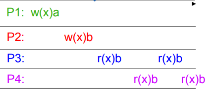

The issue is the implementation → We need to make the processes wait for write operations to complete before read → this take  time and so we need exact clock synchronization. Computer clocks experience drift in their quartz crystals → leads to change in the rate of the timer interrupts used for maintaining time → Thus, we need **Universal Coordinated Time (UTC)**. The Cs-133 atom-based time is broadcast → the computers can receive this signal and synchronize their clocks. However, even nanoseconds might create issues! **Thus, strict consistency is hard to implement**

### Sequential Consistency

We let go of the assumption of synchronizing in real-time, and instead focus on preserving the order of events so that logical outputs are not affected. Thus, we now have the following rules: 
1. Each machine has an order on its own operation
2. Results appear according to **some total order**

Thus, Reads may be stale in terms of real-time, but not in logical time but the writes are strictly ordered! Hence, the output of this on our example would be . For example, in the picture below the second case, which was not possible in the case of strict ordering, we now observe a dirty read. However, if we look at the order of the events, the read of b always happens after the read of a in both the machines. Hence, we still have the same logical order of operations and thus, our program  will be sequentially consistent

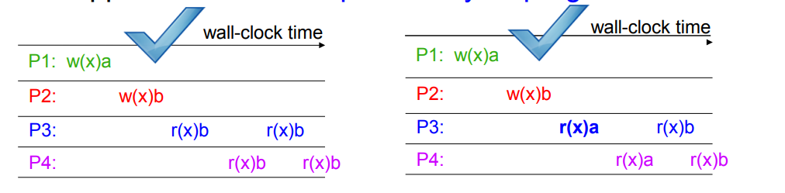

This is easier to implement than strict consistency since now we can interleave the operations and again if the operations are concurrent serially through the mechanism discussed before, we can have the same execution of programs. 

- Requests to an individual memory location (storage object) are served from a single FIFO queue → Writes occur in a single order and the read happens only after the writes have occurred, thus maintaining consistency

**Thus, we can say that not that all processes agree on exactly what time it is, but that they agree on the order in which events occur** → This is the difference between timed and ordered processes. However, this is still expensive due to communication and wait times!

## Lamport Logical Clocks

The basic idea is understanding which event happens before, which is represented by the '→ ' symbol. This is a partial order since there might be instances in a set of orders where the exact order cannot be determined, but the final order is clear.

Now, we need to use this relation to establish Logical clocks and we do this through **Lamport's Logical Clocks,**. We, first attach a counter to events so that, events (e) satisfy the following properties: 
- **P1** → If a and b are two events in the same process, then they would be preserved in the time in which they take place $a \rightarrow b \implies C(a) < C(b)$
- **P2 →**  If  a corresponds to sending a message and b corresponds to receiving that message, then also  $C(a) < C(b)$

Using these properties we have a counter $C_i$ attached to each process $P_i$, such that
- For each new event in $P_i$ , we increment $C_i$ by 1 
- Each time a message is sent from $P_i$, it receives a timestamp of the value of $C_i$ so that → $ts(m) = C_i$
- Whenever $P_j$ receives a message from $P_i$, it adjusts its local counter as → $C_j = \max \{C_j, ts(m)\}$


This lamport ordering is based on the events and not the other way round. Thus, $C(e) < C(e')$  does not imply $e \rightarrow e'$, meaning  it does not encode causal relationship. So, if I have $C(a) < C(b)$ then this does not mean that a necessarily preceded b! This is an issue for concurrency 

### Vector Clocks 

We increase the counter to a vector of counter for k processes, so that : 

- Each process $P_i$ has its counter vector that has its counter at $C[i]$ while the count of all other k-1 processes at the other places
- Whenever a process happens, the process increments the value of $C[i]$ by 1, while all other values remain the same
- When it has to send a message, the process now shares the whole vector to the other process
- The process $P_j$ which receives the vector updates its vector to the new value and increments the count of its own by 1 and then follows whatever it has to do

An example of this is shown below: 

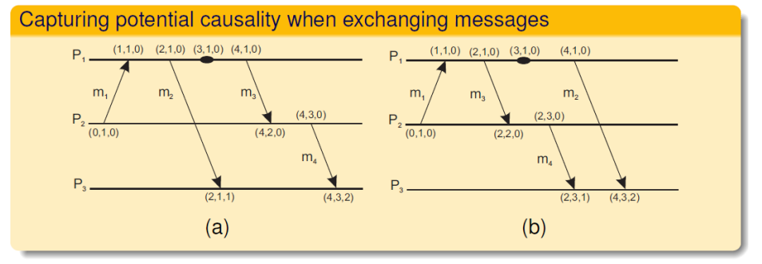

Here, we can see that in part a, all the processes start with values (0,0,0) and this then goes on as follows:

- P2 sends does performs an operation incrementing its counter by 1 in the vector while all other remain 0
- P2 sends a message to P1, which copies the vector and increments its counter by 1
- P1 performs an operation and increments its counter by 2
- P1 sens a message m2 P3, which receives m2 and updates its own counter b 1 after copying the vector
- P1 performs 2 more operations and then sens m3 to P2, which copies the value and increments its counter by 1
- P2 performs and operation j and increments its own counter by 1 and then sends the message m4 to P3, which updates its vector and adds 1 to its counter, which was previously at 1 and so the resulting vector is (4,3,2) instead of (4,3,1)

We now define a causal relationship based on the property that **if any message has all its vector value  < or = the values of the vector of another message, and at least one of the values is strictly less, then it causally precedes the other**. So, in this case, ts(m2) = (2,1,0) while the ts(m4)  = (4,3,0), which implies that m2 may causally precede m4. In case (b) we see that ts(m2) =  (4,1,0) while the ts(m4) = (2,3,0) → Thus, m2 and m4 may conflict.

## Causal Consistency

If all causal operations are executed in an order that reflects their casual relationship, then the executions are causally consistent! So if two operations are concurrent, then they can be read in different orders by different machines, till the time the causal order is followed. For the same process example below as other consistencies:

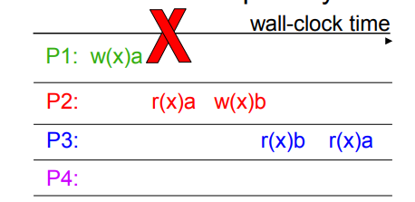

The issue here is that we see that that P1 writes a, and then P2 reads a and writes b. Since write of b happened after P2 reading a, there might be a causal relationship between P1s write of a and P2s write of b. Thus, when P3 reads b, then it cannot read a again since the writes are not concurrent → We can also reason in terms of messages.  Assume the processes start with a null value for x. Now, after P1 writes a to x, the only way P2 can read a from x is if P1 has sent a message. Thus, when P2 writes b to x, which is clearly happening after it reading a, we can say that the  write of b is causally related to the write of a by P1. Thus, the only way  P3 can read b form the variable is whe P2 sends a message of update to P3. Since no other write has happened after P3 reading b, it is not possible for it to read a again. However, if we modify this as follows:

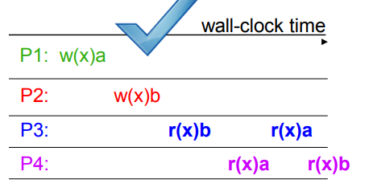

Now we see that the write of b happens after the write of a, and since there is no global time tracking the writes, these operations might not be causally related and thus, concurrent. Hence, if P first reads b and then reads a, it is acceptable since the writes are concurrent, and the same reasoning allows P4 reading in a different manner! this is very much possible if P1 writes a and sends the message to P4 → In terms of messages, we can see that if P1 writes a and P2 writes b, then essentially they are free to write to the variable since there is no read happening before the write i.e this is possible even if no message is exchanged between the processes. Now, P3 reading b is possible if a message is exchanged between P2 and then it reaching a is possible if it receives another message from P1 on the update. Similarly, P4 reading a is possible if it receives a message from P1 after its update, and then reading b is also possible since it can easily receive a message from P2 after it writes b to x. Hence, this is causally plausible and is thus, consistent
- **Causal consistency is strictly weaker than sequential and strict consistency, but one can get better performance with it since parallel operations can be executed in different orders by different machines.**


<!-- %%% -->
# Clouds: Apache Spark 

The main issue with MapReduce is the read/write from and to the disk. For example, in the case of K-means, the main steps are: 

- **HDFS Read** → Map → Network Shuffle → Reduce → **HDFS Write**

Now, the issue with the R/W operations is the issue of accessing data from the memory and disk → **Random Access from disk is slower, but it offers a larger volume of data**. So, the question is should I store my data on disk or in Memory? 

The answer → if the data is accessed more than once in 5 minutes, cache it in memory; otherwise, store it on the disk → [The 5-minute rule](https://www.hpl.hp.com/techreports/tandem/TR-86.1.pdf)

### Economics of Data Access 
- If I have 2000 euros per access from disk and 5 euros for KB of data in memory, then for each kb of data we save 2000 euros for every 5 euros we spend on memory each second. If our rate of access of 1 access per 10 secs, we save 200 euros, and this trend continues. The break-even point is 400 secs, which is roughly 5 minutes. Hence, the 5-minute rule.
- Now, HDFS stores all data in the disk and so, nothing is cached in memory → misaligned with the 5 minutes rule. Plus, Map and Reduce are too simple computationally.

## Apache Spark 
- **Let's keep the good stuff from Hadoop, but also add the touch of memory and added functions**.

The main workflow is shown below:

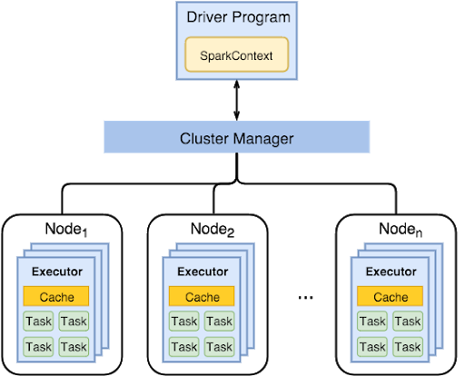

- While in MapReduce we had only 1 master to assign worker nodes as Map and Reduce, in spark we have a separation where there is a driver program scheduling the applications and the executions, while the cluster manager allocates the resources. The primary advantage is that the driver program can be initiated with a spark-context that holds the main configuration and is flexible to different kinds of configurations - single-threaded, multi-threaded, local, distributed, etc. - and thus, allows managing different operations. 
- The cluster manager sends app-codes and tasks for executors to run. The workers have a cache that they can use to run their bits composed of locally schedules tasks, in an isolated manner .
- There is no data shared between workers,  but the executors within workers share the same virtualization. Thus, if we have 2 applications, they can be run on 2 different workers and can have multiple tasks that can be scheduled in executors that share the data, and execute each task as a thread. In MapReduce, this would be executed in a purely distributed manner through mapper nodes with overheads for each. **Thus, overheads are reduced in spark.**

## RDD

Resilient Distributed Datasets extend the concepts of functions to data-structures. Thus, they are immutable objects that either point directly to a data source (HDFS), or apply filter transformations to parent RDDs. Thus the functions are of two types: 

1. **Transformations** → Apply to RDD and return an RDD. E.g., map, filter, groupBy, sortBy
    - They are lazily evaluated → Only triggered through actions
2. **Actions** → Use an RDD to return values

Thus, we can write applications as transformations on RDD and need to only execute them based on actions determined on the time on which they need to be executed. This is similar to the lambda functions in python → They work Lazily. 

The execution steps are:

1. Create DAG of computation
2. Create a Logical execution plan with as much pipelining as possible 
3. Partition the tasks into nodes
4. Determine Dependency and Split DAG into “stages” based on the **need to shuffle data** → determined by the kind of function in the stage
5. Submit Each stage and its task as ready
6. Launch task via Master
7. Retry failed and straggler tasks 
8. Execute tasks
9. Store and serve blocks

The dependency mentioned in step-4 can be of two types: 
- **Narrow Dependency** → The mapping from parent to Children RDD is on a 1-1 basis i.e each parent RDD will share data with at-most 1 child RDD. Thus, there is no shuffling step in the middle which reduces overhead. e.g `map`. `filterMap`, `filter`, `sample`.
- **Wide Dependency** → Multiple child partitions may depend on one partition of the parent RDD. E.g. `sortByKey`, `reduceByKey`, `groupByKey`, `cogroupByKey`, `join`, `cartesian`.

The key idea in creating a pipeline is to look for shuffling → If we have a group of tasks that do not require shuffling, we can group them together as a stage, and then shuffle. Thus, the stuff in one stage can be executed iteratively. For example, in the DAG shown below: 

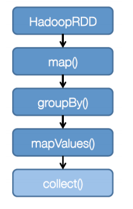

We know that `groupBy()` requires shuffling but the `map()` does not. Thus, we break a stage here. Then, we see that   `mapvalues()` function does not require shuffling, so we have two stages as shown below:

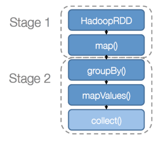


## RDD and Spark
- **We can cache outpus in the memory improve performance!**

Let's take the example of Log Mining, where we want to see the error log to look for certain kinds of error like MySQL and php. The following code template would be used for reference:

```python
lines = spark.textfile("hdfs://...)
errors = lines.filter(lambda s: s.startswith("Error"))
messages = errors.map(lambda s: s.split("\t")[2])
messages.cache()

messages.filer(lambda s: "mysql" in s).count()
```

Here, we are taking an HDFS file and filtering for the word "Error" in it. Then, we split it around tabs "\t" and look at the second element in the split array. This output is cached. To this cached output, we apply the filter for "MySQL", to search for SQL errors. If we were to close the code till the cache, the output would still be there when we apply MySQL query to it. Now, if we add a PHP query later to this 

```python
lines = spark.textfile("hdfs://...)
errors = lines.filter(lambda s: s.startswith("Error"))
messages = errors.map(lambda s: s.split("\t")[2])
messages.cache()

messages.filer(lambda s: "mysql" in s).count()
messages.filer(lambda s: "php" in s).count()
```
It would only work on the cached output, and not repeat the process before it. Thus, the new computation would only happen on local machines, and the data would be fetched from the memory instead of the disk. This is the key feature that makes spark aligned with the 5-minute rule: **We can cache the computations that are being accessed regularly while keeping the rest in disk!!**

### Failure Tolerance 
The RDD abstraction is immutable, and simultaneous updates are not allowed. Thus, it can be cached and shared across processes and tasks! This allows failures to be taken into account easily.


<!-- %%% -->
# Clouds: MapReduce

MapReduce is a programming model and an associated implementation for processing and generating big data sets with a parallel, distributed algorithm on a cluster.

## Key Ideas behind MapReduce 

### Scaling out instead of scaling up
If we have workloads that are data-intensive, it is preferable to do it on a large number of commodity low-end servers (Scaling out) instead of a small number of high-end servers (Scaling up). This is because the scale-up approach is costly since the **costs of machines do not scale linearly** and the costs associated with the operational issues like energy required for cooling etc. are additional overheads that turn out to be less flexible for the latter. Thus, most MapReduce applications are built for low-end servers. Scaling-out leads to the following implications: 

- Processing Data is quick, but I/O is really slow due to the network bottleneck imposed by low bandwidth
- There is flexibility in what the computers end up sharing → In a shared-nothing architecture, all the systems are performing individual computations and only haring the relevant data as managed by a distributed file system

### Failure is the Norm, not the Exception

In clusters, failures are not only inevitable but commonplace. Mature implementations of the MapReduce programming model are able to robustly cope with failures through a number of mechanisms such as automatic task restarts on different cluster nodes.

### Data Locality Principle

In traditional HPC applications, the servers are segregated into **storage** and **compute nodes** linked together by a high-capacity inter-connect. However, many data-intensive workloads do not require a high processor capability and so, this segregation creates a bottleneck. It is more efficient to move the processing around instead of the data by co-locating the processor and the data storage and running the job on the processor directly attached to the data, **managing synchronization through a distributed file system.**

### Sequentially Process Data

Data-intensive applications mean that the datasets are large and thus, must be held on disks. However, the seek times for random data access on disks are fundamentally limited. Thus, it is more efficient to avoid this and process the data sequentially in batches, which is what the MapReduce architecture is based upon.

### Hide the System Level Details from Developers

MapReduce abstracts the system-level details and provides a framework that the developer can use, thus, separating the lower-level details of the computations from the commands to do them. Thus, the execution framework needs to be designed only once.

### Scalability

We can define scalability along two dimensions: 

- Given twice the amount of Data, the same algorithm should take at-most twice as long to run, if everything else is the same
- Given twice the number of processors, the same algorithm should take at-most half the time to run

These settings should, ideally, work for a high range of data → MB to PB → and all kinds of clusters. Moreover, the ideal algorithm should not require further tuning. WHile MapReduce does not achieve all of it, it is a step in this direction


## MapReduce and Functional Programming

The key feature of functional languages is the concept of **higher-order functions** that can accept other functions as arguments. Two functions that are common are: 

1. **Map →** Takes a function $f$  as an input and applies it to all elements in a list.
2. **Fold →** Takes a function $g$ and a first data as inputs and applies it to the first item in the list. the result of this computation is stored as an intermediate variable and then applied as an input to the second item, and so on.

This is summarized in the figure below: 

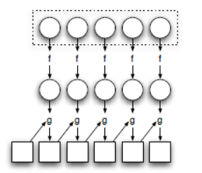

So, Map is a **transformation** on the input functions that can be parallelized in a straightforward manner since it happens on all the items in a list, while Fold is an aggregation operation that needs to happen on individual elements, that must be brought together before applying it. This is the essence of MapReduce, which can be translated to the following steps: 

1. Apply a user-defined computation in a parallel manner on all the elements in a list
2. Aggregate intermediate results by another user-specified computation

## MapReduce Working 

The input to a job is data stored on the underlying distributed file system. To this data, a mapper and a reducer are defined a  follows :

- Mapper → $(k_!, v_1) \rightarrow [(k',v')]$
- Reducer → $[(k',[v'])] \rightarrow [(k_2,v_2)]$

The mapper generates an arbitrary number of intermediate key-value pairs for every input key-value pair, distributed across multiple files. The reducer is applied to all the values associated with an intermediate key - which is sort-of an inherent grouby operation - and generates an output key-value pair. These output key-value pairs from each reducer are written persistently back onto the distributed file system. The files in the file system are of the same number as the number of reducers, and these output files can further serve as an input to another Mapper.

A classic example of  MapReduce is a program to count the words n files, and this would go as follows; 

1. The input to the mapper is of the form - `(document_id, document_text)` - where each document has a unique ID
2. The mapper tokenizes the document and emits an intermediate key-value pair for every word in a document, where the key is the word and the value is the 1 in the vanilla version, or count if we apply a combiner. So, for this implementation let's say it is the count of the word in that document.
3. The shuffler guarantees that all the values associated with the same key are brought together to one reducer, and ensure this happens for all the keys. Thus, every pair corresponding to the word **the** would come to the same reducer.
4. The reducer emits the word and its count as the output, which is in the form of an individual document.

### Partitioners

These determine which reducer is responsible for which data key. The mapper writes the key-value pairs to a partitioning block and the partitioner maps each key to an integer i \in [0,R], which is then used to send the pairs to R reducers. We can also use URLs, hex hashes, etc. to create the identity of the reducers

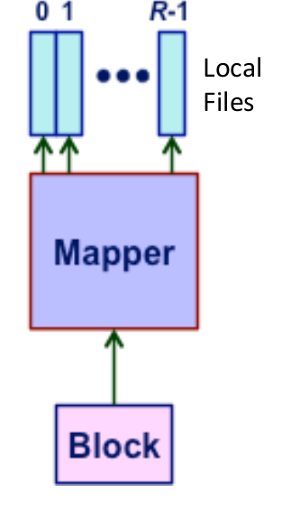

### Combiners
These are just mini-reducers. Their input is the same as reducers and the output is the same as mappers. So, in the counting example, the mapper would generate the key-value pairs in the form of  [word, 1] for each word. To this, we can add combiners that aggregate the counts for each file while still maintaining the output format for the mappers, as shown below. This kind of pre-aggregation saves network time. 

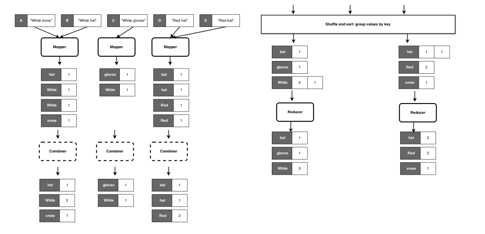

However, there are certain cautionary notes on combiners: 

1.  The correctness of the algorithm cannot depend on computation (or even execution) of the combiners
2. They don't work for all problems. e.g. Mean of letters

### K-means in MapReduce 
A classic example of Distributed algorithms would be K-means, which is an iterative task. In this case of an iterative task, we need a driver to run the MapReduce multiple times and check for convergence. Each map-reduce iteration would be as follows: 
1. We would need a file containing the co-ordinates of each centroid 
2. The input to the mapper would be the data points, and each mapper would compute the distance of the point from each cluster. the output of the mapper would be (cluster, point)
3. the reduce would be receive the data points grouped by a cluster ids, and it ou compute the centroid, thus, producing the output (cluster, centroid)

## Architecture of MapReduce

The Architecture is based on the **Google File-System (GFS),** and the run is as follows:

- Master breaks work into tasks and schedules them on workers dynamically
- Workers implement the MapReduce Functionality on the GFS server daemons

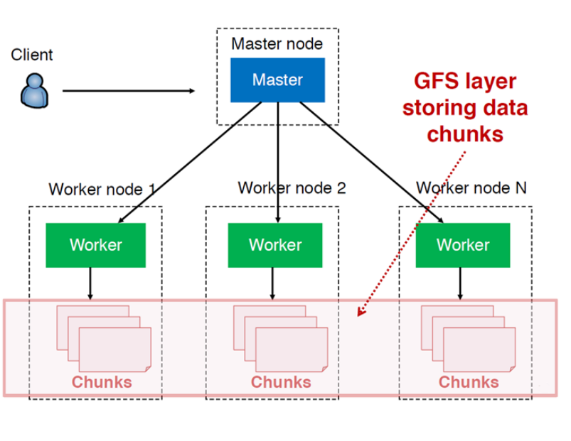

The following diagram shows the flow of MapReduce from the paper: 

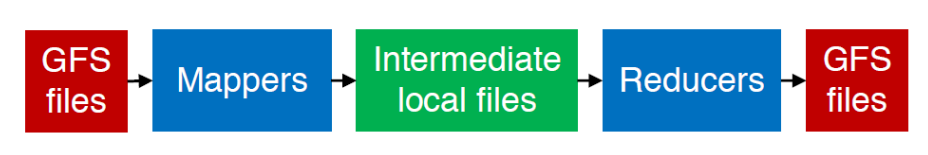

It can be explained as follows : 

1. Library splits files into 16-64MB pieces
2.  Master picks workers and assigns map or reduce task (M map, R reduce tasks)
3.  Map worker reads input split, calls map function, buffers map output in memory
4.  Periodically, in-memory data flushed to disk & master is informed of disk location (Partitioning)
5.  Master notifies reduce worker of location, reduce worker reads map output files, sorts data
6.  Reduce worker iterates over sorted data, passes each unique key, list of values to reduce function. The output of reduced function written out to files.

### Fault Tolerance 
- The mapper spreads tasks over GFS Replicas of inputs so that even if a mapper crashes, a copy of the output is available to reducers through re-runs, and the reducers are notified of the re-run
- If the reducer crashes, the tasks that were completed are stored in GFS with replicas and the ones still remaining are re-run.

### Load-Balancing 
1. Scales linearly with data → as required
2. For stragglers i.e the tasks that take a lot of time, the workers who have already finished a task are assigned new tasks  → the  no. of tasks are always greater than the number of workers


<!-- %%% -->
# Clouds: Parallelism and Distributed Computing


## Parallelism in CPUs
A CPU executes instructions in stages, the major stages being Fetch, Decode, Execute, Memory, and Write. Parallelism in CPUs can be achieved in many ways, the most basic being through pipelining instructions, where independent instructions are executed together to improve efficiency. This is represented in the waterfall model shown below:

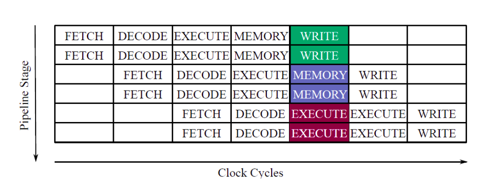

A measure of how many of the instructions in a computer program can be executed simultaneously is called **Instruction-level parallelism** and a processor that executes this kind of parallelism is called a **Superscalar Processor**. The problem with the above parallelization is the possibility of conflicts that increases with an increase in clock cycles i.e fitting increasingly more instructions together as the pipeline stage continues. Moreover, automatic search for independent instructions requires additional resources.

### Vectorization: Automatic and Explicit
One way to overcome the roadblocks of deeper cycles in CPUs is by exploiting parallelism in data. For example, if the same operation - say addition - needs to be performed on two arrays then this operation can be replaced by a single operation on the whole array. This is called **vectorization**.

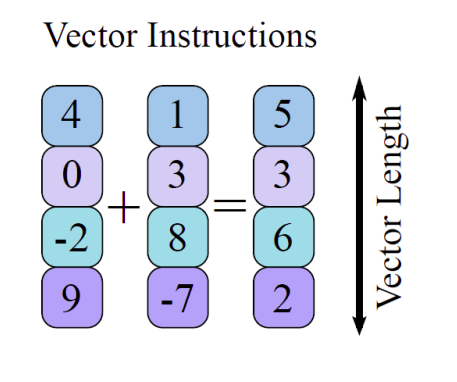

Vectorization can be **Automatic** when the scalar operation is automatically converted by the processor into a parallel one, and **Explicit** when the user manually implements vectorization. While the obvious benefit of automatic vectorization is the ease of implementation, it does not always work. For example, in the following code auto-vectorization will not work because for each element the addition depends on the previous element and so, the operation cannot be split into chunks.  

```cpp

    for(int i=1; i < n; i++){
        a[i] += a[i-1]
    }
```

The subtraction might work if the loop is not checking the previous, but an element that is one more than the length of the vector

```cpp
    for(int i=1; i < n; i++){
        a[i] += a[i - N] ;
    }

```

However, if we just replace the 'i-1' with an 'i+1' as shown in the code below, vectorization works since now all the processor needs to do is take a snapshot of the element that the for loop has not reached yet and add that to the current element.

```cpp

    for(int i=1; i < n; i++){
        a[i] += a[i+1] ;
    }
```

Another case in which Automatic Vectorization does not work is when there is assumed dependence as shown below, where the code would only work if a and b are not aliased ( a == b - 1) and b > a

```cpp
    for(int i=1; i < n; i++){
        a[i] += b[i] ;
    }
```
Thus, the limitations of auto vectorization are:

1. Works on only innermost loops
2. No Vector dependence
3. Number of iterations must be known

However, we can guide auto-vectorization by using the SIMD directives. An example is shown below:

```cpp
    #pragma omp declare simd double func(double x); 

    const double dx = a / (double)n ;
    double integral = 0.0 ; 

    #pragma omp simd reduction(+, integral)for (int i=0; i<n; i++){
        const double xip2 = dx * ( (double)i + 0.5) ;
        const double dI = func(xip2) * dx ; 
        integral += dI
    }
```
The pragma directive signals the **SIMD**(Single Instruction Multiple Data) processors to parallelize 'func()' while the reduction on the addition of the integral signals that the sum needs to be calculated in a reductive manner, where different parts of the parallel sums are combined to get a result which is then finally added to the integral variable instead of using an integral variable every time.

## Parallelism in Multi-Core CPUs

A multi-core CPU has multiple CPU units sharing the same memory, as shown below:

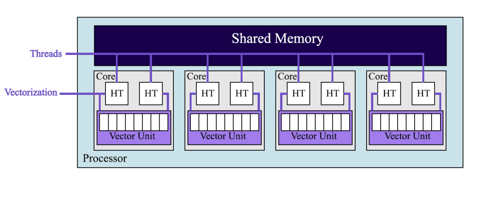

Thus, all the stuff explained above is happening on one vector unit. Since the memory is shared, all the CPU units have the ability to access and modify the contents of the same memory. Thus, they don't need external communication as it is implemented implicitly. However, the relevant issue now becomes the synchronization of these processes since the code written is Multi-Threaded.

### OpenMP

Open Multi-Processing (OpenMP) is a framework for shared-memory programming that allows the distribution of threads across the CPU cores for parallel speedup. It can be included in the CPP programs and easily used through the pragma keyword. For example, in the above Reimann sum OpenMP can be applied as follows:

```cpp
    #pragma omp declare simd 
    double func(double x); 

    const double dx = a / (double)n ;
    double integral = 0.0 ; 

    #pragma omp parallel for reduction(+: integral)
    for (int i=0; i<n; i++){
        const double xip2 = dx * ( (double)i + 0.5) ;
        const double dI = func(xip2) * dx ; 
        integral += dI
    }
```
Here, the reduction is applied to use the reduction sum instead of a normal sum as integral is a shared variable that is incremented in each iteration. If we were to use a normal parallel sum without reduction, the performance would not speed up since the mutex between threads would prevent the loops from parallel operation as each loop would wait for one operation to complete and release the variable. Thus, the addition of the reduction sum allows parallelization, and the performance improves dramatically as shown in the figure below: 

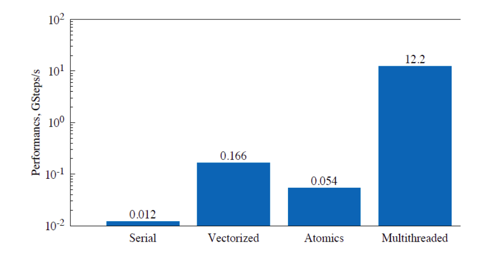

### Adding More Cores : MIMD

The next step in the trend was to add more cores and make each core perform the same function Thus, more transistors performing specialized tasks allowed splitting independent work over multiple processors, for example in pixel analysis of images. This is called **Task Parallelism**, and this leads to **Multiple Instructions Multiple Data (MIMD)** cores. When the work being done by each core is identical, but the data is different, then it is called **Single Program Multiple Data (SPMD)**, a subcategory of MIMD. The most obvious addition that can be done to SPMDs is sharing the fetch and decode parts of processing amongst multiple processes as shown below:

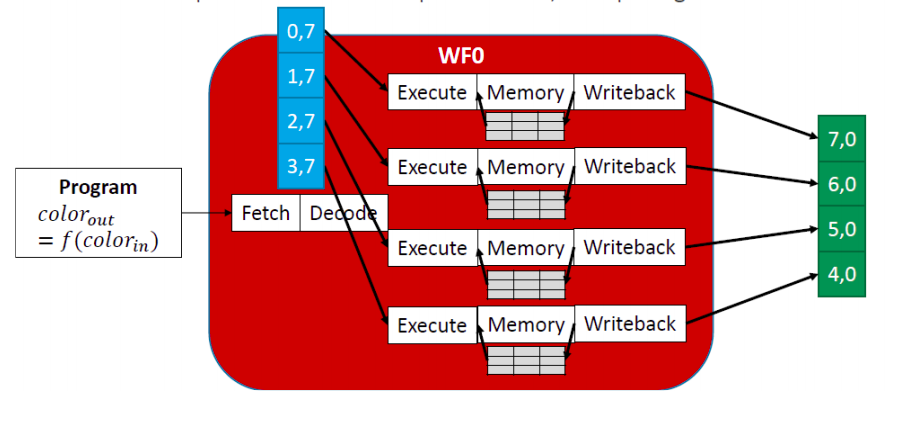

This is called **Single Instruction Multiple Thread (SIMT)** approach, and this is the foundation for GPUs and CUDA.

## GPUs
The SIMT approach forms the core of the Graphical Processing Units (GPUs) where each unit does identical work. Many SIMT threads grouped together make up a GPU core. A GPU has many such cores and a hierarchy can be created as follows:

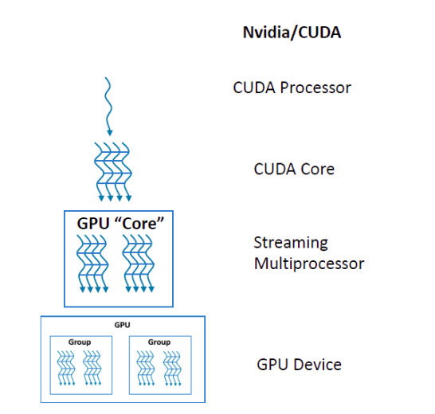

### Explaining CUDA

As explained before, the core idea in a GPU is to make multiple smaller cores perform the same function, thus, maximizing throughput. This differentiates GPUs from CPUs, which are designed to minimize latency by implementing advanced control logic and caching. Thus, the focus of GPUs is on the cores that have threads executing the same task in large numbers in a parallel fashion, and these cores occupy the major area of the Silicon Wafer. These Cores are called **Kernels**. When we run a function on these kernels - called launching a kernel - each function is mapped to a thread of execution on a core. Thus, these programs are massively multi-threaded. Now, the basic way of going about parallel programs is to make the CPU run the normal execution, but make it share its DRAM with the GPU through a PCI Bus, which allows it to  parallelize computations that are massive and can be broken down to be done by the GPU

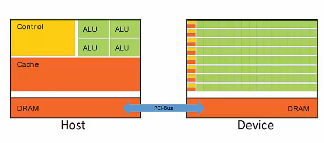


Thus, the CPU is called the **Host** and the GPU is the **Device,** and this way of sharing computations is called **Heterogeneous Parallel Programming.** This is implemented in the NVIDIA GPUs through the CUDA language → which is essentially C with added instructions. The threads execute Kernel instructions in a SIMT manner, and are organized into 3 classes: 

1. **Threads** → A set of threads is executed by a Kernel.
2. **Blocks →** Threads are grouped into blocks executed on a set of cores.
3. **Grid** → Sets of Blocks → Each kernel Launch is executed as a grid mapped to the entire GPU.

The threads and blocks can be 1D, 2D, and 3D structures. The identifiers are as follows: 

- Grid Dimension → blockDim
- BLock ID → blockIdx
- Thread index → threadIdx. 

The Thread Identity depends on the block identities as follows : 
- 1D → Thread ID == Thread Index
- 2D → Thread ID (x,y) = $x + D_xy$
- 3D → Thead ID (x, y, z) = $x + D_xy + D_xD_yz$

1. Decalre pointers to memory 
2. Allocate memory to the Cuda device → `cudaMalloc (pointer, size of variable type)`
3. Transfer memory to the device → `cudaMemcpy( dst, src, size of variable type, direction )`
4. Configure the grid and block parameters → `dim3(x,y,z)`
5. Launch Kernel → `<<<grid, block >>>(...)`
6. Copy the results back to the main execution after completion → `cudaMemcpy( dst, src, size of variable type, direction )`
7. De-allocate the memory → `cudaFree(pointer)`

An example of this is shown below: 

```cpp
    void main {
        
        // Declare vairables
        int *h_c ;// Host 
        int *d_c ;// Device 
        
        //Allocate the memory to device 
        cudaMalloc( (void**)&d_c, sizeof(int) ) ;

        //Set-up the Data transfer
        cudaMemcpy (d_C, h_c, sizeof(int), cudaMemcpyHostToDevice ) ;

        //Define the Grid and Block cofigs
        dim3 grid_size(3,2) ;
        dim3 block_size(4,3) ;

        //Launch the kernel 
        kernel<<grid_size, block_size>>>(...) ;

        //Copy the data after completion
        cudaMemcpy (h_c, d_C, sizeof(int), cudaMemcpyDeviceToHost ) ;

        //De-allocate the memory 
        cudaFree(d_c); 
        cudaFree(h_c);

    }
```

The kernel is defined using `__global__` keyword and always returns void.  The function defined inside the Kernel will always be executed by all the threads. 

### Parallelizing For Loop

In the CPU code, the for loop is written as : 

```cpp
    void increment_cpu(int *a, int N) {

        for ( int i=0; i<N; i++) {
            a[i] = a[i] + 1 ; 
        }

    }
```

Since each step fo the loop performs the same  operation, we can parallelize it :

```cpp
    __global__ void Kernel( int* a, int N) {
        int i = threadIdx.x ; 
        
        if ( i < N ){
            a[i] = a[i] + 1 ; 	
        } 
    }


    void main {
        
        // Declare vairables
        int *h_c[N] = ... ;// Host 
        int *d_c ;// Device 
        
        //Allocate the memory to device 
        cudaMalloc( (void**)&d_c, sizeof(int) ) ;

        //Set-up the Data transfer
        cudaMemcpy (d_C, h_c, sizeof(int), cudaMemcpyHostToDevice ) ;

        //Define the Grid and Block cofigs
        dim3 grid_size(1) ;
        dim3 block_size(N) ;

        //Launch the kernel 
        kernel<<grid_size, block_size>>>(d_c, N) ;

        //Copy the data after completion
        cudaMemcpy (h_c, d_C, sizeof(int), cudaMemcpyDeviceToHost ) ;

        //De-allocate the memory 
        cudaFree(d_c); 
        cudaFree(h_c);

    }
```
Another Example is to do Matrix Multiplication on GPU, shown below: 
```cpp
    __global__ void MatrixMultiplyKernel(
                                const float* devM, 
                                const float* devN,
                                float* devP, 
                                const int width ){
            
            int tx = threadIdx.x;
            int ty = threadIdx.y;
            
            // Initialize accumulator to 0
            float pValue = 0;

            // Multiply and add
            for (int k = 0; k < width; k++) {
                float m = devM[ty * width + k];
                float n = devN[k * width + tx];
                pValue += m * n;
            }
            
            // Write value to device memory - 
            // each thread has unique index to write to
            devP[ty * width + tx] = pValue;
    }

    void MatrixMultiplyOnDevice(float* hostP, 
                                                            const float* hostM, 
                                                            const float* hostN, 
                                                            const int width
                                                        )
    {
        int sizeInBytes = width * width * sizeof(float);
        float *devM, *devN, *devP;
        
        // Allocate M and N on device
        cudaMalloc((void**)&devM, sizeInBytes);
        cudaMalloc((void**)&devN, sizeInBytes);
        
        // Allocate P
        cudaMalloc((void**)&devP, sizeInBytes);

        // Allocate the dimensions
        dim3 threads(width, width);
        dim3 blocks(1, 1);
        
        // Copy M and N from host to device
        cudaMemcpy(devM, hostM, sizeInBytes, cudaMemcpyHostToDevice);
        cudaMemcpy(devN, hostN, sizeInBytes, cudaMemcpyHostToDevice);
        
        // Launch the kernel
        MatrixMultiplyKernel<<<blocks, threads>>>(devM, devN, devP, width)
        
        // Copy P matrix from device to host
        cudaMemcpy(hostP, devP, sizeInBytes, cudaMemcpyDeviceToHost);
        // Free allocated memory
        cudaFree(devM);
        cudaFree(devN);
        cudaFree(devP);
    }
```

## Inter-node parallelism 

All that has been discussed previously is specific to parallelism implemented within a node on a cluster and so, is called i**ntra-node parallelism**. Since the memory is shared between the CPUs and each of them can have their own caches, synchronized using mutexes and executed in a multi-threaded manner, the previous approach is also called **Shared-Memory Parallelism**. However, when we speak of computing on several nodes in a cluster, the intra-node sync vanishes since now each node has its own memory which is separate from the other nodes, and so this is called **Inter-Node Parallelism**. Moreover, now the synchronization cannot happen through the shared memory approach and is implemented by passing messages between nodes → **Message Passing Parallelism →** and so, the thing that is central here is **a deadlock.**

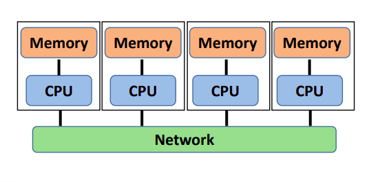


### Message Passing Interface (MPI)

MPI is a library standard defined by a committee of vendors, implementers, and parallel programmers that is used to create parallel programs based on message passing. It is Portable and the De-facto standard platform for the High-Performance Computing (HPC) community. The 6 basic routines in MPI are :

1. `MPI_Init` : Initialize 
2. `MPI_Finalize` : Terminate : 
3. `MPI_Comm_size` : Determines the number of processes 
4. `MPI_Comm_rank` : Determines the label of calling process
5. `MPI_Send` : Sends an unbuffered/blocking message
6. `MPI_Recv` : Receives an unbuffered/blocking message.

**MPI Communicators** define the communication interface over MPI and are used by the message passing functions. The prototypes of each of the above functions are shown below:

```cpp
1. int MPI_Init(int *argc, char ***argv)
2. int MPI_Finalize()
3. int MPI_Comm_size(MPI_Comm comm, int *size)
4. int MPI_Comm_rank(MPI_Comm comm, int *rank
5. int MPI_Send(void *buf, int count, MPI_Datatype datatype,int dest, int tag, MPI_Comm comm)
6. int MPI_Recv(void *buf, int count, MPI_Datatype datatype, int source, int tag, MPI_Comm comm, MPI_Status *status)  
```

MPI also provides a Send and Receive function that helps in avoiding deadlock through handshakes, and other functions for scattering and broadcast.

1. `MPI_Sendrecv` : Send and Recieve in one-shot 
2. `MPI_Bcast` : Broadcast same data to all processes in a group
3. `MPI_Scatter` : Send different pieces of an array to different  processes through partitioning
4. `MPI_Gather` : Take elements from many processes and gather them to one single process

There are two other important functions that help in reduction sums: 

1. `MPI_Reduce` : Takes an array of input elements on each process and returns an array of output elements to the root process given a specified operation 
2. `MPI_Allreduce`: Like `MPI_Reduce` but distribute results to all processes

As an example, we can use the `MPI_Allreduce` for numerical Integration and it gives a massive advantage, even compared to the vanilla Multi-threading:

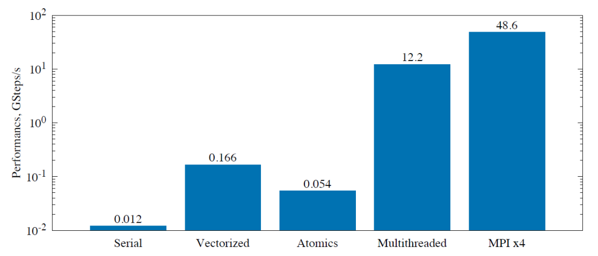

The advantages offered by MPI, clearly, are in the allocation of resources that it allows through explicit and direct communication with the resources. Thus, it is very useful in the scientific domain for HPC applications. However, it has certain weaknesses:
1. it requires careful tuning of applications 
2. It is not tolerant to variability
3. Dealing with failures is hard → No way to save information for later use


<!-- %%% -->
# Clouds: Basics of Cloud Technologies

The best way to look at the development of the cloud is to look at the lifecycle of major utilities throughout history. Take the case of water, initially, the people procured water themselves which was very intensive in terms of effort and time. However, models were developed to separate the process of procurement of water and its usage. Thus, the market moved towards some players procuring water and delivering it to the populace who could use it. However, this also went ahead and developed into a system where water was delivered through pipelines and a user would be charged on a pro-rata basis, depending on their usage. The same thing happened with electricity. This trend can be generalized to the lifecycle shown in the figure below:


If we look at IT from the lens of this cycle, then the innovation phase would be the phase where new kinds of products and services were introduced into the market, the product phase would be when companies maintained these on a growing user base, and the service phase would be when companies started addressing the growing demand and user-base by trying to achieve economies of scale through the cloud.

## Defining Cloud Computing
Cloud Computing can be defined in the following three ways:
1. It is the delivery of computing as a service rather than a product
2. It is a method to offer shared resources, software, and information to computers and other devices
3. It is a metered service over the network

### IT as a Service
There are 3 primary ways in which IT as a service can be offered:
1. **Software-as-a-Service (SaaS):** These are applications running on a browser
2. **Platform-as-a-Service (Paas):** These are software platforms made available to developers through APIs, to build applications
3. **Infrastructure-as-a-Service (Iaas):** These are basic computing resources like CPU, Memory, Disk, etc. made  available to users in the form of Virtual Machine Instances

Some other models that are also possible are: 
 - **Hardware-as-a-Service (Haas):** where users can get access to barebones hardware machines, do whatever they want with them (E.g clusters)
 - **X-as-a-service (Xaas):** which might extend to Backend, Desktop, etc.

### Cloud Infrastructure
Servers are computers that provide service to user machines - the client - and the main idea behind these is that they can be designed for reliability and to service a high number of requests. Dual socket servers are the fundamental building blocks of cloud infrastructure. Organizations usually require many physical servers, like a web server or database server, to provide various services. These servers are grouped, organized, and placed into racks. For standardization, 1 Rack Unit (RU) is defined as 4.45 cm.

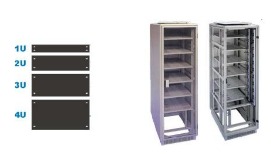

A data center is a facility that is used to house a large number of servers. It needs to provide Air-Conditioning to cool the servers, Power supply to all the servers and needs to implement monitoring, network, and security mechanisms for these servers. Now the companies all have the option of privately owned data centers, but these are certain problems associated with this:
- These are expensive to set-up with a high CAPEX for real-estate, servers, and peripherals
- They have high OPEX in energy and administration costs
- It is difficult to grow or shrink applications → If the company initially budgets a small number of servers, and then a demand surge happens, sometimes even overnight for companies like FaceApp, they would have to expand the area abruptly, which is very difficult. Now, let us say they are able to expand the area and resource pool, they would not be able to shrink these if they demand tapers off. These things are simply not possible for smaller companies, as much as they are for bigger companies like Dropbox.
- Servers can also suffer from the problem of low utilization. This can be caused by uneven usage of applications, where one application might be exhausting one resource while leaving the others stranded-off. Another reason for this is sudden demand spikes, which taper off even more suddenly

Thus, the idea behind cloud infrastructure is to alleviate these problems by separating the server infrastructure from the end-users. The servers can be grouped into a large resource pool and then access can be given to applications based on their demand and the pricing can be set-up based on the usage of this resource pool. Hence, the applications don't need to worry about the usage statistics as far as to look into load balancing. Moreover, the sudden demand spikes and shrinks can be easily adjusted by changing the user requests. However, to offer such a service two requirements need to be met:
- A Means for rapidly and dynamically satisfying fluctuating resource need of the application → provided by **Virtualization**
- A Means for servers to Quickly and reliably access shared and persistent data → done by programming models and distributed file/storage/database systems

This resource pool can also be defined based on its location:
- **Single-Site Cloud :** This would be the collection of hardware and software that the vendors use to offer computing resources and services to users.
- **Geographically Distributed Cloud :** This is a resource pool that is spread across multiple locations and has a composition of different structures and services.

### Cloud Hardware and Software stack
The full stack for clouds has 9 components, as shown in the figure below:


- **Applcations :** These are applications like Web-apps or Scientific Computation Jobs etc.
- **Data :** These are the database systems like Old SQL (Oracle, SQLServer), No SQL (MongoDB, Cassandra), and New SQL (TimesTen, Impala, Hekaton) systems.
- **Runtime Environment :** These are runtime platforms like Hadoop, Spark, etc. to support cloud programming models.
- **Middleware :** These are platforms for Resource Management, Monitoring, Provisioning, Identity Management, and Security.
- **Operating Systems :** These are operating systems like Linux used on a personal machine, but they can also be packed with libraries and software for quick deployment. For example, Amazon Machine Images (AMI) contain OS as well as required software packages as a “snapshot” for instant deployment.
- **Virtualization :** This layer is the key enabler of the cloud services. It creates a mapping between the lower hardware layers and the upper applications and OS layers and contributes towards multi latency. For example, the Amazon EC2 is based on the Xen virtualization platform, and Microsoft Azure is based on HyperV.

The stuff below virtualization has already been discussed. However, one thing that can now be understood is how does this stack help in differentiating between the offered services. As shown in the figure below, in the case of Saas the user has only access to the applications offered by the cloud. In the case of Paas, the user manages the application and Data layer of the stack. In the case of Iaas, the user has access to all the layers above the virtualization layer, so that they can build their own application on the offered resources.

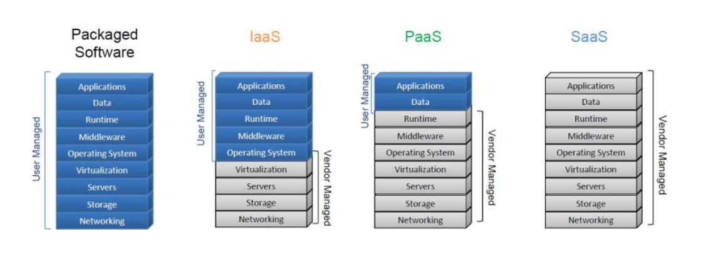

### Types of Cloud
There are three basic types of clouds:
1. **Public (external) Cloud :**  This is a resource pool that serves as an open market for on-demand computing and IT resources. However, the availability, reliability, security, trust, and SLAs can have limitations.
2. **Private (Internal) Cloud :** This is the same set of services of cloud, but devoted to the functions of a large enterprise with the budget of large-scale IT.
3. **Hybrid Cloud :** This is the best of both worlds. The private cloud is extended by connecting it to other public cloud vendors to make use of their available cloud services. So, a company can use their private cloud, and when the resources surge they can also extend usage to the public cloud, of course paying pro-rata.

### Applications Enabled by the Cloud
The applications that can be enabled by the cloud are of 4 types
1. **High-Growth Applications:** This the same case as FaceApp that was discussed previously. Imagine a startup that is growing. They would need a dynamic resource usage mechanism, that as discussed previously, is comfortably offered by the cloud. The risk of not setting up a distributed resource management method is losing on customer experience. This was the case with Friendster(2001), which had a similar offering as Facebook but could not keep up with the user growth.
2. **Aperiodic Applications:** These are applications that face sudden demand peaks and need a way to handle this. The cloud enables them comfortably, and again the risk is user experience. For example, Flipkart offered the 'Big-Billion Day' sale in a similar manner to Amazon's Prime Day, but initially, they could not handle the load and the customer experience was ruined. However, they did fix it over time.
3. **On-off Applications:** These are one-off applications for which extending private resources makes no sense. for example, scientific simulations requiring 1000s of computers.
4. **Periodic Applications:** These are applications that will have a periodic demand surge, like stock market analysis tools or HFT tools, and thus, dynamic, flexible infrastructure can reduce costs, improve performance.

### Advantages Offered by Cloud Computing
1. Pay-as-you-go economic model
2. Simplified IT Management
3. Quick adn Effortless scalability
4. Flexible options
5. Improved Resource Utilization
6. Decrease in Carbon Footpriint


## Cloudonomics
In 2012, Joe Weinman came up with the economic theory to estimate the business value of cloud computing, calling it **Cloudonomics**. The major benefits of the cloud that come out are the following:
1. Common Infrastructure
2. Location Independence
3. Online connectivity
4. Utility pricing

### Utility Pricing Calculation
To understand how utility pricing allows cloud services to be advantageous, we look at the load and the related quantities as follows:
- **L(t) →** Load demand as a function of time, with T being the total time
- **P →** maximum load or peak load
- **A  →** Average load
- **B  →** Baseline cost i.e the cost associated with owning the infrastructure
- **C →** Cloud unit cost i.e cost per second incurred when using a cloud service
- **U →** Utility Premium = C / B

Now, when we measure the costs for a time period of T, then we get:
$$
\begin{alignedat}{2}
&B_T = P.B.T \\
&C_T = \int L(t)dt = A.U.B.T \\
\end{alignedat}
$$

The condition for the cloud services to be cheaper is that the aggregated cost of using the cloud is less than the cost of owning the service i.e 

$$
C_T < B_T
$$

When combined with the above equations, we get the condition as :
$$
U < \frac {P}{A}
$$

Thus, by checking if the utility premium is less than the peak-to-average ratio it can be determined whether the cloud is beneficial or not. 

## Value Created by Cloud

The value that the cloud provides is through the following two methods:

1. Resource Pooling: When resources are shared between multiple services, the profit can be made in reducing the overhead of setting up the infrastructure (like cooling facility, etc.) and economies of scale that come with exploiting synergies.
2. Multiplexing: By multiplexing services over time, the benefit comes from building the infrastructure for handling peak and average loads.

### Measuring the benefit of Multiplexing: Smoothness

The figure below shows the activity profile of a sample of 5,000 Google Servers over a period of 6 months:

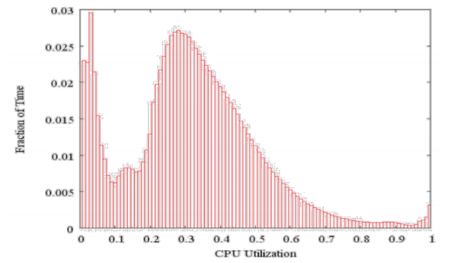

The way multiplexing helps here is twofold:

1. For the part that is built to handle peak load, it yields higher utilization and lowers costs per resource
2. For the part build to handle less than peak load, it reduces the unserved requests and penalties associated with them on the off chance that service level agreements are violated.

To understand how multiplexing does this, the metric used is the **smoothness** of the load. This is measured by a load variation coefficient defined as follows:

$$
C_v = \sigma / | \mu |
$$

Here, $\sigma$ is the standard deviation of the load variation and μ is the mean of this standard deviation. This coefficient is always non-negative since we are taking the modulus of the mean, and so when its value is closer to 1 the load is smoother since this either happens with a lower standard deviation or with a higher mean. Now, let's take the case of n independent jobs $X_1, X_2, ..., X_n$ running with the same values for the mean and standard deviation. Thus, when we multiplex them, we get: 

$$
\begin{aligned}
&X = X_1 + X_2 + ... + X_n \\
&\mu(X) = n*\mu \\ 
&Var(X) = n*Var(X_i) \implies \sigma(X) = \sqrt{n} \sigma \\
\end{aligned}
$$

Thus, the  coefficient for the multiplexed variable comes out to be
$$
C_v(X) = \frac {1} {\sqrt{n}} C_v(X_i)
$$

Hence, by multiplexing the load variation scales down proportional to the number of jobs that are multiplexed! The ideal scenario is when two jobs are negatively correlated, in which case $ X_2 = 1 - X_1$ and we get a deviation of 0, which leads to a flat curve.

## Virtualization

The key idea behind virtualization is sharing computing resources among multiple applications. This translates to mapping the key components to abstract counterparts i.e CPU to a virtual CPU, Disk to a virtual disk, NIC to virtual NIC, etc., to create a **Virtual Machine** that can be used in the place of a real machine. Through this, each tenant can be provided with a virtual machine that they can use to access the compute resources, and thus, multiple tenants can be hosted, as shown below:

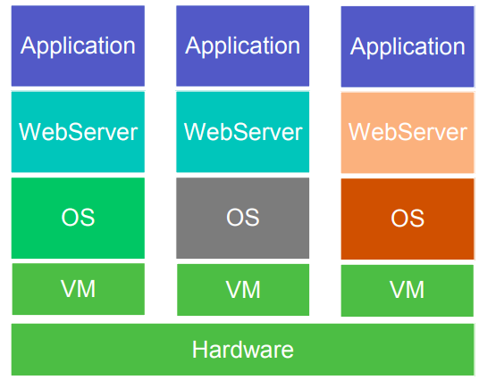

This mapping is created through a **Virtual Machine Monitor (VMM)** , also called a **Hypervisor**, which can be of two types :
- **Type 1:** VMM runs directly on the hardware, and performs scheduling and allocation of resources. E.g. VMWare ESX Server.
- **Type 2:** VMM is built completely on top of an OS where the host OS provides the resource allocation and standard execution environment. E.g User-mode Linux (UML), QEMU.

### How it works 

The CPU has the **Instruction Set Architecture (ISA)** which defines the registers and the memory available to the user and the operations that can be used to modify the contents of these. The ISA has 2 parts:

1. **User ISA:** This is used for computation and has the fetch, decode, etc. instruction that can modify the user virtual memory, but it cannot modify the kernel
2. **System ISA:** This is controlled through **privilege** and used for resource management of the kernel. It can modify the actual registers, can set traps, and interrupts and modify the Memory Management Unit.

Virtualization creates an isomorphism between the ISA on the machine and the virtual system provided to the user by emulating the commands entered on the VM on the ISA on the host machine. This decoupling allows controlling what multiple users can modify by abstracting that bit out into the VM that is provided to them. This emulation is done by encapsulating the instruction set on the host machine into a set of commands that can be executed on the guest machine and creating a schema that maps these commands from the guest machine to the host machine. There are three ways to do this, each one addressing a problem in the previous approach:

1. **Exact Mapping:** The most basic way is to create a 1-1 mapping between each command. This is exhaustive and easy to implement but can be extremely slow due to the interpretation overhead that comes with it.
2. **Trap and Emulate:** The key realization in this approach is only the instructions written to the system ISA need to be interpreted and 'worked around'. Thus, we let the user ISA instructions run as they are and every time the command to the kernel is accessed, the system will generate an interrupt which can be caught (trap) and handled by rewriting them by an interpreter in the privileged mode (emulate). The issue with this approach is that not all architectures (For example, x86) trap the attempts to write to the privileged mode from unprivileged access.
3. **Binary Translation:** Here we translate each guest instruction to the minimal binary set of host instructions required to emulate it, thus avoiding the function-call overhead of an interpreter. We can also re-use translations by using a translator cache. However, this is still slower than direct execution.

In the [DISCO Approach](https://dl.acm.org/doi/10.1145/268998.266672) :

- trap-and-emulate for the non-privileged part of the guest instruction set
- binary translation for the privileged part.

### Containers

Containers raise the abstraction to another level by virtualizing over the OS as shown: 

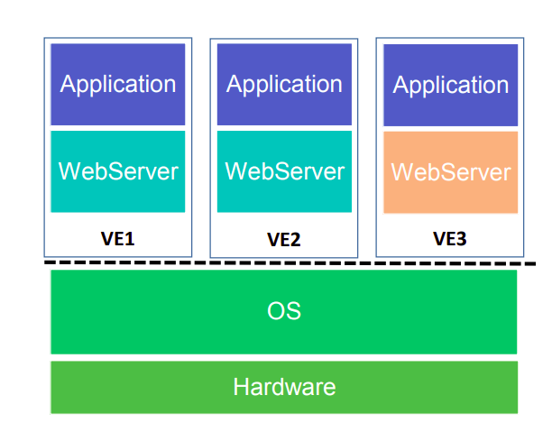

The key benefits come to the hosting providers:

1. It is now possible to host multiple applications/tenants on a single server as containers work on an OS abstraction level as compared to the hypervisors that work on the hardware abstraction level
2. They offer high density as multiple containers can be packed in a server
3. They are easy to scale-up (Everything in google is containerized)
4. There is no virtualization overhead
5. They reduce multitenancy and license fee that comes with providing the OS and libraries for every application
6. They dramatically improve the SDLC

The key point here is to find a way to extend OS to securely isolate multiple applications by observing and controlling the resource allocation and limiting visibility and communication across and between multiple processes. This was first done in Linux through Control Groups (CGroups) and Namespaces, which allowed multiple Linux distributions to share the same kernel (LXC). Thus, apart from the Linux kernel, multiple applications running on RHEL, Debian, Ubuntu, etc. could be isolated.

**Docker** was the obvious next step that has primarily two functions:

1. **Package System :** Can pack an application and all dependencies as a container image after development
2. **Transport System:** Ensures that the application image runs exactly similar on test and production systems

Thus, with Docker one can package everything from libraries to applications, and till the time the kernel is shared, it can be run on multiple devices, servers, etc.

### Serverless Computing

The idea here is to abstract even above OS and allow multiple applications to share the server and runtime.

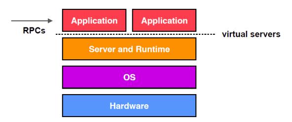

The model is primarily event-driven and can be described as follows:

1. The developer develops business logic and provides it to a provider (like amazon) which encapsulates this in the form of functions (FaaS)
2. Whenever a client requests a function through the application, a notification is triggered by a listener
3. The server tries to locate the code that is responsible for answering the request
4. Only the relevant bit of code is loaded into a container which then executes the code
5. The result of the execution is used to build a response which is then sent to the client

The way the listener works is through using the backend for authentication as a separate service. The advantages of the serverless approach are:

- Less server-side work
- Reduced Cost that comes through being able to use a pay-as-you-go model and economies of scale
- Reduced risk and increased efficiency through specialization
- Scalability
- Shorter lead time

The limitations of this approach are:

- Managing the state is relatively complex
- Higher latency due to increased calls
- Vendor lock-in due to control shifted to the providers, but this might change as more providers enter the market.


<!-- %%% -->
# RL: Model-Free Control

While prediction is all about estimating the value function in an environment for which the underlying MDP is not known, Model-Free control deals with otimizing this value function.


<!-- %%% -->
# RL: Model-Free Prediction
One of the problems with DP is that it assumes a full knowledge of the MDP, and consequently, the environment. While this holds true for a lot of applications, it might not hold true for all cases. In fact, the upper limit does turn out to be the ability to be accurate about the underlying MDP. Thus, if we don't know the true MDP behind a process, the next best thing would be to try to approximate them. One of the ways to go about this is **Model-Free RL**. 

## Monte-Carlo Methods
The first that comes to my mind when someone speaks fo approximation is Monte-carlo methods. The core idea behind the monte-carlo approach, which has its root in gambling, is to use probaility to approximate quantities. suppose we have to approximate the area of a circle relative to a rectangle inside which it is inscribed (This is a classic exmaple and an easy experiment too), the experiment-based approach would be to make a board and randomly throw some balls on it. In a true random throw, let's call the creation of a spot on the board as a simulation ( experiment, whatever!), after each simulation, record the number of sots inside the circular area and he total number of spots including the circular area and the the recangluar area. A ratio of these two quantities would give us an estimate of the relative area of the circle and the rectangle. Now as we conduct more such experiments, this estimate would actually get better since the underlying probability of a spot appearing inside the circle is proportional to the amount of area that the circle occupies inside the rectangle. Thus, in the infinity limit, we could get the exact value of this ratio. 

### Applying MC idea to RL
Another way to put the monte-carlo approach would be to say that Monte-Carlo methods only require experience. In the case of RL, this would translate to sample sequences of states, actions, and rewards from actual or simulated interaction with an environment. An experiment in this sense would be a full rollout of an episode which will create a sequence of states and reqards. when multiple such experiments are conducted, we get better approximations of our MDP. To be specific, our goal here would be to learn $v_{\pi}$ from episodes of experience under policy $\pi$. The value function is the expectation fo reward

$$
v_{\pi}(s) = E_{\pi}[G_t | S_t = s]
$$

So, all we have to do is estimate this expectation using the empirical mean of the returns for the experiments. 

### First-Visit MC Evaluation
To evaluate state s, at the first time-step t at which s is visited: 
1. Increment counter $N(s) \gets  N(s) + 1$
2. Increment total return $S(s) \gets S(s) + 1 $
3. Estimate value by the mean return $V(s) = S(s)/N(s) $

As we repreat more experiments and update the values at the  first visit, convergence to optimal values $V(s) \to  v_{\pi}$
as $N(s) \to \infin$

### Every-Visit MC Evaluation
This is same as first visit evaluation, excep  we update at every visit: 
1. $N(s) \gets  N(s) + 1$
2. $S(s) \gets S9(s) + 1 $
3. $V(s) = S(s)/N(s) $


### Incremental MC updates
The empirical mea can be expressed as an incremental update as follows: 

$$
{\mu}_k = \frac{1}{k} \displaystyle\sum_{j=1}^n x_j = \frac{1}{k} (x_k + \displaystyle\sum_{j=1}^{k-1} x_j) = \frac{1}{k} (x_k + (k-1)\mu_{k-1})
$$

Thus, for the state updates, we can follow a similar pattern and for each state $S_t$ and return $G_t$ express it as: 
1. $N(S_t) \gets N(S_t) + 1$
2. $V(S_t) = V(S_t) + \frac{1}{N(S_t)}(G_t - V(S_t))$

An another useful way would be to track a running mean: 

$$
V(S_t) \gets V(S_t) + \alpha (G_t - V(S_t)
$$


## Temporal-Difference (TD) Learning
The MC method of learning needs an episode to terminate in order to work its way backward. In TD, the idea is work the way forwrad by replacing the remainder of the states with an estimate. This is one method that is considered central adn novel to RL (According to Sutton adn Barto). Like MC methods, TD methods can learn directly from raw experience and like DP, TD methods update estimates based in part on other learned estimates, without waiting for a final outcome, something which is called Bootstrapping - updating a guess towards aguess (I know!).

### Concept of Target and Error
If we look at the previous equation of Incremental MC, the general form that can be extrapolated is 

$$
V(S_t) \gets V(S_t) + \alpha (T - V(S_t)
$$

Here, the quantity $T$ is called the **Target** and the quantity $T - V(S_t)$ is called the **error**. Now, in the MC version, the target is the return $G_t$, means the MC method has to wait for this return to be propagated backwards to then see the error if its current value function from this return, and improve. This is where TD methods show their magic; At time t+1 they immediately form a target and make a useful update using the observed reward and the current estimate of the value function. The simplest TD method, TD(0), thus has the following form 

$$
V(S_t) \gets V(S_t) + \alpha (R_{t+1} + \gamma V(S_{t+1}) - V(S_t)
$$

This is why bootstrapping is a guess of guess, since the TD method bases its update in part on an existing estimate. 

## Comparing TD, MC and DP
Another way to look these algorithms would be through the bellman optimality equation:

$$
v_{\pi}(s) = E [ R_{t+1} + \gamma v_{\pi}(S_{t+1})| S_t = s]
$$

The MC method is an estimate because it does not have a model of the environment and thus, needs to sample in order to get an estimate of the mean. The DP method is an estimate because it does not know the future values of states and thus, uses the current state value estimate in its place. The TD method is an estimate because it does both of these things. Hence, it is combination of both. However, unlike DP, MC and TD do not require a model of the environment. Moreover, the online nature of these algorithms is something that allows them to work with samples of backups, whereas DP requires full backup.TD and MC can be differentiated in the nature of the samples that they work with: TD requires shallow backups since it is inherently online in nature, while MC requires deep backups due to the  nature of its search. Another way to look at the inherent difference is to realize that DP inherently dies a breadth first search, while MC does a depth first search. TD(0) only looks one step ahead and forms a guess. David silver summarizes the differences on the following spectrum, which I find really helpful: 


## Extending TD to n-steps 

The next natural step for something like TD, would be to extend it to further steps. For this, we generalize the target and define the it as follows:

$$
G^{(n)}_t = R_{t+1} + \gamma R_{t+2} + ... + \gamma^{n-1} R_{t+ n} + \gamma^n V(S_{t+n})
$$

And so the equation again follows the same format:

$$
V(S_t) \gets V(S_t) + \alpha (G^{(n)}_t - V(S_t)
$$

One interesting thing to note here is that if n is increased all the way till the terminal state, then we essentially get the same equation as MC methods! 

### Averaging over n returns 
To get the best out of all n's, one improvement could be to avergae teh returns over certain number of states. For example, we could combine 2-step and 4-step returns and take teh average :

$$
G_avg = \frac{1}{2} [ G^{(2)} + G^{(4)} ]
$$

This has been shown to work  better in many cases, but only incrementally.

### $\lambda$-Return

This is a method to combine the returns from all the n-steps:

$$
G^{(\lambda)}_t = (1 - \lambda ) \displaystyle\sum_{n=1}^{\infin} \lambda^{n-1} G^{(n)}_t

$$

And ths, is als called **Forward-view TD($\lambda$)**

### Backward View 

To understand the backward view, we need a way to see how we are going to judge the causal relationships between events and outcomes (Returns). There are two heuristics:
1. **Frequency Heuristic :** Assign credit to the most frequent states
2. **Recency Heuristic :** Assign credit to the most recent states.

The way we keep track of how each states fares on these two heuristic is through **Eligibility Traces** :

$$
E_t(s) = \gamma \lambda E_{t-1}(s) + \bold{1}(S_t = s)
$$

These traces accumulate as the frequency increases, and are higher for more recent states. If the frequency drops, they also drop. This is evident in the figure below:


So, all we need to do it scale the TD-error $\delta_t$ according to the trace function:

$$
V(S) \gets  V(S) + \alpha \delta_t E_t(s)
$$

Thus, when $\lambda = 0$, we get TD(0) and when $\lambda = 1$, the credit is deferred to the end of the episode nand we get MC


<!-- %%% -->
# RL: Planning and Dynamic Programming

Dynamic programming (DP) is a method that solves a problem by breaking it down into sub-problems and then solving each sub-problem individually, and then combining them into a solution. A godo example is the standard fibonacci sequence calculation problem, where traditionally the way to solve ti would be through recursion

```cpp
int fib(int x)
{
    if (x < 2)
        return 1;

    return fib(x-1) + fib(x-2);
}

```
However, the way DP would go about this would be to cache the variables after teh first call, so that the same call is not made again, making the program more efficient:

```cpp
int fib(int x)
{
    static vector<int> cache(N, -1);

    int& result = cache[x];

    if (result == -1)
    {
        if (x < 2)
            result = 1;
        else
            result = fib(x-1) + fib(x-2);
    }

    return result;
}

```

The 2 characteristics that a problems need to have fo DP to solve it are: 
1. **Optimal Substructure :** Any problem has optimal substructure property if its overall optimal solution can be constructed from the optimal solutions of its subproblems i.e the property $Fib(n) = Fib(n-1) + Fib(n-2)$ in fibonacci numbers
2. **Over-lapping Sub-problems :** The problem involves sub-problems which need to be solved recursively many tiimes

Now, in teh case of an MDP, we have already seen that these properties are fulfilled: 
1. The Bellman equation gives a recursive relation that satisfies the overlap requirement
2. The valu function is able to store and re-use the solutions from each state-visit, and thus, the we can exploit it as an optimal substructure

Hence, DP can be used for making solutions to MDPs more tractable, and thus, is a good tool to solve the planning problem in an MDP. The plannign problem, as discussed before, is of two types: 
1. **Predicton Problem :** **How do we evaluate a policy ?** or, Using the MDP tuple as an input, the output is a value function $V_{\pi}$ and/or a policy $\pi$
2. **Control Problem :** **How do we optimie the policy ?** Using the MDP tuple as an input, the output is a an optimal value function $V_{*}$ and/or a policy $\pi_{*}$ 

## Iterative Policy Evaluation

The most basic way is to iteratively apply the bellman equation, using hte old values to calculate a new estimate, and then using this new estimate to calculate new values. IN the bellman equation for the state-value function 

$$
v_{\pi}(s) = \sum_{\substack{a \in A}} \pi (a|s) [ R^{a}_s  +  \gamma \sum_{\substack{s' \in S}} P^{a}_{ss'} v_{\pi} (s) ]
$$

As long as either $\gamma < 1$ or eventual termination is guaranteed from all states under the policy $\pi$, the uniqueness of the value function is guaranteed. Thus, we can consider a sequence of approximation functions $v_0, v_1, v_2, ...$ each mapping states to Real numbers, start with an arbitrary estimate of $v_0$, and obstain successive approximations using bellman equation, as follows: 

$$
v_{k+1}(s) = \sum_{\substack{a \in A}} \pi (a|s) [ R^{a}_s  +  \gamma \sum_{\substack{s' \in S}} P^{a}_{ss'} v_{k} (s') ]
$$

The sequence $v_k$ can be shown to converge as $ k \rightarrow \infin $

the process, is basically a propogation towards the root of the decision tree from the roots.


This update operation is applied to each state in the MDP at each step, and so, is called **Full-Backup**, ad so in a computer program we would have two cache arrays - one for $v_k(s)$ and one for $v_{k+1}(s)$

## Policy Improvement
Once we have a policy, the next question is do we follow this policy or shift to a new improved policy ? one way to answer this problem is to take an action that this policy does not suggest and then evluate the smae policy after that action. If the returns are higher than the we can say that taking that action is better than following the current policy. The way we evaluate the action is throught the action value function: 

$$
q_{\pi}(s,a) = R^{a}_s  +  \gamma \sum_{\substack{s' \in S}} P^{a}_{ss'} v_{\pi} (s')
$$

If this value is greater than the value function of a state S, then that means that it is better to select this action than follow the policy $\pi$, and by extension, it would mean that anytime we encounter state S, we would like to take this action. So, let's call the schema of taking action a everytime we encounter s as a new policy ${\pi}'$, and so, we can now say 

$$
q_{\pi}(s,{\pi}'(s)) \geqslant v_{\pi}(s)
$$


This implies that the policy ${\pi}'$ must be at-least as good as the policy $\pi$

$$
v_{{\pi}'} \geqslant v_{\pi}
$$

Thus, if we extend this idea to multiple possible actions at any state s,  the net incentive is to go full greedy on it and select best out of all those possible actions: 

$$
{\pi}'(s) = \argmax_a q_{\pi}(s,a)
$$

The greedy policy, thus, takes the action that looks best in the short term i.e after one step of lookahead. The point at which the new policy stops becoming better than the old one, is the conveergence point, and we can conclude that optimality has been reached. This idea also applies in the general case of stochastic policies, with the addition tha in the case of multiple actions with the maximum value, a portion of the stochastic probabiltiy can be given to each.

## Policy Iteration

Following the greedy policy improvement process, we can bstain a sequency of policies: 

$$
{\pi}_0 \rightarrow v_{\pi_0} \rightarrow {\pi_1} \rightarrow v_{\pi_1} .... \rightarrow {\pi}_* \rightarrow v_{{\pi}_*}
$$

Since a finite MDP has a finite number of policies, this process must converge at some point to an optimal value. This process is called **Policy Iteration**. The algorithm, thus, follows the process: 
1. **Evaluate** the policy using the Bellman equation
2. **Improve** the policy using greedy policy improvement.

A natural question that comes up at this point is that do we actually need to follow this optimiztaion procedure till the end ? It does sound like a lot of work, and in fact, as  seen in the Gridworld example (Sutton and Barto), the workably optimal policy is actually reached much before the final iteration step, where basically teh final three steps actualy are redundant. Thus, we can include stopping conditions to tackle this: 
1. $\epsilon$-convergence
2. Stop after k iteratiokns
3. Value Iteration


## Value Iteration

in this algorithm, the evaluation is truncated to one sweep, or one backup of each state. to understand this, the first step is to understand something called the **Principle of Optimality**. The basic idea is that an optimal policy can be subdivided into two parts:
- An optimal first action $A_*$
- An optimal policy from the successor state S'

So, if we know the the solution to $v_*(s')$ for all s' succeeding a state, s , then the solution can be found with just a one-step lookahead

$$
v_*(s) \gets \max_{a \isin A} R^a_s + \gamma \sum_{\substack{s' \in S}} P^{a}_{ss'} v_{*} (s')
$$

The intuition is to start from teh final reward and work your way backward. There is no explicit update of policy, only values. This also opens up the possibility that the intermediate values might not correspond to any policies, and so interpreting anything midway will have some residue in addition to the greedy policy.  In practice, we stop once the value function changes by only a small amount in a sweep. A  summary of synchronous methods for DP is given by David Silverman:


<!-- %%% -->
# RL: Markov Processes
These are random processes indexed by time and are used to model systems that have limited memory of the past. The fundamental intuition behind Markov processes is the property that the future is independent of the past, given the present. In a general scenario, we might say that to determine the state of an agent at any time instant, we only have to condition it on a limited number of previous states, and not the whole history of its states or actions. The size of this window determines the order of the Markov process.

To better explain this, one primary point that needs to be addressed is that the complexity of a Markov process greatly depends on whether the time axis is discrete or topological. When this space is discrete, then the Markov process is a Markov Chain. A basic level understanding of how these processes play out in the domain of reinforcement learning is very clear when analyzing these chains. Moreover, the starting point of analysis can be further simplified by limiting the order of Markov Processes to first-order. This means that at any time instant, the agent only needs to see its previous state to determine its current state, or its current state to determine its future state. This is called the **Markov Property**

$$
\Rho(S_{t+1}|S_t) = \Rho(S_{t+1}|S_1, ..., S_t) )
$$

## Markov Process
tthe simplest process is a tuple $<S,P>$ of states and Transitions. The transitions can be represented in the form of a Matrix $P = [P_{ij}]$, mapping the states from which the transition originates, the i index, and the states to which the transition goes, the j index.

$$
\begin{bmatrix}
  P_{11} & . & . & . & P_{1n}\\
  . & . & . & . & . \\ 
  . & . & . & . & . \\
  . & . & . & . & . \\
  P_{n1} & . & . & . & P_{nn}
\end{bmatrix}
$$

Another way to visualize this would be in the form of a graph, as shown below, courtsey David Silver. 


This is a basic chain that represents the actions a student can take in the class, with associated probabilities of taking those actions. Thus, in the state - Class 1 - the student has an equal chance of going to the next class or browsing Facebook. Once they start browsing Facebook, then they have a 90% chance of continuing to browse since it is addictive. Similarly, other states can be seen too. 

## Markov Reward Process
Now if we add another parameter of rewards to the Markov processes, then the scenario changes to the one in which entering each state have an associated expected immediate reward. This, now, becomes a Markov Reward Process. 


To fully formalize this, one more thing needs to be added - the discounting factor $\gamma$. This is a hyperparameter that intuitively represents the amount of weightage we give to future rewards. The use of Gamma can be seen in computing the return $G_t$ on a state:

$$
G_t = R_{t+1} + \gamma R_{t+2} + \gamma^2 R_{t+3} + ... 
$$


The reasons for discounting are as follows:
- To account for uncertainty in the future, and thus, better balance our current decisions. The larger the value, the more weightage we give to the 'shadow of the future'
- To make the math more convenient, since only when we discount the successive terms, we can get convergence on an infinite GP
- Avoid Infinite returns, which might be possible in loops within the reward chain
- This is similar to how biological systems behave 

Thus, the reward process becomes can be characterized by the tuple $<S, P, R, \gamma >$ . Now, to better analyze this chain, we will also define a way to estimate the value of a state - **Value function** - as an expectation of the Return on that state. Thus,

$$
V(S) = E[ G_t| S_t = s ]
$$

An intuitive way to think of this is in terms of betting. Each state is basically a bet that our agent needs to make. Thus, the reward process represents the agent's understanding of each of these bets, and to qualify them, the agent has to think in terms of the potential returns that these bets can give. This is what we qualify here as the expectation. But the magic comes when we apply it recursively, and this is called the **Bellman Equation**

$$
V(S) = E[R_{t+1} + \gamma V(S_{t+1}| S_t = s]
$$

This basically means that the value of the current state can be seen in terms of the value of the next state and so on, and thus, we can have a correlated relationship between states. To better see how this translates to the whole MDP, we can also express this as a Matrix Operation

$$
\begin{bmatrix} 
   V_1 \\
   .  \\
   .  \\
   V_n
\end{bmatrix} 
= 
\begin{bmatrix} 
   R_1 \\
   .  \\
   .  \\
   R_n
\end{bmatrix} 
+ 
\begin{bmatrix}
  P_{11} & . & . & P_{1n}\\
  . & . & . & . \\ 
  . & . & . & . \\
  P_{n1} & . & . & P_{nn}
\end{bmatrix}
\begin{bmatrix} 
   V_1 \\
   .  \\
   .  \\
   V_n
\end{bmatrix} 
$$

And so, the numerical way to solve this would be to invert the matrix (assuming it is invertible) and the solution, then would be:
$$
\bar{V} = (1 - \gamma \bar{P})^{-1} \bar{R}
$$

However, as anyone familiar with large dimensions knows, this becomes intractable pretty easily. Hence, the whole of RL is based on figuring out ways to make this tractable, using majorly three kinds of methods: 
1. Dynamic Programming
2. Monte-Carlo Methods
3. Temporal Difference Learning

We will delve deeper into these in the next parts! 

## Markov Decision Process

If we add actions to the Markov Reward Process, then there can multiple states that the agent can reach by taking action to each state. Thus, the agent now has to decide which action to take. This is called a Markov Decision Process.


Thus, the MDP can be summarized by the tuple $<S, A, P, R, \gamma >$. Here, we can also define the transitions and rewards in terms of the actions:

$$
\begin{aligned}
R^{a}_{s} = E[ R_{t+1} | S_t=s, A_t=a ] \\
P^{a}_{ss'} = P[ S_{t+1}=s'| S_t=s, A_t=a ]
\end{aligned}
$$

Now, the important thing is how should the agent make these decisions. The schema that the agent follows for this is called a **Policy**, which can be seen as the probability of taking an action, given the state: 

$$
\pi (a|s) = P [ A_t = a | S_t = s ] 
$$

Under a particular policy $\pi$, the Markov chain that results is nothing but an MRP, since we don't consider the actions that the agent did not take. This can be characterized by $<S, P^{\pi}, R^{\pi}, \gamma>$, and the respective transitions and rewards can be described as:

$$
\begin{aligned}
R^{\pi} = \sum_{\substack{a \in A}} \pi (a|s) R^{a}_{s}\\
P^{\pi}_{ss'} = \sum_{\substack{a \in A}} \pi (a|s) P^{a}_{ss'}
\end{aligned}
$$

Another important thing that would need to be distinguished here is the value function, which can be defined for both states and actions: 
- **State-Value Function ($v_{\pi}$):** Values for states when policy $\pi$ is followed 

$$
v_{\pi}(s) = E_{\pi}[G_t | S_t = s]
$$

- **Action-Value Function ($q_{\pi}$):** Expected return onj starting from state s, following policy $\pi$ and taking action a

$$
q_{\pi}(s, a) = E_{\pi}[G_t | S_t = s, A_t = a] 
$$


### Bellman Equation for MDPs
We can extend the bellman formulation to recursively define the qualities of state and actions:

$$
\begin{aligned}
v_{\pi}(s) = E_{\pi} [R_{t+1} + \gamma v_{\pi}(s')| S_t = s, S_{t+1} = s'] \\

q_{\pi}(s, a) = E_{\pi} [R_{t+1} + \gamma q_{\pi}(s', a')| S_t = s, S_{t+1} = s', A_t = a, A_{t+1} = a']

\end{aligned}
$$

However, a better way is to look at the inter-dependencies of these two value functions. The value of the state can be viewed as the sum of the value of the actions that can be taken from this state, which can in-turn be viewed as the weigted sum of values of the states that can result from each action.

#### Bellman Expectation in second recursive form

The expectation for the value of states is the sum of the values of the actions that can result from that state


Thus, under the policy $\pi$ this value is the sum of the q-values of the actions: 

$$
v_{\pi}(s) = \sum_{\substack{a \in A}} \pi (a|s) q_{\pi} (s,a)
$$

Now, the action can be viewed in a similar manner as a sum over the value fo the states that can result from it


and written in the same manner

$$
q_{\pi}(s,a) = R^{a}_s  +  \gamma \sum_{\substack{s' \in S}} P^{a}_{ss'} v_{\pi} (s)
$$

And, if we put these equations together, we can get a self-recursive formulation of the bellman expectation. So, for the state this would be

$$
v_{\pi}(s) = \sum_{\substack{a \in A}} \pi (a|s) [ R^{a}_s  +  \gamma \sum_{\substack{s' \in S}} P^{a}_{ss'} v_{\pi} (s) ]
$$

A Visualization for this would basically be a combination of the above two trees


A similar process can be done for the action value function, and the result comes out to be

$$
q_{\pi}(s,a) = R^{a}_s  +  \gamma \sum_{\substack{s' \in S}} P^{a}_{ss'} \sum_{\substack{a' \in A}} \pi (a'|s') q_{\pi} (s',a')
$$


#### Bellman Optimality Equation

With the recursive forms, the question really comes on how do we go about creating a closed-loop optimality criterion. Here, the key point that needs to be taken into account is **The agent is free to choose the action that it can take in each state, but it can't choose the state that results from that action**. This means, we start from a state, and maximize the result by choosing the action with the maximum action value. This is the first step of lookahead. Now, each of those actions has the associated action value that needs to be determined. In the case where the action can only lead to one state, it's all well and good. However, in the case where multiple states can result out of the action, the value of the action can be determined by basically rolling a dice and seeing which state the action leads to. Thus, the value of the state that the action leads to determines the value of the action. This happens for all the possible action from our first state, and thus, the value of the state is determined. Hence, with this **Two-step lookahead**, we can formulate the decision as maximizing the action values.

$$
v_{*}(s) = \max_{\substack{a}} [ R^{a}_s + \gamma \sum_{\substack{s' \in S}} P^{a}_{ss'} v_{*} (s)]
$$

Now, the question arises as to how can this equation be solved. The thing to note here is the fact that it is not linear. Thus, in general, there exists no closed-form solution. However, a lot of work has been done in developing iterative solutions to this, and the primary methods are:
- **Value Iteration :** Here methods solve the equation by iterating on the value function, going through episodes, and recursively working backward on value updates
- **Policy iteration :** Here, the big idea is that the agent randomly selects a policy and finds value function corresponding to it. Then it finds a new and improved policy based on the previous value function, and so on.
- **Q Learning :** This is a model-free way in which the agent is guided through the quality of actions that it takes, wit the aim of selecting the best ones
- **SARSA :** Here the idea is to iteratively try to close the loop by selecting a **S**tate, **A**ction, and **R**eward and then seeing the **S**tate and **A**ction that follows.

## Extensions to MDP

MDPS, as a concept, has been extended to make them applicable to multiple other kinds of problems that could be tackled. Some of these extensions are: 
1. **Infinite and Continuous MDPs :** In this extension, the MDP concept is applied to infinite sets, mainly countably infinite state or action spaces, Continuous Spaces (LQR), continuous-time et. al  
2. **Partially Observable MDPs (POMDP) :** A lot of scenarios exist where there are limits on the agent's ability to fully observe the world. These are called Partially-Observable cases. Here, the state is formalized in terms of the belief distribution over the possible observations and encoded through the history of the states. The computations become intractable in theory, but many interesting methods have been devised to get them working. Eg. DESPOT
3. **Undiscounted and Average Reward MDP :** These are used to tackle ergodic MDPs - where there is a possibility that each state can be visited an infinite number of times ( Recurrence), or there is no particular pattern in which the agent visits the states (Aperiodicity) - and to tackle this, the rewards are looked at as moving averages that can be worked with on instants of time.


<!-- %%% -->
# RL: Introduction to Reinforcement learning
The way I like to think about Reinforcement learning is by imagining myself as a ring-master who has to train a certain creature. One of the reasons why I like this visualization is because RL has historical roots in trial and error and the psychology of animal learning. So, let's say I want to train this creature to perform some tricks around a hula-hoop, one of the ways I might go about this is by creating a scheme where the creature would be punished for not jumping through the hoop. As the training goes on, the punishment guides it to go to places where it does not receive punishment, and over time, it learns to jump through the hoop.

A similar thing happens in RL. The thing that I need to train is called an **Agent**. My language of communication with this agent is through numbers, encoded in processes that I create for it to understand and interact with the world around it. The way this agent interacts with the world around it is through **Actions (A)** and the way it understands the world is through **Observations (O)**. Now, my task is to define these actions and observations and train this agent to achieve a certain task by creating a closed-loop control of feedback for the actions it takes. This feedback is the **reward (R)** that agent receives for each of its actions. So, the key is to devise a method to guide the agent in such a way that it 'learns' to reach the goal by selecting actions with the highest **Expected Rewards (G)**, updating these values by observing the environment after taking that action. Thus, the agent first takes random actions and updates its reward values, and slowly, it starts to favor actions with higher rewards, which eventually lead to the goal.


The way I define observations is through formalizing it as a **State (S)** in which this agent exists, or can exist. This state can either be the same as the observation, in case the agent can see everything about its environment, for example, in an extreme case imagine if you were able to see all the atoms that constitute your surroundings, or the state can be defined in terms of **Beliefs (b)** that agent the might have based on its observation. More on this in the next sections!

A standard testbed in RL, and an overly used example, is the Mountain Car scenario. As shown in the figure below, the car exists in a valley and the goal is at the top. The car needs to reach this goal by accelerating, but it is unable to reach the top by simply accelerating from the bottom. Thus, it must learn to leverage potential energy by driving up the opposite hill before the car is able to make it to the goal at the top of the rightmost hill.

<!-- 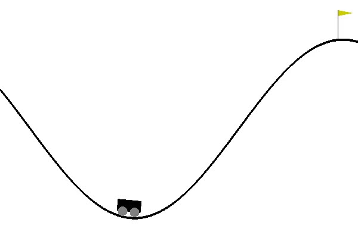 -->


One way to define the values for the agent - the car - would be to define the state as the (position, velocity) of the car, the actions as (Do nothing, Push the car left, Push the car right), and rewards as -1 for each step that leads to a position that is not the goal and 0 for reaching the goal.

To characterize the agent, the following components are used in the RL vocabulary:
- **Policy $(\pi : S \rightarrow A)$:** This is the behavior of the agent that i.e the schema it follows while navigating in the environment it observes by taking actions. Thus, it is a mapping from state to action
- **Value Function (V):** This is the agent's prediction of future rewards. The way this fits into the picture is that at each step the agent predicts the rewards that it can get in the future by following a certain set of actions under a policy. This expectation of reward is what determines which actions the agent should select.
- **Model :** The agent might make a model of the world that it observes around itself. Then it can use this model to extract information that it can use to better decide the actions that the it can take. There are two types of models that are used, Reward Model and Transition
- **Reward Model :** Model to predict the next immediate reward. This is defined in terms of Expectation fo reward conditioned on a state and action : $R^{a}_{s} = \Epsilon[ R | S=s, A=a ]$
- **Transition Model :** Model to predict the next state using the dynamics of the environment. This is deinfed in terms of probability of a next state, conditioned on the current state and actions : $P^{a}_{ss'} = \Rho[ S'=s'| S=s, A=a ]$

Thus, using the above components learning can be classified into three kinds:
1. **Value-Based RL :**  In this type, the agent uses a value function to track the quality of states and thus, follows trends in the value functions. For example, in a maze with discretized boxes as steps, the agent might assign values to each step and keep updating them as it learns, and thus, end up creating a pattern where a trend of following an increase int eh value would inevitably lead to the way out of the maze
2. **Policy-Based RL:** In this case, the agent would directly work with the policy. So, in the case of the maze example, each step might be characterized by four directions in which the agent can traverse ( up, down, left, right) and for each box, the agent might assign a direction it will follow once it reaches that, and as it learns it can update these directions t create a clear path to the end of the maze
3. **Actor-Critic :** If two ideas are well-established in the scientific community, in this case, the value-based, and policy-based approach, then the next best step could be to try and merge them to get the best of both worlds. This is what the actor-critic does; it tries to merge both these ideas by splitting the model into two parts. The actor takes the state as an input and outputs the best actions by following a learned optimal policy ( policy-based learning ). The critic generates the value for this action by evaluating the value function ( value-based learning ). These both compete in a game to improve their methods and overall the agent learns to perform better.

The learning can also be distinguished based on whether the agent has a model of the world, in which case the learning is **Model-Based RL**, or whether the agent operates without a model of the world i.e **Model-Free RL**. This will be explored in more detail in the next sections.

Finally, certain paradigms are common in RL which recurs regularly and thus, it might be good to list them down:
- **Learning and Planning :** In learning the rules of the game are unknown and are learned by putting the agent in the environment. For example, I remember some people once told me how some coaches teach the basics of swimming by asking the learner to directly jump into the semi-deep water and try to move their hands and legs in a way so that they can float. Irrespective of whether this actually happens or not, if someone learned this way I could think of it as a decent enough analogy. Planning, on the other hand, is driven by a model of the rules that need to be followed, which can be used by the agent to perform a look-ahead search on the actions that it can take.
- **Exploration and Exploitation :** This is the central choice the agent needs to make every time it takes an action. At any step, it has certain information about the world and it can go on exploiting it to eventually reach a goal (maybe), but the problem is it might not know about the most optimal way to reach this goal if it just acts on the information it already has. Thus, to discover better ways of doing things, the agent can also decide to forego the path it 'knows' will get it the best reward according to its current knowledge and take a random action to see what kind of reward it gets. Thus, in doing so the agent might end up exploring other ways of solving a problem that it might not have known, which might lead to higher rewards than the path it already knows. Personally, the most tangible way I can visualize it is by thinking of a tree of decisions, and then imagining that the agent knows one way to reach the leaf nodes with the maximum reward. However, there might exist another portion of the tree that has higher rewards, but the agent might not ever go to if it greedily acts on its current rewards.
- **Prediction and Control :** Prediction is just finding a path to the goal, while control is optimizing this path to the goal. Most of the algorithms in RL can be distinguished based on this.

<!-- %%% -->
# LIS: Setting up RAI on HPC

## List of RPMs:
```
- ann-devel-1.1.2-3.el7.x86_64.rpm        
- gflags-2.1.1-6.el7.x86_64.rpm          
- jsoncpp-0.10.5-2.el7.x86_64.rpm      
- poly2tri-0.0-10.20130501hg26242d0aa7b8.el7.x86_64.rpm
- assimp-devel-3.1.1-2.el7.x86_64.rpm             
- gflags-devel-2.1.1-6.el7.x86_64.rpm    
- lapack-3.4.2-8.el7.x86_64.rpm        
- proj-4.8.0-4.el7.x86_64.rpm
- atlas-3.10.1-12.el7.x86_64.rpm                  
- glfw-3.2.1-2.el7.x86_64.rpm            
- libann-1.1.2-alt5.x86_64.rpm         
- pybind11-devel-2.4.3-2.el8.aarch64.rpm
- atlas-devel-3.10.1-12.el7.x86_64.rpm            
- glibc-2.17-307.el7.1.x86_64.rpm        
- libassimp3-3.3.1-alt1_5.x86_64.rpm   
- qhull-2003.1-20.el7.x86_64.rpm
- ceres-solver-1.12.0-5.el7.x86_64.rpm            
- glibc-devel-2.17-307.el7.1.x86_64.rpm  
- libgcc-4.8.5-39.el7.x86_64.rpm       
- suitesparse-4.0.2-10.el7.x86_64.rpm
- ceres-solver-devel-1.12.0-5.el7.x86_64.rpm      
- glibc-static-2.17-307.el7.1.i686.rpm   
- libgeotiff-1.2.5-14.el7.x86_64.rpm   
- suitesparse-devel-4.0.2-10.el7.x86_64.rpm
- ceres-solver-devel-1.13.0-12.el8.x86_64.rpm     
- glog-0.3.3-8.el7.x86_64.rpm            
- libGLEW-1.10.0-5.el7.x86_64.rpm      
- tbb-4.1-9.20130314.el7.x86_64.rpm
- eigen3-devel-3.3.4-6.el7.noarch.rpm             
- glog-devel-0.3.3-8.el7.x86_64.rpm      
- libstdc++-4.8.5-39.el7.x86_64.rpm    
- zlib-1.2.7-18.el7.x86_64.rpm
- f2c-20160102-1.el7.x86_64.rpm                   
- gnuplot-4.6.2-3.el7.x86_64.rpm         
- libX11-1.6.7-2.el7.x86_64.rpm
- freeglut-3.0.0-8.el7.x86_64.rpm                 
- graphviz-2.30.1-21.el7.x86_64.rpm      
- libX11-devel-1.6.7-2.el7.x86_64.rpm
- gcc-x86_64-linux-gnu-4.8.5-16.el7.1.x86_64.rpm  
- irrXML-1.8.1-3.el7.2.x86_64.rpm        
- minizip-1.2.7-18.el7.x86_64.rpm
```
## Initial Set-up:
```
- module load comp/gcc/7.2.0  
- module load python/3.6.8_tf-cpu
- module load nvidia/cuda/9.2.88
- export C_INCLUDE_PATH=$C_INCLUDE_PATH:$HOME/usr/include:$HOME/usr/local/bin/include/python3.6m
- export CPLUS_INCLUDE_PATH=$CPLUS_INCLUDE_PATH:$HOME/usr/include:$HOME/usr/local/bin/include/python3.6m
- export PATH=$PATH:$HOME/usr/local/bin/bin
- alias python3=python3.6
```
## Problems: 
These were the list of problems faced during the set-up

### Eigen and Assimp Issue (Type = Not Linked )
  - ln -sf eigen3/Eigen Eigen
  - ln -sf assimp/ Assimp 
### Cannot find -ljsoncpp and cannot find -llapack ( Type = .so file not present)
```
- ld -ljsoncpp --verbose
- ld -llapack --verbose
- Re-installed the rpm, the normal binary, and not the devel one, and set the symbolic link to what was being searched for 

- Added to generic.mk the following:
    CXXFLAGS += -L/home/users/a/amsks1996/usr/lib64
    CXXFLAGS += -Wl,-rpath=/home/users/a/amsks1996/usr/lib64

- Symbolic Links $HOME/usr/lib64
- ln -sf libjsoncpp.so.0 libjsoncpp.so
- ln -sf liblapack.so.3 liblapack.so
```
-  Assimp issue ( Type = include ) : download the devel rpm and place the files in the include folder

- Ceres not found ( Type = include ) : download the devel rpm adn place the files in the include folder

-  glog/logging.h not found ( Type = include ): Downloaded the rpm for 

- gflags/gflags.h ( Type = include ) : same 

-  qhull/qhull_a.h ( Type = include ) : Same for qhull-devel-2003.1-20.el7.x86_64.rpm 

-  **-lglew**, **-lqhull**, **-lGeo**, **-lglfw**, **-lcgraph**, **-lgvc**     **-ljsoncpp** **-llapack**  -lOptim  **-lann** : Compiled from the code

### libspqr.so libtbbmalloc.so libtbb.so libcholmod.so libccolamd.so libcamd.so libcolamd.so libamd.so liblapack.so libf77blas.so libatlas.so libsuitesparseconfig.so librt.so libcxsparse.so liblapack.so libf77blas.so libatlas.so libsuitesparseconfig.so librt.so libcxsparse.so libgflags.so.2.2.1 libglog.so 

These are related to the Ceres solver, and are defined in rai/buil/defines.ml

- Change the location to the usr/home

```
-lceres -lglog -lcholmod -llapack -lblas -lpthread  $(HOME)/usr/lib/libspqr.so $(HOME)/usr/lib/libtbbmalloc.so $(HOME)/usr/lib/libtbb.so $(HOME)/usr/lib/libcholmod.so $(HOME)/usr/lib/libccolamd.so $(HOME)/usr/lib/libcamd.so $(HOME)/usr/lib/libcolamd.so $(HOME)/usr/lib/libamd.so $(HOME)/usr/lib/liblapack.so $(HOME)/usr/lib/libf77blas.so $(HOME)/usr/lib/libatlas.so $(HOME)/usr/lib/libsuitesparseconfig.so $(HOME)/usr/lib/librt.so $(HOME)/usr/lib/libcxsparse.so $(HOME)/usr/lib/liblapack.so $(HOME)/usr/lib/libf77blas.so $(HOME)/usr/lib/libatlas.so $(HOME)/usr/lib/libsuitesparseconfig.so $(HOME)/usr/lib/librt.so $(HOME)/usr/lib/libcxsparse.so $(HOME)/usr/lib/libgflags.so.2.2.1 -lpthread $(HOME)/usr/lib/libglog.so"
```
- Recursively the dependencies


### Random Shared Issue 

g++ -L/home/users/a/amsks1996/git/ceres-solver/build/lib -L/home/users/a/amsks1996/opt/physx3.4/lib -L/beegfs/home/users/a/amsks1996/git/rai-python/rai/lib -L/home/users/a/amsks1996/opt/lib -L/usr/local/lib -L/home/users/a/amsks1996/usr/lib64 -L/home/users/a/amsks1996/usr/include -L/home/users/a/amsks1996/usr/bin  -o libOptim.so ./BayesOpt.o ./GlobalIterativeNewton.o ./GraphOptim.o ./Graph_Problem.o ./KOMO_Problem.o ./RidgeRegression.o ./benchmarks.o ./constrained.o ./convert.o ./gradient.o ./lagrangian.o ./newOptim.o ./newton.o ./opt-ceres.o ./optimization.o ./primalDual.o -lCore -lceres -lglog -lcholmod -llapack -lblas -lpthread  /usr/lib/x86_64-linux-gnu/libspqr.so /usr/lib/x86_64-linux-gnu/libtbbmalloc.so /usr/lib/x86_64-linux-gnu/libtbb.so /usr/lib/x86_64-linux-gnu/libcholmod.so /usr/lib/x86_64-linux-gnu/libccolamd.so /usr/lib/x86_64-linux-gnu/libcamd.so /usr/lib/x86_64-linux-gnu/libcolamd.so /usr/lib/x86_64-linux-gnu/libamd.so /usr/lib/x86_64-linux-gnu/liblapack.so /usr/lib/x86_64-linux-gnu/libf77blas.so /usr/lib/x86_64-linux-gnu/libatlas.so /usr/lib/x86_64-linux-gnu/libsuitesparseconfig.so /usr/lib/x86_64-linux-gnu/librt.so /usr/lib/x86_64-linux-gnu/libcxsparse.so /usr/lib/x86_64-linux-gnu/liblapack.so /usr/lib/x86_64-linux-gnu/libf77blas.so /usr/lib/x86_64-linux-gnu/libatlas.so /usr/lib/x86_64-linux-gnu/libsuitesparseconfig.so /usr/lib/x86_64-linux-gnu/librt.so /usr/lib/x86_64-linux-gnu/libcxsparse.so /usr/lib/x86_64-linux-gnu/libgflags.so.2.2.1 -lpthread /usr/lib/x86_64-linux-gnu/libglog.so -lpthread -lrt -lPhysX3Extensions -lPhysX3_x64 -lPhysX3Cooking_x64 -lPhysX3Common_x64 -lPxFoundation_x64 -lBulletSoftBody -lBulletDynamics -lBulletCollision  -lLinearMath -lrt -shared


### Path Variable Backup 

```
/beegfs/home/cluster/python/3.6.8/bin:/cluster/comp/binutils/2.29/bin:/cluster/comp/gcc/7.2.0/bin:/home/users/a/amsks1996/usr/bin:/usr/local/sbin:/usr/local/bin:/usr/sbin:/usr/bin:/home/users/a/amsks1996/.local/bin:/home/users/a/amsks1996/bin:/cluster/cuda/cuda-9.2.88//bin/:/cluster/cuda/cuda-9.2.88//open64/bin/:/cluster/cuda/cuda-9.2.88//nvvm/:/cluster/cuda/cuda-9.2.88//samples/bin/x86_64/linux/release/:/home/users/a/amsks1996/usr/include
```

### Linking step error

AAA -lceres -lglog -lcholmod -llapack -lblas -lpthread  $(HOME)/usr/lib/libspqr.so $(HOME)/usr/lib/libtbbmalloc.so $(HOME)/usr/lib/libtbb.so $(HOME)/usr/lib/libcholmod.so $(HOME)/usr/lib/libccolamd.so $(HOME)/usr/lib/libcamd.so $(HOME)/usr/lib/libcolamd.so $(HOME)/usr/lib/libamd.so $(HOME)/usr/lib/liblapack.so $(HOME)/usr/lib/libf77blas.so $(HOME)/usr/lib/libatlas.so $(HOME)/usr/lib/libsuitesparseconfig.so $(HOME)/usr/lib/librt.so $(HOME)/usr/lib/libcxsparse.so $(HOME)/usr/lib/liblapack.so $(HOME)/usr/lib/libf77blas.so $(HOME)/usr/lib/libatlas.so $(HOME)/usr/lib/libsuitesparseconfig.so $(HOME)/usr/lib/librt.so $(HOME)/usr/lib/libcxsparse.so $(HOME)/usr/lib/libgflags.so.2.2.1 -lpthread $(HOME)/usr/lib/libglog.so -lceres -lglog -cholmod ld: final link failed: Nonrepresentable section on output

### PYTHON not shareable issue 

python is not built with share option

```
Re-install python 3.6.8 from source locally and build the project with that. 

Commands: 
    - curl -O https://www.python.org/ftp/python/3.6.8/Python-3.6.8.tgz
    -  tar -xzf Python-3.6.8.tgz
    -  cd Python-3.6.8/
    -  ./configure --enable-optimizations --enable-shared --prefix=$HOME/usr/local/bin/
    -  make altinstall

```
### Python Linking Issue
Have to specify the path variables and  link the stuff

```
g++ -g -O3 -Wall -DRAI_PYBIND `python3-config --cflags` -DRAI_PHYSX -D_DEBUG -DPX_DISABLE_FLUIDS -DCORELIB -DPX32 -DLINUX -DRAI_BULLET -DBT_USE_DOUBLE_PRECISION -Wno-terminate -fPIC -static -L /home/users/a/amsks1996/usr/lib64/ -std=c++14 -L/home/users/a/amsks1996/usr/lib64 -o ry-Feature.o -c ry-Feature.cpp
/bin/sh: python3-config: command not found
        - Solved via adding python to the C_INCLUDE_PATH, and CPLUS_INCLUDE_PATH , and creating alias
```

## libassimp.so issue (Total Bitch!)

```
/home/users/a/amsks1996/usr/lib64/libassimp.so.3: undefined reference to `std::__cxx11::basic_stringstream<char, std::char_traits<char>, std::allocator<char> >::basic_stringstream()@GLIBCXX_3.4.26'
/home/users/a/amsks1996/usr/lib64/libassimp.so.3: undefined reference to `p2t::CDT::CDT(std::vector<p2t::Point*, std::allocator<p2t::Point*> > const&)'
/home/users/a/amsks1996/usr/lib64/libassimp.so.3: undefined reference to `std::__cxx11::basic_ostringstream<char, std::char_traits<char>, std::allocator<char> >::basic_ostringstream()@GLIBCXX_3.4.26'
/home/users/a/amsks1996/usr/lib64/libassimp.so.3: undefined reference to `log@GLIBC_2.29'
/home/users/a/amsks1996/usr/lib64/libassimp.so.3: undefined reference to `powf@GLIBC_2.27'
/home/users/a/amsks1996/usr/lib64/libassimp.so.3: undefined reference to `pow@GLIBC_2.29'
/home/users/a/amsks1996/usr/lib64/libassimp.so.3: undefined reference to `p2t::CDT::AddHole(std::vector<p2t::Point*, std::allocator<p2t::Point*> > const&)'

libIrrXML.so.1()(64bit) -
libc.so.6(GLIBC_2.14)(64bit) ------ found libc.so.6 at /home/users/a/amsks1996/usr/lib64//libc.so.6
libgcc_s.so.1()(64bit) ------  found libgcc_s.so.1 at /cluster/comp/gcc/7.2.0/lib64/libgcc_s.so.1
libgcc_s.so.1(GCC_3.0)(64bit) ------  ound libgcc_s.so.1 at /cluster/comp/gcc/7.2.0/lib64/libgcc_s.so.1
libm.so.6()(64bit)  ------   found libm.so.6 at /home/users/a/amsks1996/usr/lib64//libm.so.6
libm.so.6(GLIBC_2.2.5)(64bit)   - 
libminizip.so.1()(64bit) ------  found libminizip.so.1 at /home/users/a/amsks1996/usr/lib64//libminizip.so.1
libpoly2tri.so.1.0()(64bit) ------- found libpoly2tri.so.1.0 at /home/users/a/amsks1996/usr/lib64//libpoly2tri.so.1.0
libpthread.so.0()(64bit)    ------- found libpthread.so.0 at /home/users/a/amsks1996/usr/lib64//libpthread.so.0
libpthread.so.0(GLIBC_2.2.5)(64bit) -
libstdc++.so.6()(64bit) ------ found libstdc++.so.6 at /cluster/comp/gcc/7.2.0/lib64/libstdc++.so.6
libstdc++.so.6(CXXABI_1.3)(64bit)   -
libstdc++.so.6(GLIBCXX_3.4)(64bit)  -
libstdc++.so.6(GLIBCXX_3.4.11)(64bit)   -
libstdc++.so.6(GLIBCXX_3.4.15)(64bit)   -
libstdc++.so.6(GLIBCXX_3.4.9)(64bit)    -
libz.so.1()(64bit)  -
rtld(GNU_HASH)


attempt to open ./libassimp.so succeeded
-lassimp (./libassimp.so)
libz.so.1 needed by ./libassimp.so --->  found libz.so.1 at /home/users/a/amsks1996/usr/lib64//libz.so.1
libminizip.so.1 needed by ./libassimp.so ---> found libminizip.so.1 at /home/users/a/amsks1996/usr/lib64//libminizip.so.1
libpoly2tri.so.1.0 needed by ./libassimp.so ---> found libpoly2tri.so.1.0 at /home/users/a/amsks1996/usr/lib64//libpoly2tri.so.1.0
libstdc++.so.6 needed by ./libassimp.so ---> found libstdc++.so.6 at /home/users/a/amsks1996/usr/lib64//libstdc++.so.6
libm.so.6 needed by ./libassimp.so ---> found libm.so.6 at /home/users/a/amsks1996/usr/lib64//libm.so.6
libgcc_s.so.1 needed by ./libassimp.so ---> found libgcc_s.so.1 at /home/users/a/amsks1996/usr/lib64//libgcc_s.so.1
libc.so.6 needed by ./libassimp.so ---> found libc.so.6 at /home/users/a/amsks1996/usr/lib64//libc.so.6
libGL.so.1 needed by /home/users/a/amsks1996/usr/lib64//libpoly2tri.so.1.0 ---> found libGL.so.1 at /usr/lib64/libGL.so.1
ld-linux-x86-64.so.2 needed by /home/users/a/amsks1996/usr/lib64//libstdc++.so.6 ---> found ld-linux-x86-64.so.2 at /home/users/a/amsks1996/usr/lib64//ld-linux-x86-64.so.2


libexpat.so.1 needed by /usr/lib64/libGL.so.1 ---> found libexpat.so.1 at /usr/lib64/libexpat.so.1
libxcb-dri3.so.0 needed by /usr/lib64/libGL.so.1 ---> found libxcb-dri3.so.0 at /usr/lib64/libxcb-dri3.so.0
libxcb-present.so.0 needed by /usr/lib64/libGL.so.1 ---> found libxcb-present.so.0 at /usr/lib64/libxcb-present.so.0
libxcb-sync.so.1 needed by /usr/lib64/libGL.so.1 ---> found libxcb-sync.so.1 at /usr/lib64/libxcb-sync.so.1
libxshmfence.so.1 needed by /usr/lib64/libGL.so.1 ---> found libxshmfence.so.1 at /usr/lib64/libxshmfence.so.1
libglapi.so.0 needed by /usr/lib64/libGL.so.1 ---> found libglapi.so.0 at /usr/lib64/libglapi.so.0
libselinux.so.1 needed by /usr/lib64/libGL.so.1 ---> found libselinux.so.1 at /usr/lib64/libselinux.so.1
libXext.so.6 needed by /usr/lib64/libGL.so.1 ---> found libXext.so.6 at /usr/lib64/libXext.so.6
libXdamage.so.1 needed by /usr/lib64/libGL.so.1 ---> found libXdamage.so.1 at /usr/lib64/libXdamage.so.1
libXfixes.so.3 needed by /usr/lib64/libGL.so.1 ---> found libXfixes.so.3 at /usr/lib64/libXfixes.so.3
libX11-xcb.so.1 needed by /usr/lib64/libGL.so.1 ---> found libX11-xcb.so.1 at /home/users/a/amsks1996/usr/lib64//libX11-xcb.so.1
libX11.so.6 needed by /usr/lib64/libGL.so.1 ---> found libX11.so.6 at /home/users/a/amsks1996/usr/lib64//libX11.so.6
libxcb.so.1 needed by /usr/lib64/libGL.so.1 ---> found libxcb.so.1 at /usr/lib64/libxcb.so.1
libxcb-glx.so.0 needed by /usr/lib64/libGL.so.1 ---> found libxcb-glx.so.0 at /usr/lib64/libxcb-glx.so.0
libxcb-dri2.so.0 needed by /usr/lib64/libGL.so.1 ---> found libxcb-dri2.so.0 at /usr/lib64/libxcb-dri2.so.0
libXxf86vm.so.1 needed by /usr/lib64/libGL.so.1 ---> found libXxf86vm.so.1 at /usr/lib64/libXxf86vm.so.1
libdrm.so.2 needed by /usr/lib64/libGL.so.1 ---> found libdrm.so.2 at /usr/lib64/libdrm.so.2
libpthread.so.0 needed by /usr/lib64/libGL.so.1 ---> found libpthread.so.0 at /home/users/a/amsks1996/usr/lib64//libpthread.so.0
libdl.so.2 needed by /usr/lib64/libGL.so.1 ---> found libdl.so.2 at /home/users/a/amsks1996/usr/lib64//libdl.so.2
libXau.so.6 needed by /usr/lib64/libxcb-dri3.so.0 ---> found libXau.so.6 at /usr/lib64/libXau.so.6
libpcre.so.1 needed by /usr/lib64/libselinux.so.1 ---> found libpcre.so.1 at /usr/lib64/libpcre.so.1


ld: warning: cannot find entry symbol _start; not setting start address
/home/users/a/amsks1996/usr/lib64//libassimp.so: undefined reference to `p2t::CDT::AddHole(std::vector<p2t::Point*, std::allocator<p2t::Point*> > const&)'
/home/users/a/amsks1996/usr/lib64//libassimp.so: undefined reference to `log@GLIBC_2.29'
/home/users/a/amsks1996/usr/lib64//libassimp.so: undefined reference to `std::__cxx11::basic_ostringstream<char, std::char_traits<char>, std::allocator<char> >::basic_ostringstream()@GLIBCXX_3.4.26'
/home/users/a/amsks1996/usr/lib64//libassimp.so: undefined reference to `p2t::CDT::CDT(std::vector<p2t::Point*, std::allocator<p2t::Point*> > const&)'
/home/users/a/amsks1996/usr/lib64//libassimp.so: undefined reference to `std::__cxx11::basic_stringstream<char, std::char_traits<char>, std::allocator<char> >::basic_stringstream()@GLIBCXX_3.4.26'
/home/users/a/amsks1996/usr/lib64//libassimp.so: undefined reference to `powf@GLIBC_2.27'
/home/users/a/amsks1996/usr/lib64//libassimp.so: undefined reference to `pow@GLIBC_2.29'
```

### Relocation Error : Third Party Software

```
unset LD_LIBRARY_PATH
export LD_LIBRARY_PATH=$HOME/usr/lib64


readlink -f /path/file


/beegfs/home/cluster/comp/gcc/7.2.0/lib64/libstdc++.so.6.0.24

```


<!-- %%% -->
# Misc: Setting up Envrironment

#### Installing VS Code 

- Install the .deb link from 

```
https://code.visualstudio.com/Download
```
- Navigate to the Downloads folder

```
cd ~/Downloads
```
- Install using dpkg 

```
sudo dpkg -i Name_of_file
```

#### Installing Sublime Text

- Open Terminal and install the key

```
wget -qO - https://download.sublimetext.com/sublimehq-pub.gpg | sudo apt-key add -
```

- Add the apt repository

```
echo "deb https://download.sublimetext.com/ apt/stable/" | sudo tee /etc/apt/sources.list.d/sublime-text.list
```

- Finally, check updates and install sublime-text via apt

```
sudo apt update

sudo apt install sublime-text
```

#### Installing CUDA

- Remove all NVIDIA traces in the system

```
sudo rm /etc/apt/sources.list.d/cuda*
sudo apt remove --autoremove nvidia-cuda-toolkit
sudo apt remove --autoremove nvidia-*
```

- Setup the correct CUDA PPA on the system

```
sudo apt update
sudo add-apt-repository ppa:graphics-drivers

sudo apt-key adv --fetch-keys  http://developer.download.nvidia.com/compute/cuda/repos/ubuntu1804/x86_64/7fa2af80.pub

sudo bash -c 'echo "deb http://developer.download.nvidia.com/compute/cuda/repos/ubuntu1804/x86_64 /" > /etc/apt/sources.list.d/cuda.list'

sudo bash -c 'echo "deb http://developer.download.nvidia.com/compute/machine-learning/repos/ubuntu1804/x86_64 /" > /etc/apt/sources.list.d/cuda_learn.list'
```

- Install CUDA 10.1 packages

```
sudo apt update
sudo apt install cuda-10-1
sudo apt install libcudnn7
```

- To specify PATH to CUDA in ‘.profile’ file, open it :

```
sudo gedit ~/.profile
```

- Then add this to the end of the file

```
# set PATH for cuda 10.1 installation
if [ -d "/usr/local/cuda-10.1/bin/" ]; then
    export PATH=/usr/local/cuda-10.1/bin${PATH:+:${PATH}}
    export LD_LIBRARY_PATH=/usr/local/cuda-10.1/lib64${LD_LIBRARY_PATH:+:${LD_LIBRARY_PATH}}
fi
```

- Restart and check the versions for the installation. For CUDA, NVIDIA and libcudnn

```
nvcc  – version

nvidia-smi

/sbin/ldconfig -N -v $(sed ‘s/:/ /’ <<< $LD_LIBRARY_PATH) 2>/dev/null | grep libcudnn
```

#### Setting up Virtual Environment for DL

- Install virtual env using apt

```
sudo apt update

sudo apt install virtualenv
```

- Install virtualenvwrapper

```
sudo apt install virtualenvwrapper
```

- Check the installation paths ( Should be in /usr/bin/ )

```
which virtualenv

which virtualenvwrapper
```

- Create the new environment for keras and tensorflow

```
mkvirtualenv keras_tf -p python3
```

- Check if the global commands work

```
workon keras_tf 

deactivate
```

- Install and Check tf

```
pip install --upgrade tensorflow

python
>>> import tensorflow as tf
>>> tf.__version__

```

- Install Keras related dependencies

```
pip install numpy scipy
pip install scikit-learn
pip install pillow
pip install h5py
```

- Install keras

```
pip install keras
```

#### Setting up Jekyll for local website
- First check if ruby and gem are already installed on your system

```
ruby -v
gem -v 
```

- if no, then install ruby

```
sudo apt-get install ruby-full
```

- Install other dependencies

```
build-essential zlib1g-dev
```

- Configure gem installation related stuff in the bashrc

```
echo '# Install Ruby Gems to ~/gems' >> ~/.bashrc
echo 'export GEM_HOME="$HOME/gems"' >> ~/.bashrc
echo 'export PATH="$HOME/gems/bin:$PATH"' >> ~/.bashrc
source ~/.bashrc
```

- Install jeyll and bundler

```
gem install jekyll bundler
```

- Clone the github pages repo and navigate to it. Then make an orphan branch

```
git checkout --orphan gh-pages
```

- To create a new Jekyll site, use the jekyll new command, replacing VERSION with the current dependency version for Jekyll

```
bundle exec jekyll VERSION new .
```

- Update the gemfile with the sources

```
gem "github-pages", "~> VERSION", group: :jekyll_plugins
```

- Check if any other related dependencies are missing

```
bundle install
```

- Run the localhost:4000 website

```
bundle exec jekyll serve
```