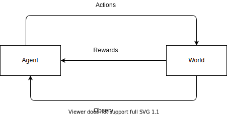

# Reinforcement Learning

 This is a concept flow for the major topics in RL, as understod from various sources listed in the [reading list](Reading.md)

## Introduction

The way I like to think about reinforcement learning is by imagining myself as a ring-master who has to train an animal. I call this animal an **agent**. My language of communication with this animal is through numbers, encoded in processes that I create for it to understand and interact with the world around it. The way this agent interacts with the world around it is through **actions** and the way it understands the world is through **observations**. Now, my task is to define these actions and observations, and train this agent to achieve a certain task by creating a closed-loop control of feedback for the actions it takes. This feedback is the **reward** that agent recieves for each of its actions.

Now, the way I define observations is thorugh formalizing it as a **state** in which this agent exists, or can exist. This state can either be the same as the observation, in case the agent is able to see everything about its environment, for example, in an extreme case imagine if you were able to see all the atoms that constitute your surroundings, or the state can be defined in terms of **beliefs** that the might have based on its observation.

To charecterize this agent, following components are deinfed:
- **Policy**($e=mc^2$): It characterizes the behaviour of the agent i.e how it should navigate around the this world that it is observing. 
